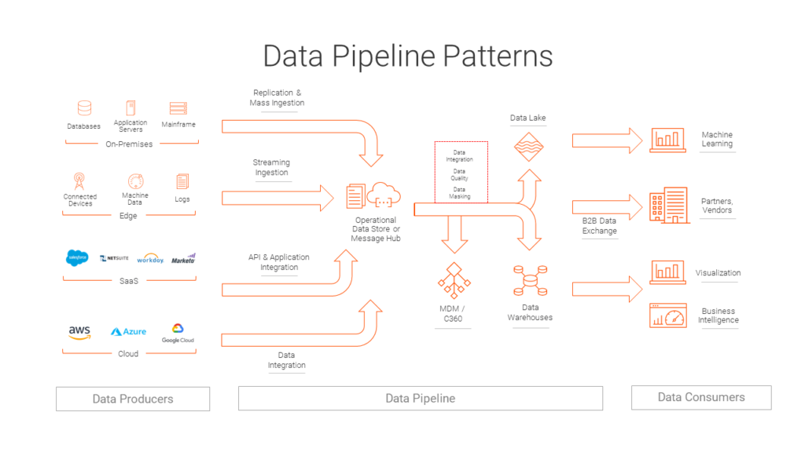

```{r, include=FALSE,warning=FALSE,message=FALSE}
options(htmltools.dir.version = FALSE)
knitr::opts_chunk$set(
  message = FALSE,
  warning = FALSE,
  dev = "svg",
  fig.align = "center",
  #fig.width = 11,
  #fig.height = 5
  cache = TRUE
)

# define vars
om = par("mar")
lowtop = c(om[1],om[2],0.1,om[4])
library(tidyverse)
library(knitr)
library(reticulate)
#use_python("C:\\Users\\jbpost2\\AppData\\Local\\Programs\\Python\\Python310\\python.exe")
#use_python("C:\\python\\python.exe")
options(dplyr.print_min = 5)
options(reticulate.repl.quiet = TRUE)
```


# Where are we?

- Foundation in Python through `JupyterLab`

Now:

- What is Big Data?
- What are common things we'll run into with Big Data?
- What issues are we going to try and tackle?
- What software can be useful?

---

# What is Big Data?

Useful definition:

- Big data = data that you can't handle 'normally'

<!--too big to fit in memory, data being added constantly, etc.-->

---

# What is Big Data?

Useful definition:

- Big data = data that you can't handle 'normally'

&nbsp;  
&nbsp;  
&nbsp;  
&nbsp;  

- Big Data usually requires learning of new tools

- [Want to feel overwhelmed?](https://mattturck.com/landscape/mad2025.pdf) (updated to 2025 version)


---

# What are Common Attributes of Big Data?

- Fifth **V** = [Value](https://www.ibm.com/think/topics/big-data-analytics)

```{r, echo = FALSE, fig.align='center', out.width = "650px"}
knitr::include_graphics("img/fourvs.jpg")
```


---

# What are We Going to Consider?

- Basics of Big Data storage  
<br><br><br>
<!--storage systems, file types, splitting the data up, backups/fault recovery-->
- Basics of Big Data querying  
<br><br><br>
<!--querying data in a Data Lake, Data Warehouse, and Database-->
- Basics of handling streaming data  
<br><br><br>
<!--Create our own streaming data and do some basic responses to it-->
- Summarizing and modeling Big Data  
<br><br><br>
<!--sampling from big data, mapreduce for counting/basic stuff, sufficient statistics and updating models-->


---

# Data and Model Pipelines

In the end, we should have a reasonable idea of how data comes in, gets transformed/combined/etc., can be used to build models or predict an outcome!

```{r, echo = FALSE, out.width = "700px", fig.cap = "Image from informatica.com", fig.align = 'center'}

```


---

# Recap

- Big Data requires learning new tools & considering different algorithms

- Storage and retrieval of data is important

- Modeling and summarizing data can be done

- Should consider overall process/pipeline of data from start to finish
