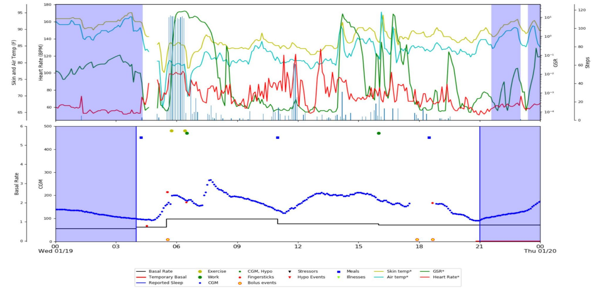

```{r, include=FALSE,warning=FALSE,message=FALSE}
options(htmltools.dir.version = FALSE)
knitr::opts_chunk$set(
  message = FALSE,
  warning = FALSE,
  dev = "svg",
  fig.align = "center",
  #fig.width = 11,
  #fig.height = 5
  cache = TRUE
)

# define vars
om = par("mar")
lowtop = c(om[1],om[2],0.1,om[4])
library(tidyverse)
library(knitr)
library(reticulate)
#use_python("C:\\Users\\jbpost2\\AppData\\Local\\Programs\\Python\\Python310\\python.exe")
use_python("C:\\ProgramData\\Anaconda3\\python.exe")
options(dplyr.print_min = 5)
options(reticulate.repl.quiet = TRUE)
```


# What Do Statisticians Do? 

- Understand and account for variability in data

    + Populations & Samples
    + Sampling Distributions and Likelihoods
    + Inferences on the population


---

# Basic Inference Idea

- Statisticians usually consider **populations** and **samples**

- Example:

    - Population - all customers at a bank  
    - Parameter - p = proportion of customers willing to open an additional account
    - Sample - Observe 40 *independent* customers  
    - Statistic - Sample proportion = $\hat{p} = 8/40 = 0.2$

- Question: Bank makes money if the population proportion is greater than 0.15. Can we conclude that?
- Answer:  ?? Is observing $\hat{p} = 8/40 = 0.2$ reasonable if $p = 0.15$ is the true proportion?

---

# Simulating a Sampling Distribution

By simulating this experiment many times, we can understand the sampling distribution of $\hat{p}$

- Assumptions:
    + $p=0.15$
    + $n = 40$
    + Independent customers

```{python}
import numpy as np
import scipy.stats as stats
import matplotlib.pyplot as plt
```

---
    
# Simulating a Sampling Distribution 

 - Where does our value fall in the realm of all possible values?

```{python}
np.random.seed(5)
stats.binom.rvs(n = 40, p = 0.15, size = 1)
stats.binom.rvs(n = 40, p = 0.15, size = 2)
np.random.seed(5)
stats.binom.rvs(n = 40, p = 0.15, size = 1)/40
stats.binom.rvs(n = 40, p = 0.15, size = 2)/40
```


---

# Simulating a Sampling Distribution

```{python, eval = FALSE}
proportion_draws = stats.binom.rvs(n = 40, p = 0.15, size = 100000)/40
plt.figure(figsize = (12, 7))
plt.hist(proportion_draws, bins = [x/40 for x in range(0, 21)])
plt.axvline(x = 8/40, c = "Red")
plt.text(
  x = 0.3, 
  y = 12500, 
  s = "Probability of seeing 0.2 or \n larger is " + str(round(np.mean(proportion_draws >= 0.2), 4)))
plt.xlabel("Sample Proportions")
plt.ylabel("# of Occurrences")
plt.title("Sampling Distribution of p-hat for n = 40 and p = 0.15")
plt.show()
plt.close()
```

---

# Simulating a Sampling Distribution

```{python, eval = TRUE, echo = FALSE, results = "hide", out.width = "700px", fig.align = 'center'}
proportion_draws = stats.binom.rvs(n = 40, p = 0.15, size = 100000)/40
plt.figure(figsize = (12, 7))
plt.hist(proportion_draws, bins = [x/40 for x in range(0, 21)])
plt.axvline(x = 8/40, c = "Red")
plt.text(x = 0.3, y = 12500, s = "Probability of seeing 0.2 or \n larger is " + str(round(np.mean(proportion_draws >= 0.2), 4)))
plt.xlabel("Sample Proportions")
plt.ylabel("# of Occurrences")
plt.title("Sampling Distribution of p-hat for n = 40 and p = 0.15")
plt.show()
plt.close()
```


---

# Hypothesis Testing  

- Logic above is the idea of a hypothesis test  

- Assume something about the population  

    + Collect data around a quantity of interest
    + Estimate the quantity
    + Use probability to quantify uncertainty in estimate  

- If result unlikely to be seen under assumptions, reject assumption  


---

# $n =$ all or $n = 1$

- Sometimes we can record every user action... don't we have everything?  

    + Is there any variability to consider?
    + Is our sample size the population size?  **n = all**

<!-- 
Still can consider the data as a sample from a **super population** and try to make inferences about the underlying data generating process
Is all the data really collected?
-->

---

# $n =$ all or $n = 1$

- Can now consider **user-level** (or observational unit level) modeling!

    + Example [modeling user intention on social media networks](https://www.sciencedirect.com/science/article/pii/S0268401219313325) to detect depression

```{r, echo = FALSE, fig.align='center', out.width = "700px"}

```


---

# What Do Statisticians Do?

.left35[
- Carefully consider data sources and **bias**

    + Combining data sets
    + Understanding data quality
    + Causal relationships
]

.right65[
```{r, echo = FALSE, fig.align='center', out.width = "400px"}

```
]

---

# What Do Statisticians Do?

- Model data

    + Define assumptions, model structure, and relationships
    + Investigate behavior <!--make inferences, understand importance, etc.-->
    + Provide error measurements

```{r, echo = FALSE, fig.align='center', out.width = "700px"}

```

---

# Modeling Big Data

- Explaining variable importance (Random forests, Deep learning)
- Understanding how models relate (Trees as MLR models, a framework for penalized regression)
- Updating models with streaming data 

```{r, echo = FALSE, fig.align='center', out.width = "700px", fig.cap="https://academic.oup.com/biomet/article/110/4/841/7048657"}

```


---

# What Do Statisticians Do?

- Consider how to be smarter with data

```{r, echo = FALSE, fig.align='center', out.width = "600px"}

```


---

# Thinking Critically About Models


<div style = "float: left; width: 35%;">
```{r, echo = FALSE, fig.align='center', out.width = "400px"}

```
</div>

<div style = "float: right; width: 60%;">

<ul>
<li> Statistical accuracy and computational cost trade-off</li>
  <ul>
    <li> Active Learning - which data to acquire (DOE) and causal relationships</li>
    <li> Coresets - a small, weighted subset of the data, that approximates the full dataset</li>
    <li> Divide and conquer algorithms</li>
  </ul>
</ul>
</div>


<!--identify subsets of data that capture the essential patterns-->
<!--Parallel computation with guaranteed performance when recombining-->

---

# What Do Statisticians Do?

- Understand randomness and rare events

- If you have enough data, you'll eventually see weird things just by chance (similar to multiple testing idea in hypothesis testing)


---

# What Do Statisticians Do?

- Understand randomness and rare events

- If you have enough data, you'll eventually see weird things just by chance (similar to multiple testing idea in hypothesis testing)

- Rare Events & Expected Numbers

    -  Suppose we have an event that occurs with probability $p$
    - We run $k$ different **independent** experiments$$P(\mbox{At least 1 occurrence})=1-(1-p)^{k}$$
    - We would expect to see the following number of occurrences of the event$$E(\mbox{# of occurrences}) = k*p$$


---

# Rare Events Example

- Suppose you have an app that screens phone calls for people
$$P(\mbox{Detected}|\mbox{Spam}) = 0.99999$$
$$P(\mbox{Detected}|\mbox{Non-spam}) = 0.00002$$
And generally, you know that
$$P(\mbox{Spam}) = 0.2, P(\mbox{Non-spam}) = 0.8$$

---

# Rare Events Example

- Given a call is detected as spam, what is the probability it wasn't a spam call?

$$P(\mbox{Non-spam}|\mbox{Detected}) = \frac{P(\mbox{Detected}|\mbox{Non-spam})P(\mbox{Non-spam})}{P(\mbox{Det}|\mbox{Non-spam})P(\mbox{Non-spam})+P(\mbox{Det }|\mbox{Spam})P(\mbox{Spam})}$$
$$= \frac{0.00002*0.8}{0.00002*0.8+0.99999*0.2} = 0.00008$$
- Our event of interest: Given a call is detected as spam, we were wrong has a tiny probability of happening!

---

# Consider This as a Function of the Number of "Trials"

<table>
<th><tr><td> # of calls flagged as spam</td><td>P(At least one mistakenly flagged call)</td><td>Expected Number of Mistakes</td></tr></th>
<tr><td> 1</td><td>0.00008</td><td>0.00008</td></tr>
<tr><td> 100</td><td>0.007968</td><td>0.008</td></tr>
<tr><td> 1,000</td><td>0.076887</td><td>0.08</td></tr>
<tr><td> 10,000</td><td>0.550685</td><td>0.8</td></tr>
<tr><td> 100,000</td><td>1</td><td>8</td></tr>
</table>

<!-- Your app screened 100,000 calls today and received five complaints from users that calls were not screened.  Your app is probably working fine.-->


---

# Recap

Although big data has a lot of info, statisticians help us extract that info in a meaningful way!

Some things statisticians do: 

- Understand and account for variability in data
- Carefully consider data sources and bias
- Model data
- Consider how to be smarter with data
- Understand randomness and rare events