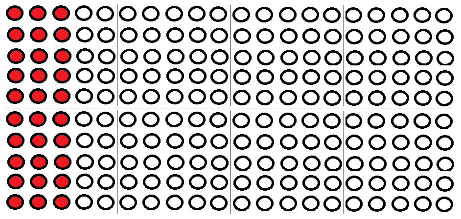
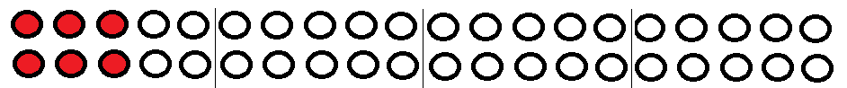
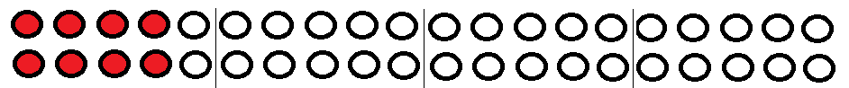
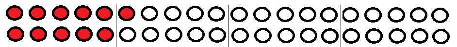

```{r, include=FALSE,warning=FALSE,message=FALSE}
options(htmltools.dir.version = FALSE)
knitr::opts_chunk$set(
  message = FALSE,
  warning = FALSE,
  dev = "svg",
  fig.align = "center",
  #fig.width = 11,
  #fig.height = 5
  cache = TRUE
)

# define vars
om = par("mar")
lowtop = c(om[1],om[2],0.1,om[4])
library(tidyverse)
library(knitr)
library(reticulate)
use_python("C:\\Users\\jbpost2\\AppData\\Local\\Programs\\Python\\Python310\\python.exe")
#use_python("C:\\python\\python.exe")
options(dplyr.print_min = 5)
options(reticulate.repl.quiet = TRUE)
```


layout: true

<div class="my-footer"></div> 

# What is Big Data?

Useful definition:

- Big data = data that you can't handle 'normally'

      + Data won't fit on a single computer
      + Data is constantly being added/updated
      

---

# Do we still need statistics with Big Data?

- Statisticians usually consider **populations** and **samples**
<br><br><br><br><br><br><!-- Introduce/recap those terms and discuss the ideas of relating sample data to populations-->

- Make assumptions about the data generating processes and try to make inference or predict using **sampling distributions**
<!--Define sampling distribution and talk about CI and HT ideas-->


---

# Sampling Distributions

- Population - all customers at a bank  
- Parameter - p = proportion of customers willing to open an additional account (historically 0.15)  
- Sample - Observe 40 *independent* customers  
- Statistic - Sample proportion = $\hat{p} = 8/40 = 0.2$


---

# Sampling Distributions

- Population - all customers at a bank  
- Parameter - p = proportion of customers willing to open an additional account (historically 0.15)    
- Sample - Observe 40 *independent* customers  
- Statistic - Sample proportion = $\hat{p} = 8/40 = 0.2$
<br><br><br>
- Question: Is the (population) proportion greater than 0.15? 
- Answer:  ?? Is observing $\hat{p} = 8/40 = 0.2$ reasonable if $p = 0.15$ is the true proportion?


---

# Data Variability

 - For $n=40$, how likely are sample proportions near 0.2 if the true proportion is 0.15?  
 
```{r, out.width = '600px', echo = FALSE}

```


---

# Data Variability  

 - For $n=40$, how likely are sample proportions near 0.2 if the true proportion is 0.15?  
 
```{r, out.width = '600px', echo = FALSE}

```

One possible sample: $\hat{p} = 6/40$
```{r, out.width = '600px', echo = FALSE}

```


---

# Data Variability

 - For $n=40$, how likely are sample proportions near 0.2 if the true proportion is 0.15?  
 
```{r, out.width = '600px', echo = FALSE}

```

One possible sample: $\hat{p} = 8/40$
```{r, out.width = '600px', echo = FALSE}

```


---

# Data Variability

 - For $n=40$, how likely are sample proportions near 0.2 if the true proportion is 0.15?  
 
```{r, out.width = '600px', echo = FALSE}

```

One possible sample: $\hat{p} = 11/40$
```{r, out.width = '600px', echo = FALSE}

```


---

# Simulating a Sampling Distribution

By simulating this experiment many times, we can understand the sampling distribution of $\hat{p}$

- Assumptions:
    + $p=0.15$
    + $n = 40$
    + Independent customers

```{python}
import numpy as np
import scipy.stats as stats
import matplotlib.pyplot as plt
```

---
    
# Simulating a Sampling Distribution 

 - Where does our value fall in the realm of all possible values?

```{python}
np.random.seed(5)
stats.binom.rvs(n = 40, p = 0.15, size = 1)
stats.binom.rvs(n = 40, p = 0.15, size = 2)
np.random.seed(5)
stats.binom.rvs(n = 40, p = 0.15, size = 1)/40
stats.binom.rvs(n = 40, p = 0.15, size = 2)/40
```


---

# Simulating a Sampling Distribution

```{python, eval = FALSE}
proportion_draws = stats.binom.rvs(n = 40, p = 0.15, size = 100000)/40
plt.figure(figsize = (12, 7))
plt.hist(proportion_draws, bins = [x/40 for x in range(0, 21)])
plt.axvline(x = 8/40, c = "Red")
plt.text(
  x = 0.3, 
  y = 12500, 
  s = "Probability of seeing 0.2 or \n larger is " + str(round(np.mean(proportion_draws >= 0.2), 4)))
plt.xlabel("Sample Proportions")
plt.ylabel("# of Occurrences")
plt.title("Sampling Distribution of p-hat for n = 40 and p = 0.15")
plt.show()
plt.close()
```

---

# Simulating a Sampling Distribution

```{python, eval = TRUE, echo = FALSE, results = "hide", out.width = "700px", fig.align = 'center'}
proportion_draws = stats.binom.rvs(n = 40, p = 0.15, size = 100000)/40
plt.figure(figsize = (12, 7))
plt.hist(proportion_draws, bins = [x/40 for x in range(0, 21)])
plt.axvline(x = 8/40, c = "Red")
plt.text(x = 0.3, y = 12500, s = "Probability of seeing 0.2 or \n larger is " + str(round(np.mean(proportion_draws >= 0.2), 4)))
plt.xlabel("Sample Proportions")
plt.ylabel("# of Occurrences")
plt.title("Sampling Distribution of p-hat for n = 40 and p = 0.15")
plt.show()
plt.close()
```


---

# Hypothesis Testing  

- Logic above is the idea of a hypothesis test  

- Assume something about the population  

    + Sample data  
    
    + Estimate things with the data  
    
    + Understand variability (distribution) in estimators  
    
- Use probability to quantify uncertainty in estimate  

- If result unlikely to be seen under assumptions, reject assumption  

- Otherwise, fail to reject assumption  


---

# Do we still need statistics with Big Data?

- Sometimes we can record every user action... don't we have everything?  Is there any variability to consider?

    + i.e. "With enough data, the numbers speak for themselves"...
    
    + Is our sample size the population size?  **n = all**

<!-- 
Still can consider the data as a sample from a **super population** and try to make inferences about the underlying data generating process
Is all the data really collected?
-->


---

# **n = 1** 

- On the other hand, can now consider **user-level** (or observational unit level) modeling!

    + Example [modeling user intention on social media networks](https://www.sciencedirect.com/science/article/pii/S0268401219313325) to detect depression


---

# Rare Events in Big Data

Can happen more often than you'd think!

- If you have enough data, you'll eventually see weird things just by chance (similar to multiple testing idea in hypothesis testing)


---

# Rare Events in Big Data

Can happen more often than you'd think!

- If you have enough data, you'll eventually see weird things just by chance (similar to multiple testing idea in hypothesis testing)

- **Independence of Events**:

    - Two events A and B are independent if $P(A\cap B)=P(A)P(B)$
 
    - Intuitively implies that knowledge of one event tells nothing about the probability of another


---

# Rare Events in Big Data

Is a certain type of coin fair (equal probability of flipping a head and a tail)?  

- Assume $p = P(Head) = 0.5$

- Experiment:

    + Flip one of these coins 10 times
    + If 10 heads or 10 tails appear, declare coin **biased**


---

# Rare Events in Big Data

Is a certain type of coin fair (equal probability of flipping a head and a tail)?  

- Assume $p = P(Head) = 0.5$

- Experiment:

    + Flip one of these coins 10 times
    + If 10 heads or 10 tails appear, declare coin **biased**

$$P(\mbox{False Positive}) = P(\mbox{Concluding coin is biased}) = P(10~heads) + P(10~tails)$$
$$ = (0.5)^{10} + (0.5)^{10} = 0.001953125$$
Very rare!  


---

# Rare Events in Big Data

- Suppose we now look at 1000 separate (independent) runs of the experiment

- Seeing any 1 coin of the 1000 being declared biased is quite likely!
$$P(\mbox{All 1000 coins identified as fair}) = P(\mbox{1st fair}\cap \mbox{2nd fair}\cap ... \mbox{1000th fair})$$
$$= (1-0.001953125)^{1000} = 0.1416$$
$$P(\mbox{At least 1 false positive}) = P(\mbox{At least 1 coin of the 1000 is classified as biased})$$
$$= 1-0.1416 = 0.8584$$


---

# Rare Events in Big Data

- Suppose we now look at 1000 separate (independent) runs of the experiment

- Seeing any 1 coin of the 1000 being declared biased is quite likely!
$$P(\mbox{All 1000 coins identified as fair}) = P(\mbox{1st fair}\cap \mbox{2nd fair}\cap ... \mbox{1000th fair})$$
$$= (1-0.001953125)^{1000} = 0.1416$$
$$P(\mbox{At least 1 false positive}) = P(\mbox{At least 1 coin of the 1000 is classified as biased})$$
$$= 1-0.1416 = 0.8584$$

- We'd actually **expect** 1000*0.00195 = 1.95 coins to be classified as biased here!


---

# Rare Events & Expected Numbers

- Suppose we have an event that occurs with probability $p$

- We run $k$ different **independent** experiments

$$P(\mbox{At least 1 occurrence})=1-(1-p)^{k}$$
- We would expect to see the following number of occurrences of the event

$$E(\mbox{# of occurrences}) = k*p$$


---

# Example

- Suppose you have an app that screens phone calls for people
$$P(\mbox{Detected}|\mbox{Spam}) = 0.99999$$
$$P(\mbox{Detected}|\mbox{Non-spam}) = 0.00002$$
And generally, you know that
$$P(\mbox{Spam}) = 0.2, P(\mbox{Non-spam}) = 0.8$$


---

# Example

- Given a call is detected as spam, what is the probability it wasn't a spam call?

$$P(\mbox{Non-spam}|\mbox{Detected}) = \frac{P(\mbox{Detected}|\mbox{Non-spam})P(\mbox{Non-spam})}{P(\mbox{Det}|\mbox{Non-spam})P(\mbox{Non-spam})+P(\mbox{Det }|\mbox{Spam})P(\mbox{Spam})}$$
$$= \frac{0.00002*0.8}{0.00002*0.8+0.99999*0.2} = 0.00008$$


---

# Example

- Given a call is detected as spam, what is the probability it wasn't a spam call?

$$P(\mbox{Non-spam}|\mbox{Detected}) = \frac{P(\mbox{Detected}|\mbox{Non-spam})P(\mbox{Non-spam})}{P(\mbox{Det}|\mbox{Non-spam})P(\mbox{Non-spam})+P(\mbox{Det }|\mbox{Spam})P(\mbox{Spam})}$$
$$= \frac{0.00002*0.8}{0.00002*0.8+0.99999*0.2} = 0.00008$$
- Our event of interest!  Given a call is detected as spam, we were wrong. $p = 0.00008$


---

# Consider This as a Function of the Number of "Trials"

<table>
<th><tr><td> # of calls flagged as spam</td><td>P(At least one mistakenly flagged call)</td><td>Expected Number of Mistakes</td></tr></th>
<tr><td> 1</td><td>0.00008</td><td>0.00008</td></tr>
<tr><td> 100</td><td>0.007968</td><td>0.008</td></tr>
<tr><td> 1,000</td><td>0.076887</td><td>0.08</td></tr>
<tr><td> 10,000</td><td>0.550685</td><td>0.8</td></tr>
<tr><td> 100,000</td><td>1</td><td>8</td></tr>
</table>

<!-- Your app screened 100,000 calls today and received five complaints from users that calls were not screened.  Your app is probably working fine.-->


---

# Recap

- Big Data requires learning new tools

- Big Data doesn't mean we have **everything**

- Statistics and machine learning can still be applied to Big Data but will require some modifications

