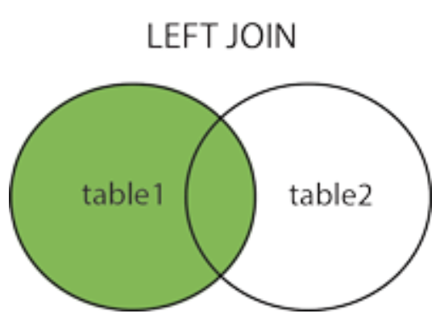
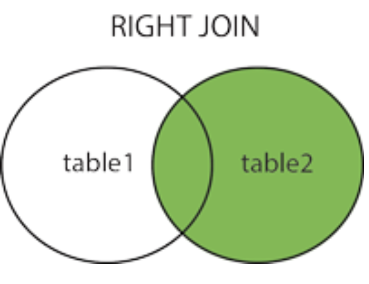
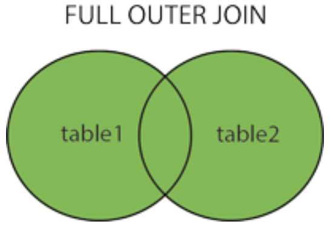

```{r, include=FALSE,warning=FALSE,message=FALSE}
options(htmltools.dir.version = FALSE)
knitr::opts_chunk$set(
  message = FALSE,
  warning = FALSE,
  dev = "svg",
  fig.align = "center",
  #fig.width = 11,
  #fig.height = 5
  cache = TRUE
)

# define vars
om = par("mar")
lowtop = c(om[1],om[2],0.1,om[4])
library(tidyverse)
library(knitr)
library(reticulate)
#use_python("C:\\Users\\jbpost2\\AppData\\Local\\Programs\\Python\\Python310\\python.exe")
use_python("C:\\ProgramData\\Anaconda3\\python.exe")
options(dplyr.print_min = 5)
options(reticulate.repl.quiet = TRUE)
```


layout: false
class: title-slide-section-red, middle

# `SQL` Joins
Justin Post 

---

# Relational Databases

- Often want to combine data from multiple tables to summarize/model

```{r, echo = FALSE, fig.align='center', out.width = '600px'}
knitr::include_graphics("https://www4.stat.ncsu.edu/online/datasets/chinook-database-diagram.png")
```


---

# Create Our Own Database and Do Joins!

```{python}
import sqlite3
import pandas as pd
con = sqlite3.connect(':memory:')
cursor = con.cursor()
cursor.execute("CREATE TABLE IF NOT EXISTS dept (name TEXT, rank TEXT);")
```

<div style="float: left; width: 45%;">
```{python}
cursor.execute(
  """
    INSERT INTO 
      dept (name, rank)
    VALUES
      ("Justin", "Associate"),
      ("Jung-Ying", "Full"),
      ("Arnab", "Associate"),
      ("Spencer", "Full");
    """)
```
</div>
<div style="float: right; width: 45%;">
```{python}
pd.read_sql("SELECT * FROM dept", con)
```
</div>
<!--comment-->

---

# Create Our Own Database and Do Joins!

```{python}
cursor = con.cursor()
cursor.execute("CREATE TABLE IF NOT EXISTS seminar (name TEXT, topic TEXT);")
```
<div style="float: left; width: 45%;">
```{python}
cursor.execute(
  """
    INSERT INTO 
      seminar (name, topic)
    VALUES
      ("Jung-Ying", "Genetics"),
      ("Jonathan", "Design"),
      ("Arnab", "ML"),
      ("Dennis", "Non-parametrics");
    """)
```
</div>
<div style="float: right; width: 45%;">
```{python}
pd.read_sql("SELECT * FROM seminar", con)
```
</div>
<!--comment-->

---

# Joins

Combining two (or more) tables in `SQL` is called doing a **join**

- Many types of joins: `left_join()`, `right_join()`, `inner_join()`, `full_join()` are most common  

- Inner Join: Returns records with matching keys in both tables

```{r, echo = FALSE, fig.align='center', out.width="350px"}
knitr::include_graphics("img/inner_join.png")
```


---

# Inner Join: Returns records with matching keys

<div style="float: left; width: 45%;">
`Dept`
```{python, echo = FALSE}
pd.read_sql("SELECT * FROM dept", con)
```
</div>
<div style="float: right; width: 45%;">
`seminar`
```{python, echo = FALSE}
pd.read_sql("SELECT * FROM seminar", con)
```
</div>
<div style = "content: ''; clear: both; display: table;">
</div>
<!--comment-->
<br>
```{python}
inner = """
  SELECT d.name, d.rank, s.topic FROM dept as d
  INNER JOIN seminar as s ON s.name = d.name
  """
pd.read_sql(inner, con)
```


---

# Inner Join: Returns records with matching keys

<div style="float: left; width: 45%;">
`Dept`
```{python, echo = FALSE}
pd.read_sql("SELECT * FROM dept", con)
```
</div>
<div style="float: right; width: 45%;">
`seminar`
```{python, echo = FALSE}
pd.read_sql("SELECT * FROM seminar", con)
```
</div>
<div style = "content: ''; clear: both; display: table;">
</div>
<!--comment-->
<br>

```{python}
pd.merge(
  left = pd.read_sql("SELECT * FROM dept", con), 
  right = pd.read_sql("SELECT * FROM seminar", con),
  how = "inner", 
  on = "name")
```


---

# Joins

- Left Join: Returns all records from the 'left' table and any matching records from the 'right' table

```{r, echo = FALSE, fig.align='center', out.width="350px"}

```


---

# Left Join: Return left table and matching right records

<div style="float: left; width: 45%;">
`Dept`
```{python, echo = FALSE}
pd.read_sql("SELECT * FROM dept", con)
```
</div>
<div style="float: right; width: 45%;">
`seminar`
```{python, echo = FALSE}
pd.read_sql("SELECT * FROM seminar", con)
```
</div>
<div style = "content: ''; clear: both; display: table;">
</div>
<!--comment-->
<br>

```{python}
left = """
  SELECT d.name, d.rank, s.topic FROM dept as d
  LEFT JOIN seminar as s ON s.name = d.name
  """
pd.read_sql(left, con)
```


---

# Left Join: Return left table and matching right records

<div style="float: left; width: 45%;">
`Dept`
```{python, echo = FALSE}
pd.read_sql("SELECT * FROM dept", con)
```
</div>
<div style="float: right; width: 45%;">
`seminar`
```{python, echo = FALSE}
pd.read_sql("SELECT * FROM seminar", con)
```
</div>
<div style = "content: ''; clear: both; display: table;">
</div>
<!--comment-->
<br>

```{python}
pd.merge(
  left = pd.read_sql("SELECT * FROM dept", con), 
  right = pd.read_sql("SELECT * FROM seminar", con),
  how = "left", 
  on = "name")
```


---

# Joins

- Right Join: Returns all records from the 'right' table and any matching records from the 'left' table

```{r, echo = FALSE, fig.align='center', out.width="350px"}

```

- Not supported in `sqlite`'s `SQL`!  Just do a left join and switch the tables.

---

# Joins

- Outer Join: Returns all records when there is a match from the 'left' or 'right' table

```{r, echo = FALSE, fig.align='center', out.width="350px"}

```

- Not supported in `sqlite`'s `SQL`!  Have to do some work!  


---

# Outer Join: Return all matches from both tables

<div style="float: left; width: 45%;">
`Dept`
```{python, echo = FALSE}
pd.read_sql("SELECT * FROM dept", con)
```
</div>
<div style="float: right; width: 45%;">
`seminar`
```{python, echo = FALSE}
pd.read_sql("SELECT * FROM seminar", con)
```
</div>
<div style = "content: ''; clear: both; display: table;">
</div>
<!--comment-->
<br>

```{python}
outer = """
  SELECT d.name, d.rank, s.topic FROM dept as d
      LEFT JOIN seminar as s ON s.name = d.name
  UNION
  SELECT s.name, d.rank, s.topic FROM seminar as s
      LEFT JOIN dept as d ON s.name = d.name
  """
pd.read_sql(outer, con)
```


---

# Outer Join: Return all matches from both tables

<div style="float: left; width: 45%;">
`Dept`
```{python, echo = FALSE}
pd.read_sql("SELECT * FROM dept", con)
```
</div>
<div style="float: right; width: 45%;">
`seminar`
```{python, echo = FALSE}
pd.read_sql("SELECT * FROM seminar", con)
```
</div>
<div style = "content: ''; clear: both; display: table;">
</div>
<!--comment-->
<br>

```{python}
pd.merge(
  left = pd.read_sql("SELECT * FROM dept", con), 
  right = pd.read_sql("SELECT * FROM seminar", con),
  how = "outer", 
  on = "name")
```


---

# Cross Join

Other `sqlite` supported join is the cross join

- Returns every combination of rows from the left table with the right table

```{python}
cross = """
  SELECT * FROM dept
      CROSS JOIN seminar 
  """
pd.read_sql(cross, con)
```

---

# Other Joins

Lots of other joins out there!

- [See here for examples](https://www.sqlitetutorial.net/sqlite-join/) of how to implement them in sqlite!  

    + The right sidebar has more than the standard joins.

- Also ways to do [if then else type logic](https://www.sqlitetutorial.net/sqlite-case/), [intersections](https://www.sqlitetutorial.net/sqlite-intersect/), etc.

- Can do basic [summaries using `SQL`](https://www.sqlitetutorial.net/sqlite-avg/) as well (including [grouping](https://www.sqlitetutorial.net/sqlite-group-by/)), but we'll just use `python` for that!


---

# To JupyterLab!

- Let's look at the chinook database and more involved joins!


---

# Recap

- Joins allows us to combine two (or more) tables into one

- inner, left, and cross are all supported by `sqlite`

- `pandas` allows for left, right, outer, inner, and cross via the `pd.merge()` function

- Can write `SQL` code and use `pd.read_sql()`


