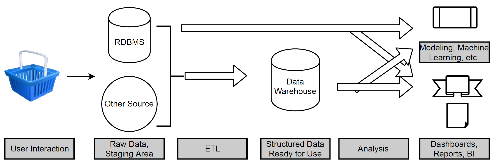
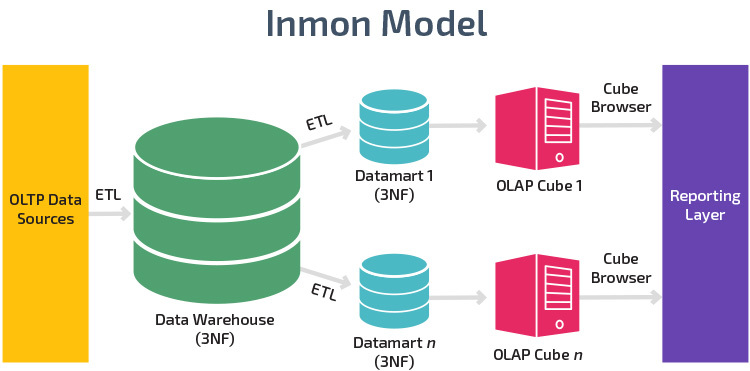
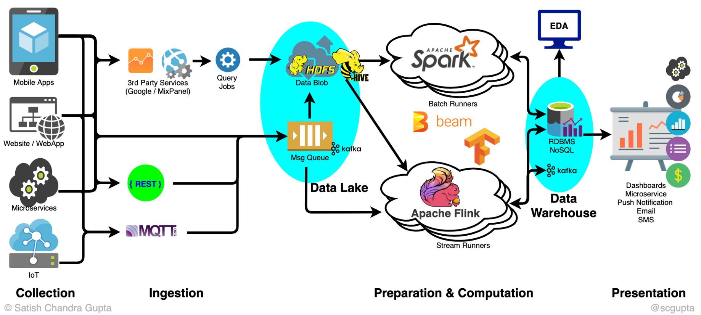
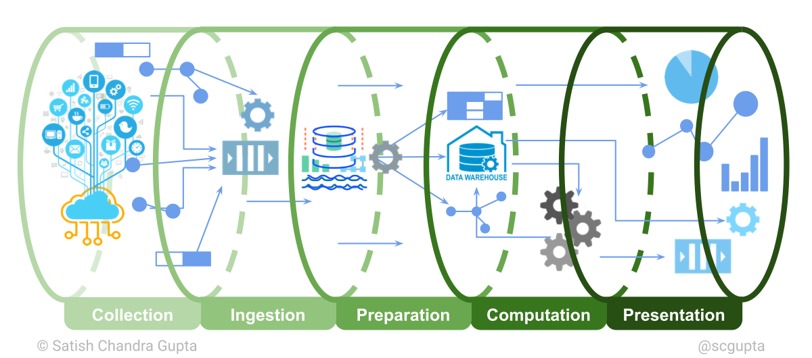
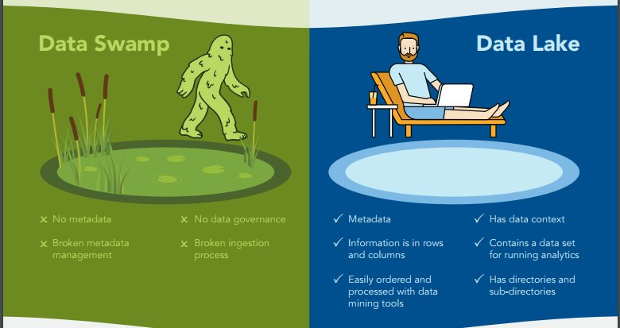
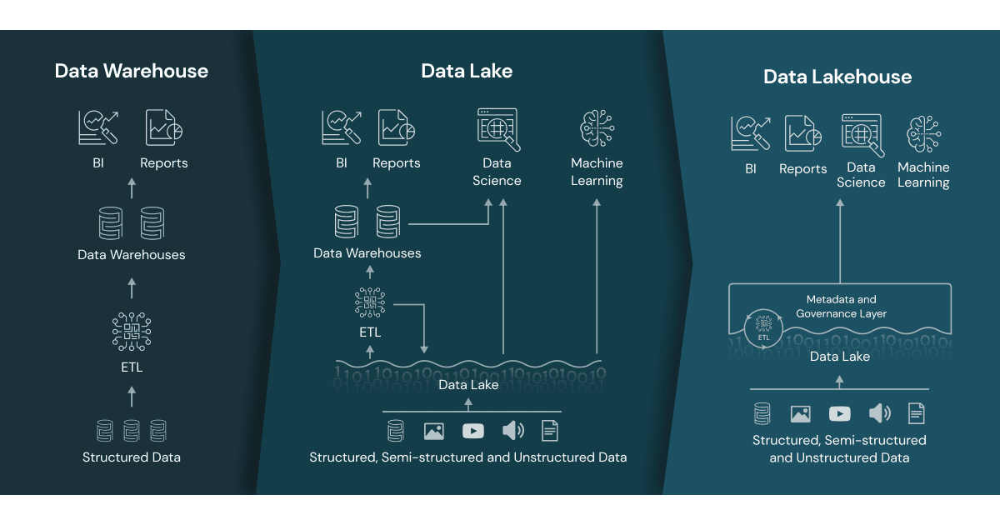
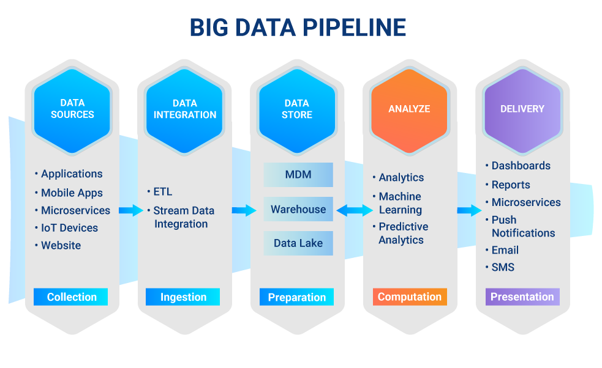
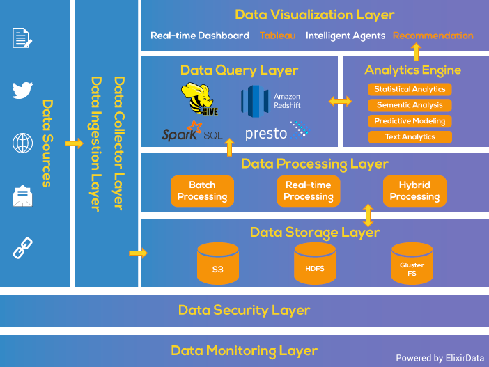
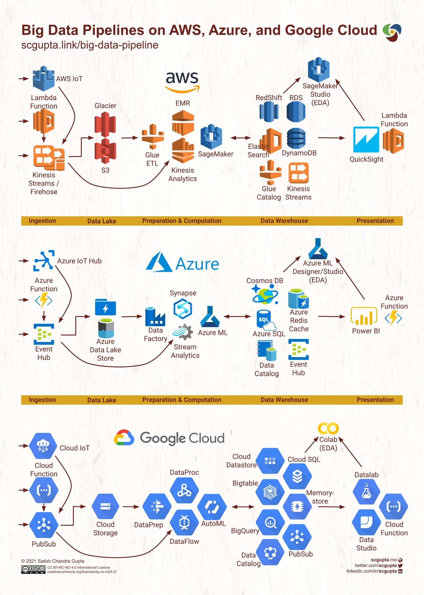

```{r, include=FALSE,warning=FALSE,message=FALSE}
options(htmltools.dir.version = FALSE)
knitr::opts_chunk$set(
  message = FALSE,
  warning = FALSE,
  dev = "svg",
  fig.align = "center",
  #fig.width = 11,
  #fig.height = 5
  cache = TRUE
)

# define vars
om = par("mar")
lowtop = c(om[1],om[2],0.1,om[4])
library(tidyverse)
library(knitr)
library(reticulate)
#use_python("C:\\Users\\jbpost2\\AppData\\Local\\Programs\\Python\\Python310\\python.exe")
use_python("C:\\ProgramData\\Anaconda3\\python.exe")
options(dplyr.print_min = 5)
options(reticulate.repl.quiet = TRUE)
```


layout: false
class: title-slide-section-red, middle

# Data Flow, Data Warehouses, and Data Lakes
Justin Post 

---

# Databases

- We've discussed the use of a relational database (data, management system, and applications associated)

- The term database is really a bit more general

    + [Object oriented databases](https://en.wikipedia.org/wiki/Object_database)
    + [NoSQL databases](https://www.opc-router.com/what-is-mongodb/)
    + [Cloud databases](https://www.ibm.com/cloud/learn/what-is-cloud-database#:~:text=A%20cloud%20database%20is%20a,infrastructure%20to%20implement%20the%20database.)
    + [Self-driving databases](https://www.cs.cmu.edu/~pavlo/blog/2018/04/what-is-a-self-driving-database-management-system.html)

- Data Warehouse

<!--NoSQL: Relational model and data consistency
The relational model is the best at maintaining data consistency across applications and database copies (called instances). For example, when a customer deposits money at an ATM and then looks at the account balance on a mobile phone, the customer expects to see that deposit reflected immediately in an updated account balance. Relational databases excel at this kind of data consistency, ensuring that multiple instances of a database have the same data all the time.

It’s difficult for other types of databases to maintain this level of timely consistency with large amounts of data. Some recent databases, such as NoSQL, can supply only “eventual consistency.” Under this principle, when the database is scaled or when multiple users access the same data at the same time, the data needs some time to “catch up.” Eventual consistency is acceptable for some uses, such as to maintain listings in a product catalog, but for critical business operations such as shopping cart transactions, the relational database is still the gold standard.-->


---

# Data Flow (Non-big data)

- As data comes in, it may be placed directly into a database (say RDBMS)  
    + Highly structured schema, normalized data

- Or ETL (Extract, Transform, and Load) may be done and the data stored in a **data warehouse**
    + Structured schema, denormalized data ready for dashboards/analysis/etc.

```{r,echo = FALSE, warning = FALSE, message = FALSE, out.width='600px', fig.align='center'}

```


---

# Data Warehouse

[Data warehouses are databases which are designed to](https://www.sas.com/en_us/insights/data-management/data-warehouse.html):  

- Store large amounts of data in a central database – and in a standard format.
- Integrate data from many different sources and standardize it, so it’s ready for analytics or reporting.
- Maintain historical records, since it can store months or even years of data.
- Keep data secure by storing it in a single location. Access can be granted only to those who need specific data.
- Provide quick, easy access to data to enable faster business decisions.


```{r,echo = FALSE, warning = FALSE, message = FALSE, out.width='400px', fig.align='center',fig.cap="https://databricks.com/glossary/unified-data-warehouse"}
knitr::include_graphics("img/datawarehouse.jpg")
```

---

# Databases vs Data Warehouses

Processing Types: OLAP vs OLTP

- Databases (like SQLite) use OnLine Transactional Processing (OLTP) to insert, replace, update, or delete records quickly

    + Optimized to add, modify, or delete records a lot
    
    
---

# Databases vs Data Warehouses

Processing Types: OLAP vs OLTP

- Databases (like SQLite) use OnLine Transactional Processing (OLTP) to insert, replace, update, or delete records quickly

    + Optimized to add, modify, or delete records a lot

- Data Warehouses use OnLine Analytical Processing (OLAP) processing to analyze large amounts of data quickly

    + Optimized to exectue a smaller number of complex quieries


---

# Databases vs Data Warehouses


- Databases often have data in a **normalized** format

    + Reduces redundancy and increases consistency as data isn't stored in multiple places
    
- Data Warehouses usually have **denormalized** that is ready to be analyzed

    + More query efficient, but data may exist in multiple places (and become inconsistent)

```{r, echo = FALSE, fig.align='center', out.width = "360px", fig.cap="https://bit.ly/3LGTnP0"}
knitr::include_graphics("img/normalized_denormalized_data.png")
```

---

# Data Marts & MDM

- Data Marts are focused versions of a data warehouse for special teams or departments

- You may also hear the term MDM (Master Data Management)

    + Another data source created that incorporates information about all **master** data sources
    
    + Provides a single consistent view of all business entities' information (a gold standard for their information)

```{r, echo = FALSE, fig.align='center', out.width = "360px", fig.cap="https://bit.ly/3HUQwju"}

```


---

# Data Flow (Non-big data)

- As data comes in, it may be placed directly into a database (say RDBMS)  
    + Highly structured schema, normalized data

- Or ETL (Extract, Transform, and Load) may be done and the data stored in a **data warehouse**
    + Structured schema, denormalized data ready for dashboards/analysis/etc.

```{r,echo = FALSE, warning = FALSE, message = FALSE, out.width='600px', fig.align='center'}

```


---

# Data Flow (Big Data)

- (Often) All data stored in a stored in a **data lake**
    + Place for raw data to go until it is needed (schema is defined on read)
- ETL (Extract, Transform, and Load) is then done on the data to prepare it for use
    + Data may be placed into a database or a data warehouse within the data lake


```{r,echo = FALSE, warning = FALSE, message = FALSE, out.width='650px', fig.align='center', fig.cap = "https://bit.ly/357wbcg"}

```
    

---
    
# Data Lakes    
    
A central repository to store all data in 

- Can handle unstructured, semi-structured, or structured data 

- Usually includes raw data and data after ETL

    + Raw data kept for long term archival and for data scientists to use
    
```{r, echo = FALSE, fig.align='center', out.width = "600px", fig.cap = "https://bit.ly/357wbcg"}

```

---

# Data Sources

Data ingestion can happen via a batch or streaming process

- **batch**: data is updated in bulk

    + Say once each day at 3am

- **streaming**: data is updated in 'real-time'  

    + Jobs run 24/7, waiting for new events to be published


---

# Data Swamps

Flexibility of Data Lakes can also cause problems

- **Data Swamp**: a data lake with poor data management

    + Data not well tagged or lacks structure
    
```{r, echo = FALSE, fig.align='center', out.width = "600px", fig.cap = "https://bit.ly/3BuHuHl"}

```


---

# Lake House

- **Lake House**: an intermediary between the unstructured data lake and the very structured database/data warehouse

- [Delta Lake](delta.io) storage technology can power the lake house

    + Guarantees ACID transactions

```{r, echo = FALSE, fig.align='center', out.width = "550px", fig.cap = "https://bit.ly/3sKOFYa"}

```


---

# Big Data Flow

- A lot to manage in the data pipeline!

```{r,echo = FALSE, warning = FALSE, message = FALSE, out.width='650px', fig.align='center', fig.cap = "https://bit.ly/357wbcg"}

```


---

# Another Flow Chart


```{r,echo = FALSE, warning = FALSE, message = FALSE, out.width='600px', fig.align='center', fig.cap = "https://bit.ly/36kiG9E"}

```
---

# Companies that Manage the Process

```{r,echo = FALSE, warning = FALSE, message = FALSE, out.width='370px', fig.align='center', fig.cap = "https://bit.ly/357wbcg"}

```


<!--Talk about different 'paradigms' for doing it (google, microsoft, ...)
google, microsoft, and amazon (kineses for streaming) offer cloud managed services to do this for you-->


---

# Open Source Tools

- Also a host of open source tools that require management (and you can mix and match)

- [Maybe feeling a little less overwhelmed?](https://mattturck.com/landscape/mad2024.pdf)

<!--Also open source tools like flink, spark, kafka but you have to manage them-->


---

# Recap

- Important to understand the basic data pipeline (big data and non-big data)

- Data lakes, data warehouses, data marts, MDM, and lake houses

- Lots of competing options

    + Open source and company managed
    
    + Cloud managed
    
<!--raw zone vs consumer zone
s3 buckets - like a folder or container to put stuff in
lake house instead of data lake (happy medium)
	
data scientist do things on raw data, for client based they do it on only consumer quality or gold quality data
-->


