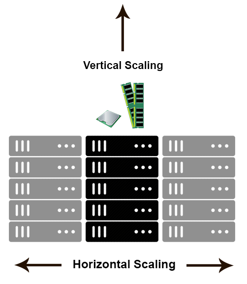

```{r, include=FALSE,warning=FALSE,message=FALSE}
options(htmltools.dir.version = FALSE)
knitr::opts_chunk$set(
  message = FALSE,
  warning = FALSE,
  dev = "svg",
  fig.align = "center",
  #fig.width = 11,
  #fig.height = 5
  cache = TRUE
)

# define vars
om = par("mar")
lowtop = c(om[1],om[2],0.1,om[4])
library(tidyverse)
library(knitr)
library(reticulate)
#use_python("C:\\Users\\jbpost2\\AppData\\Local\\Programs\\Python\\Python310\\python.exe")
use_python("C:\\ProgramData\\Anaconda3\\python.exe")
options(dplyr.print_min = 5)
options(reticulate.repl.quiet = TRUE)
```


layout: false
class: title-slide-section-red, middle

# Big Data Storage: HDFS
Justin Post 

---

# Digging Deeper

- Hopefully have an idea about the big data pipeline

- Data lakes, data warehouses, databases, etc.

- Next: 

    + How is big data actually stored?
    
    + How to we access the big data?


---

# Big Data Storage

- Commonly used data storage systems

    + Hadoop Distributed File System (HDFS)
    + Amazon's Simple Storage Service (S3)  
    + Google's Cloud Storage (GCS)
    + Azure's Blob Storage
    
- Most of these systems are for HDFS compliant as that was the major method for a long time


---

# Hadoop

Hadoop is a framework for efficiently storing and processing large datasets

- Allows for clustering of multiple computers to analyze datasets in parallel


---

# Hadoop

Hadoop is a framework for efficiently storing and processing large datasets

- Allows for clustering of multiple comptuers to analyze datasets in parallel

The [base Apache Hadoop framework](https://hadoop.apache.org/) is composed of the following modules:

- Hadoop Distributed File System (HDFS) – a distributed file-system that stores data on across machines
- Hadoop YARN – a platform responsible for managing computing resources in clusters and using them for scheduling users' applications
- Hadoop MapReduce – an implementation of the MapReduce programming model for large-scale data processing
- Hadoop Common – contains libraries and utilities needed by other Hadoop modules

```{r,echo = FALSE, warning = FALSE, message = FALSE, out.width='400px', fig.align='center'}
knitr::include_graphics("img/hadoop.png")
```


---

# HDFS

File system - system that peforms file management (organization, retrieval, naming, etc.)

Distributed file system - file system where the storage devices are physically dispersed (multiple machines for instance)


---

# HDFS

File system - system that peforms file management (organization, retrieval, naming, etc.)

Distributed file system - file system where the storage devices are physically dispersed (multiple machines for instance)

- An HDFS instance may consist of hundreds or thousands of server machines (a cluster)
- HDFS stores the data in blocks (say 128 MB chunks)
- Data stored in multiple places for fault tolerance
- Works well for computations that can be split up, run in parallel, and combined


---

# HDFS Architecture

- A **Namenode** holds all of the information about where the data is stored
- Each node in the cluster usually has a **DataNode** that manage storage for the node's data

<!--The DataNodes are responsible for serving read and write requests from the file system’s clients. The DataNodes also perform block creation, deletion, and replication upon instruction from the NameNode.-->

```{r,echo = FALSE, warning = FALSE, message = FALSE, out.width='400px', fig.align='center', fig.cap = "https://hadoop.apache.org/docs/r3.3.1/hadoop-project-dist/hadoop-hdfs/HdfsDesign.html"}
knitr::include_graphics("img/hdfsarchitecture.png")
```


---

# HDFS Data Replication

Data is split into blocks and stored in multiple places

- replication factor determines how many copies are made

```{r,echo = FALSE, warning = FALSE, message = FALSE, out.width='500px', fig.align='center', fig.cap = "https://hadoop.apache.org/docs/r3.3.1/hadoop-project-dist/hadoop-hdfs/HdfsDesign.html"}
knitr::include_graphics("img/hdfsdatanodes.png")
```


---

# HeartBeat and Balancing

HeartBeat - signal sent from datanode back to namenode

- Namenode sees no signal, datanode considered dead

Balancing - when datanodes fail, data may be under-replicated

- Namenode will send signals to replicate and balance data replication


```{r,echo = FALSE, warning = FALSE, message = FALSE, out.width='500px', fig.align='center', fig.cap = "https://www.researchgate.net/figure/HDFS-STRCUTURE-Advantages-It-has-very-high-bandwidth-to-support-map-reduce-jobs-It_fig1_303527953"}
knitr::include_graphics("img/heartbeat.png")
```


---

# Hadoop YARN - Yet Another Resource Negotiator

Hadoop YARN – a platform responsible for managing computing resources in clusters and using them for scheduling users' applications

- Client submits jobs
- Resource manager runs in the background to assign and manage resources to complete the job

```{r,echo = FALSE, warning = FALSE, message = FALSE, out.width='500px', fig.align='center', fig.cap = "https://hadoop.apache.org/docs/r3.3.1/hadoop-yarn/hadoop-yarn-site/YARN.html"}
knitr::include_graphics("img/yarn_architecture.gif")
```


---

# Hadoop MapReduce

[MapReduce](https://www.ibm.com/topics/mapreduce#:~:text=MapReduce%20is%20a%20programming%20paradigm,tasks%20that%20Hadoop%20programs%20perform.) is a programming paradigm that enables massive scalability across hundreds or thousands of servers in a Hadoop cluster

- Leverages Parallel Computing


---

# Hadoop MapReduce

[MapReduce](https://www.ibm.com/topics/mapreduce#:~:text=MapReduce%20is%20a%20programming%20paradigm,tasks%20that%20Hadoop%20programs%20perform.) is a programming paradigm that enables massive scalability across hundreds or thousands of servers in a Hadoop cluster

- Leverages Parallel Computing

    + Take computations that can be done independently 
    + Run computation simultaneously on 
        + different processor cores
        + across many connected computers (i.e on a cluster)
    + Combine results

---

# Parallel Computing Idea

```{r, echo = FALSE, out.width="450px"}
knitr::include_graphics("img/serialProblem.gif")
```
<hr>
```{r, echo = FALSE, out.width="450px", fig.cap = "https://computing.llnl.gov/tutorials/parallel_comp/"}
knitr::include_graphics("img/parallelProblem.gif")
```


---

# Hadoop MapReduce

[MapReduce](https://www.ibm.com/topics/mapreduce#:~:text=MapReduce%20is%20a%20programming%20paradigm,tasks%20that%20Hadoop%20programs%20perform.) is a programming paradigm that enables massive scalability across hundreds or thousands of servers in a Hadoop cluster

Basic MapReduce idea:
- Consider different chunks of data to be analyzed
- Use a **map** function to turn each chunk into zero or more key-value pairs
- Collect together all pairs with the same keys
- **Reduce** each collection of grouped values to produce an output for the corresponding key

```{r,echo = FALSE, warning = FALSE, message = FALSE, out.width='500px', fig.align='center', fig.cap = "https://www.todaysoftmag.com/article/1358/hadoop-mapreduce-deep-diving-and-tuning"}
knitr::include_graphics("img/mapreducewords.png")
```


<!--As an analogy, you can think of map and reduce tasks as the way a census was conducted in Roman times, where the census bureau would dispatch its people to each city in the empire. Each census taker in each city would be tasked to count the number of people in that city and then return their results to the capital city. There, the results from each city would be reduced to a single count (sum of all cities) to determine the overall population of the empire. This mapping of people to cities, in parallel, and then combining the results (reducing) is much more efficient than sending a single person to count every person in the empire in a serial fashion.-->


---

# MapReduce Example

We've already kind of done this with our counting of words from a book homework!

- Plan for a text document:
    + create a dictionary with words used as the keys and counts as values
    + This is the map part

- Use this map function across multiple text documents in parallel
    + Combine the resulting dictionaries by summing counts across the words 
    + This is the reduce part


---

# MapReduce Example

```{r,echo = FALSE, warning = FALSE, message = FALSE, out.width='600px', fig.align='center'}

```


---

# MapReduce Example - Splitting up Oliver Twist

```{python, eval = TRUE}
import string
def find_chap(lines, string):
    chap_start = lines.find(string)
    chap_end = lines.find(string, chap_start + 1)
    if chap_end == -1:
        chap_end = lines.find("End of the Project Gutenberg EBook")
    return([chap_start, chap_end])

def remove_char(lines):
    #replace punctuation
    for symbol in string.punctuation:
        lines = lines.replace(symbol, "")
    lines = lines.replace("\n", " ")
    return(lines)
```


---

# MapReduce Example - Splitting up Oliver Twist

```{python, eval = TRUE}
def save_chap(lines, chap = None):
    if chap == None:
        start_end = find_chap(lines, "CHAPTER I")
        chap = 1
    else:
        start_end = find_chap(lines, "CHAPTER")
    #get the chapter and turn it to lower case
    chap_text = lines[start_end[0]:start_end[1]].lower()
    #remove punctuation
    chap_text = remove_char(chap_text)
    with open('dickens/chap' + str(chap) + '.txt', 'w') as w:
        w.write(chap_text)
    chap += 1
    if lines[(start_end[1] + 1):].find("CHAPTER") == -1:
        return 
    else: 
        save_chap(lines[start_end[1]:], chap = chap)

#read in the book as a string
with open('dickens/charles-dickens-oliver-twist.txt', 'r') as f:
    my_lines = f.read()
save_chap(my_lines)        
```


---

# MapReduce Example - Counting Words

Now we can take in one of the chapters and count the words (our mapping function)

```{python}
def map_words(chap):
    word_count_dictionary = {}
    chap_split = chap.split(" ")
    for word in chap_split:
        if word in word_count_dictionary:
            word_count_dictionary[word] += 1
        else:
            word_count_dictionary[word] = 1
    return word_count_dictionary
  
with open('dickens/chap1.txt', 'r') as f:
    my_chap = f.read()

counted = map_words(my_chap)
for vals in list(counted.items())[:4]:
    print(vals)
```


---

# MapReduce Example - Counting Words

- We can construct an iterable with all the chapters and map our function to each chapter
- This could be parallelized across the chapters yielding 53 dictionaries

```{python}
my_chap = []
for i in range(1, 54):
    with open('dickens/chap' + str(i) + '.txt', 'r') as f:
        my_chap.append(f.read())

mapped = list(map(map_words, my_chap))
for key, value in mapped[0].items():
    print(key, ":", value)
```


---

# MapReduce Example - Counting Words

- Now we would need a reducer function
    + Takes in the dictionaries 
    + Combines their counts for each word
    
```{python}
def word_reduce(dict1, dict2):
    combined = {}
    for key in dict1.keys():
        if key in dict2:
            combined[key] = dict1[key] + dict2[key]
        else:
            combined[key] = dict1[key]
    for key in dict2.keys():
        if key not in dict1.keys():
            combined[key] = dict2[key]
    return combined
```


---

# MapReduce Example - Counting Words

- Now we would need a reducer function
    + Takes in the dictionaries 
    + Combines their counts for each word
    
```{python}
with open('dickens/chap1.txt', 'r') as f:
    my_chap = f.read()
counted1 = map_words(my_chap)

with open('dickens/chap2.txt', 'r') as f:
    my_chap = f.read()
counted2 = map_words(my_chap)

temp = word_reduce(counted1, counted2)
for key, value in temp.items():
    print(key, ":", value)
```


---

# MapReduce Example - Counting Words

We can run this function across all the 53 chapters using `functools.reduce()`!

- Recall`reduce()` takes in a function of two variables and an iterable, applies the function repetitively over the iterable, and returns the result

```{python}
import functools
functools.reduce(lambda x, y: x + y, range(1,11)) # sum first 10 numbers
```


---

# MapReduce Example - Counting Words

We can run this function across all the 53 chapters using `functools.reduce()`!

- Next we use our `word_reduce()` function with `functools.reduce()` to add up across all the chapters!

```{python}
final = functools.reduce(word_reduce, mapped)
for key, val in list(final.items())[:10]:
    print(key, ":", val)
```


---

# Data Partitioning and Organization

How you save your data is important!

- From an efficiency perspective you want to make sure the nodes in your cluster have the data they need close to them rather than constantly having to shuffle data back and forth

    + If interested in chapter specific things, would want to try to store data split by chapter

- If you had a big data set you know you want to query by state, smart to store teh data partitioned by state


---

# Hadoop

Hadoop is a framework for efficiently storing and processing large datasets

- Allows for clustering of multiple comptuers to analyze datasets in parallel

The [base Apache Hadoop framework](https://hadoop.apache.org/) is composed of the following modules:

- Hadoop Distributed File System (HDFS) – a distributed file-system that stores data on across machines
- Hadoop YARN – a platform responsible for managing computing resources in clusters and using them for scheduling users' applications
- Hadoop MapReduce – an implementation of the MapReduce programming model for large-scale data processing
- Hadoop Common – contains libraries and utilities needed by other Hadoop modules

```{r,echo = FALSE, warning = FALSE, message = FALSE, out.width='400px', fig.align='center'}
knitr::include_graphics("img/hadoop.png")
```


---

# Hadoop Limitations

- HDFS usually requires a decent amount of 'on-prem' infrastructure and support

- Difficulties with scalability
    + Horizontal scaling: adding more machines or larger disk spaces
    + Vertical scaling: adding additional computational power (CPU, RAM)

```{r,echo = FALSE, warning = FALSE, message = FALSE, out.width='250px', fig.align='center', fig.cap="https://bit.ly/3vjyHXJ"}

```


---

# Cloud Storage

- Commonly used data storage systems

    + Hadoop Distributed File System (HDFS)
    + Amazon's Simple Storage Service (S3)  
    + Google's Cloud Storage (GCS)
    + Azure's Blob Storage
    
- Many companies are moving to cloud storage for big data

    + S3, GCS, and Blob storage use **object storage** instead of a distributed file system
    + Object storage includes the data, metadata, and a unique identifier


---

# Cloud Storage

- Commonly used data storage systems

    + Hadoop Distributed File System (HDFS)
    + Amazon's Simple Storage Service (S3)  
    + Google's Cloud Storage (GCS)
    + Azure's Blob Storage
    
- Many companies are moving to cloud storage for big data

    + S3, GCS, and Blob storage use **object storage** instead of a distributed file system
    + Object storage includes the data, metadata, and a unique identifier
    
- You can still use a Hadoop MapReduce job using the cloud storage options though!

    + Drawback, it tends to be a bit slower
    + Bonus, cost is often cheaper overall


---

# Recap 

- Commonly used data storage systems

    + Hadoop Distributed File System (HDFS)
    + Amazon's Simple Storage Service (S3)  
    + Google's Cloud Storage (GCS)
    + Azure's Blob Storage

- HDFS, Hadoop YARN, MapReduce, and Hadoop Common


