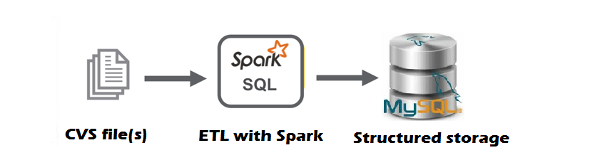
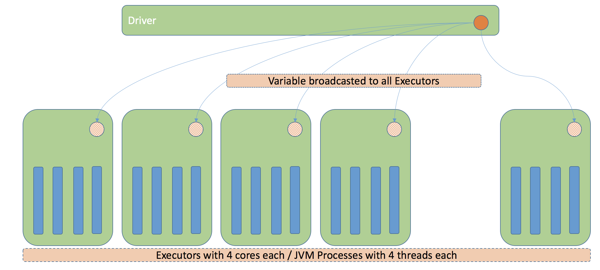

```{r, include=FALSE,warning=FALSE,message=FALSE}
options(htmltools.dir.version = FALSE)
knitr::opts_chunk$set(
  message = FALSE,
  warning = FALSE,
  dev = "svg",
  fig.align = "center",
  #fig.width = 11,
  #fig.height = 5
  cache = TRUE
)

# define vars
om = par("mar")
lowtop = c(om[1],om[2],0.1,om[4])
library(tidyverse)
library(knitr)
library(reticulate)
use_python("C:\\Users\\jbpost2\\AppData\\Local\\Programs\\Python\\Python310\\python.exe")
#use_python("C:\\python\\python.exe")
options(dplyr.print_min = 5)
options(reticulate.repl.quiet = TRUE)
```


layout: false
class: title-slide-section-red, middle

# Spark for Dealing with Big Data
Justin Post 

---
layout: true

<div class="my-footer"></div> 

---


# Recap

- Big data: data that can't be handled normally
- 5 V's: Volume, Variety, Veracity, Velocity, and Value
- Hopefully have an idea about the big data pipeline

    + Databases, Data warehouses, Data Lakes, Data Marts
    
- Common RDBMS

    + SQL can be used to query databases
    + SELECT, WHERE, JOINS

- Big Data Storage

    + HDFS, S3, GCS, Azure's Blog Storage
    + Hadoop Basics
        - HDFS, YARN, MapReduce, Common

---

# How Can We Interact with Big Data?

Spark!  What's that?

- Distributed processing system for big data workloads

- Optimized for fast analytic queries

- Can be used with Java, Scala, **Python**, and R!  

- Integrates with most any framework

```{r, echo = FALSE, fig.align='center', out.width="400px"}
knitr::include_graphics("img/spark.png")
```


---

# What can Spark do?

Five major parts to Spark

- Spark Core as its foundation
- Spark SQL for SQL type queries
- Spark Streaming for real-time analytics
- Spark MLlib for machine learning
- Spark GraphX for graph processing

```{r, echo = FALSE, fig.align='center', out.width="400px"}
knitr::include_graphics("img/sparkParts.png")
```
      

---

# Wait - what about Hadoop?

Works with Hadoop (or without) and is faster!

> Apache Spark is a lightning-fast cluster computing technology, designed for fast computation. It is based on Hadoop Map Reduce and extends the MapReduce model to efficiently use it for more types of computations, which includes interactive queries and stream processing. The main feature of Apache Spark is its in-memory cluster computing that increases the processing speed of an application.

<https://www.ibm.com/docs/en/workload-automation/9.5.0?topic=enhancements-plug-in-apache-spark>


---

# Spark vs Hadoop

Hadoop MapReduce with HDFS: Allows for massively paralellized operations without worrying about worker distribution or fault tolerance
```{r, echo = FALSE, fig.align='center', out.width="370px"}
knitr::include_graphics("img/hadoopOperations.png")
```


---

# Spark vs Hadoop

Hadoop MapReduce with HDFS: Allows for massively paralellized operations without worrying about worker distribution or fault tolerance
```{r, echo = FALSE, fig.align='center', out.width="370px"}
knitr::include_graphics("img/hadoopOperations.png")
```

Spark:  Does similar things but is built to be faster by processing in memory (RAM)
```{r, echo = FALSE, fig.align='center', out.width="500px"}
knitr::include_graphics("img/sparkOperations.png")
```

(figs from <https://www.tutorialspoint.com/apache_spark/apache_spark_rdd.htm>)

<!-- Faster for interactive operations (like SQL type queries) as well-->

---

# What kinds of Data can Spark work with?

HDFS, CSV, JSON, S3, GCS, (most types!)

- If your data is in an HDFS, spark's cluster manager will work with YARN 

- If you have data elsewhere, spark has its own cluster manager to determine how to split up data and run computations (but can also work with software like Mesos and Kubernetes, which do management as well)

```{r, echo = FALSE, fig.align='center', out.width="550px", fig.cap="https://stackoverflow.com/questions/66638879/what-is-databricks-spark-cluster-manager-can-it-be-changed"}
knitr::include_graphics("img/sparkClusterManager.png")
```


---

# How Does Spark Work?

When you want to use spark you start a **Spark Session** (or context).  We define:

- What the cluster we'll use is and **Workers** to handle computation on that cluster/node
- Central spark coordinator (i.e. the **Driver**)
- The name of the app


---

# How Does Spark Work?

When you want to use spark you start a **Spark Session** (or context).  We define:

- What the cluster we'll use is and **Workers** to handle computation on that cluster/node
- Central spark coordinator (i.e. the **Driver**)
- The name of the app

We'll use `pyspark` (discussed more later)

- Most of the time we'll start with something like this:
```{python, eval = FALSE}
from pyspark.sql import SparkSession
spark = SparkSession.builder.master('local[*]').appName('my_app').getOrCreate()
```


---

# How Does Spark Work?

- Initiating the SparkSession gives you access to create a **spark DataFrame** (or **Dataset**) and access to **spark SQL**

    + Can now run SQL queries
    + Can read in data from other sources (JSON, Parquet, hive, CSV, etc.)
    
    
---

# How Does Spark Work?

- Initiating the SparkSession gives you access to create a **spark DataFrame** (or **Dataset**) and access to **spark SQL**

    + Can now run SQL queries
    + Can read in data from other sources (JSON, Parquet, hive, CSV, etc.)
    
- Allows you to perform ETL operations!  Ex:

    + Read in a csv file as a **DataFrame**
    + Select certain subsets via SQL type queries
    + Write out to a database

```{r, echo = FALSE, fig.align='center', out.width="450px", fig.cap="https://dzone.com/articles/how-to-create-a-simple-etl-job-locally-with-spark"}

```


---

# Resilient Distributed Datasets (RDDs)

Core object that Spark works on
- [RDD](https://databricks.com/blog/2016/07/14/a-tale-of-three-apache-spark-apis-rdds-dataframes-and-datasets.html) - an immutable distributed collection of elements of your data, partitioned across nodes in your cluster that can be operated in parallel with a low-level API that offers transformations and actions


---

# Resilient Distributed Datasets (RDDs)

Core object that Spark works on
- [RDD](https://databricks.com/blog/2016/07/14/a-tale-of-three-apache-spark-apis-rdds-dataframes-and-datasets.html) - an immutable distributed collection of elements of your data, partitioned across nodes in your cluster that can be operated in parallel with a low-level API that offers transformations and actions

    - Transformation: Something that creates a new RDD (say by filtering, grouping, or mapping)
    - Action: Operation applied to an RDD that performs a computation and sends the result back 

Ex:
```{python, eval = FALSE}
df = spark.createDataFrame([
    ['red', 'banana', 1, 10], ['blue', 'banana', 2, 20], ['red', 'carrot', 3, 30],
    ['blue', 'grape', 4, 40], ['red', 'carrot', 5, 50], ['black', 'carrot', 6, 60],
    ['red', 'banana', 7, 70], ['red', 'grape', 8, 80]], schema=['color', 'fruit', 'v1', 'v2'])
df.groupby('color').avg().show() 
```


---

# Resilient Distributed Datasets (RDDs)

Now mostly hidden in the background

- Can create explicitly using the `.sparkContext.parallelize()` method

```{python, eval = FALSE}
from pyspark.sql import SparkSession
spark = SparkSession.builder.master('local[*]').appName('my_app').getOrCreate()
my_rdd = spark.sparkContext.parallelize([
  (tuple of things),
  (another tupe of things),
  ...
])
#my_rdd: ParallelCollectionRDD[0] at readRDDFromFile at PythonRDD.scala:274
```


---

# Resilient Distributed Datasets (RDDs)

But mostly RDDs are created when making a spark DataFrame

```{python, eval = FALSE}
import pandas as pd
pandas_df = pd.DataFrame({
    'a': [1, 2, 3],
    'b': [2., 3., 4.],
    'c': ['string1', 'string2', 'string3'],
    'd': [date(2000, 1, 1), date(2000, 2, 1), date(2000, 3, 1)],
    'e': [datetime(2000, 1, 1, 12, 0), datetime(2000, 1, 2, 12, 0), datetime(2000, 1, 3, 12, 0)]
})
df = spark.createDataFrame(pandas_df)
#df: DataFrame[a: bigint, b: double, c: string, d: date, e: timestamp]
```


---

# More on Transformations & Actions

- Great, so we'll work with spark DataFrames or RDDs.  What can we do with them?

Common transformations done in spark:
- `map()` apply a function to each RDD to return a new RDD
- `filter()` return a subsetted RDD
- Others like: `select()`, `filterByRange()`, `groupByKey()`, `reduceByKey()`, `distinct()`, `sample()`, `union()`, ...

---

# More on Transformations & Actions

- Great, so we'll work with spark DataFrames or RDDs.  What can we do with them?

Common transformations done in spark:
- `map()` apply a function to each RDD to return a new RDD
- `filter()` return a subsetted RDD
- Others like: `select()`, `filterByRange()`, `groupByKey()`, `reduceByKey()`, `distinct()`, `sample()`, `union()`, ...

Common Actions done in spark:
- `reduce()`
- `count()`, `min()`, `max()`
- `collect()`, `take()`, & `first()`
- `foreach()`, `aggregate()`...


---

# Fault Tolerance

Recall that Hadoop and MapReduce had built in fault tolerance

- If some data went down, backups were used (and data re-replicated)

Spark is also fault tolerant but in a different way

- Turns transformations and actions into a directed acyclic graph (DAG) that allows computation to be picked back up if something fails

```{r, echo = FALSE, fig.align='center', out.width="450px", fig.cap="https://data-flair.training/blogs/dag-in-apache-spark/#:~:text=It%20is%20a%20programming%20style,does%20not%20write%20to%20disk."}
knitr::include_graphics("img/dag_visual.jpg")
```


---

# Lazy Evaluation 

- [All transformations in Spark](https://spark.apache.org/docs/latest/rdd-programming-guide.html) are _lazy_ (they don't compute their results right away)

- **Transformations** are built up (through a DAG)
    + Computation only done when an **action** requires a result
    
---

# Lazy Evaluation 

- [All transformations in Spark](https://spark.apache.org/docs/latest/rdd-programming-guide.html) are _lazy_ (they don't compute their results right away)
- **Transformations** are built up (through a DAG)
    + Computation only done when an **action** requires a result

- Makes computation faster!
    + Spark can realize a dataset created through map will be used in a reduce and return only the result of the reduce rather than the larger mapped dataset

```{r, echo = FALSE, fig.align='center', out.width="400px", fig.cap="https://commandstech.com/spark-lazy-evaluation-with-example/"}
knitr::include_graphics("img/sparkLazy.jpg")
```


---

# Broadcast Variables and Accumulators

Last thing for us to know, Spark can share variables across clusters or machines

- Two types:

    + Broadcast variables - give access to a common (read-only) variable to all workers
    + Accumulators - variable that each worker can do an operation on (usually things like sums)

```{r, echo = FALSE, fig.align='center', out.width="450px", fig.cap="https://labs.criteo.com/wp-content/uploads/2018/06/IASV1.png"}

```


---

# Recap

Spark - Distributed processing software for big data workloads
+ Faster than MapReduce (and more flexible)
+ DAGs make it fault tolerant and improve computational speed

Five major parts to Spark
- Spark Core as its foundation
- Spark SQL for SQL type queries
- Spark Streaming for real-time analytics
- Spark MLlib for machine learning
- Spark GraphX for graph processing

Spark RDDs and DataFrames are spark's main objects


