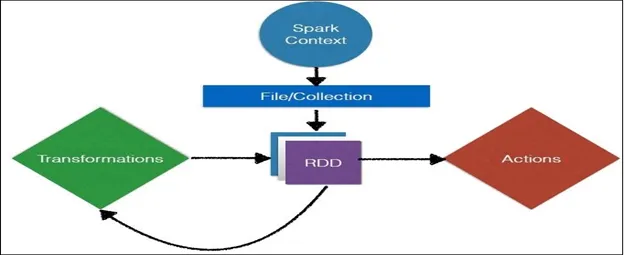

```{r, include=FALSE,warning=FALSE,message=FALSE}
options(htmltools.dir.version = FALSE)
knitr::opts_chunk$set(
  message = FALSE,
  warning = FALSE,
  dev = "svg",
  fig.align = "center",
  #fig.width = 11,
  #fig.height = 5
  cache = TRUE
)

# define vars
om = par("mar")
lowtop = c(om[1],om[2],0.1,om[4])
library(tidyverse)
library(knitr)
library(reticulate)
use_python("C:\\Users\\jbpost2\\AppData\\Local\\Programs\\Python\\Python310\\python.exe")
#use_python("C:\\python\\python.exe")
options(dplyr.print_min = 5)
options(reticulate.repl.quiet = TRUE)
```


layout: false
class: title-slide-section-red, middle

# `pyspark`: RDDs
Justin Post 

---
layout: true

<div class="my-footer"></div> 


---

# Spark Recap

Spark - Distributed processing software for big data workloads
+ Generally faster than Hadoop's MapReduce (and more flexible)
+ DAGs make it fault tolerant and improve computational speed


Five major parts to Spark
- Spark Core as its foundation
- Spark SQL for SQL type queries
- Spark Streaming for real-time analytics
- Spark MLlib for machine learning
- Spark GraphX for graph processing


---

# Starting a Spark Instance

- Use `pyspark.sql.SparkSession` to create a spark instance (or link to an existing one)

```{python, eval = FALSE}
from pyspark.sql import SparkSession
spark = SparkSession.builder.master('local[*]').appName('my_app').getOrCreate()
```

- `local[*]` implies we are using a local machine
- Could use a URL instead to connect to a spark session already created
- App name useful if you have multiple spark processes running

---

# Three Major Data Structures

- RDD

    + Usually hidden underneath
    + Not as user friendly

---

# Three Major Data Structures

- RDD
    + Usually hidden underneath
    + Not as user friendly
    
- pandas-on-spark Data Frame
    + Use pandas style code to interact with the data
    
    
---

# Three Major Data Structures

- RDD
    + Usually hidden underneath
    + Not as user friendly

- pandas-on-spark Data Frame
    + Use pandas style code to interact with the data

- Spark SQL Data Frame
    + Use SQL style code to interact with the data


---

# Resilient Distributed Datasets (RDDs)

- Can create explicitly using the `.sparkContext.parallelize()` method

```{python, eval = TRUE}
#create some 'data' to put into an RDD
quick_cat = lambda x: "a" if x < 20 else "b"
my_data = [(quick_cat(x), x) for x in range(1,51)]
my_data[:3]
```

---

# Resilient Distributed Datasets (RDDs)

- Can create explicitly using the `.sparkContext.parallelize()` method

```{python, eval = TRUE}
#create some 'data' to put into an RDD
quick_cat = lambda x: "a" if x < 20 else "b"
my_data = [(quick_cat(x), x) for x in range(1,51)]
my_data[:3]
```
```{python, eval = FALSE}
#spark session available through spark object
my_rdd = spark.sparkContext.parallelize(my_data)
my_rdd
```

`ParallelCollectionRDD[1] at readRDDFromFile at PythonRDD.scala:274`


---

# RDD objects

- RDD object stored over multiple partitions

```{python, eval = FALSE}
my_rdd.getNumPartitions()
```
`12`


---

# RDD objects

- RDD object stored over multiple partitions

```{python, eval = FALSE}
my_rdd.getNumPartitions()
```
`12`

- Doesn't print out data unless you ask it to!

```{python, eval = FALSE}
my_rdd.take(3)
```
`[('a', 1), ('a', 2), ('a', 3)]`


---

# RDD Keys and Values

If a series of tuple type objects are passed
- 1st element is the key
- 2nd element is the value

```{python, eval = FALSE}
my_rdd.keys().take(3)
```
`['a', 'a', 'a']`

```{python, eval = FALSE}
my_rdd.values().take(3)
```
`[1, 2, 3]`


---

# RDD with Just Elements

If not a series of tuple type objects, you just have a bunch of elements

```{python, eval = FALSE}
my_rdd2 = spark.sparkContext.parallelize([i for i in range(0,20)])
my_rdd2.collect()
```

`[0, 1, 2, 3, 4, 5, 6, 7, 8, 9, 10, 11, 12, 13, 14, 15, 16, 17, 18, 19]`

- No key/value pairs here!


---

# Resilient Distributed Datasets (RDDs)

Two types of operations ([see here for reference](https://spark.apache.org/docs/3.3.1/api/python/reference/pyspark.html#rdd-apis)):

- Transformation: Something that creates a new RDD 
- Action: Operation applied to an RDD that performs a computation and sends the result back 

```{r, echo = FALSE, fig.align = "center", out.width = "550px"}

```


---

# Actions on RDDs

- Action: Operation applied to an RDD that performs a computation and sends the result back 

Must perform an **action** to actually see the data:
- `.collect()`, `.take()`, & `.first()`
- `.reduce()` 
- `.count()`, `.min()`, `.max()`, `.countByKey()`
- `.aggregate()`, `.foreach()`

```{python, eval = FALSE}
my_rdd.take(3)   #specify how many to take
my_rdd.collect() #would return everything
my_rdd.first()   #just the first
```

---

layout: false

# Actions on RDDs

- Action: Operation applied to an RDD that performs a computation and sends the result back 

Must perform an **action** to actually see the data:
- `.collect()`, `.take()`, & `.first()`
- `.reduce()` 
- `.count()`, `.min()`, `.max()`, `.countByKey()`
- `.aggregate()`, `.foreach()`

```{python, eval = FALSE}
my_rdd.count()
```
`50`

```{python, eval = FALSE}
my_rdd.countByKey()
```
`defaultdict(int, {'a': 19, 'b': 31})`

---
layout: true

<div class="my-footer"></div> 

---

# Transformations on RDDs

Common transformations:
- `map()` (and `mapValues()` for key/value pairs) 
    + Apply a function to each RDD (or just the values) return an RDD of the same *structure* 
- `flatMap()` (and `flatMapValues()` for key/value pairs) 
    + Apply a function to each RDD (or just the values) return an RDD with more or less elements
- `filter()` return a subsetted RDD

---

# Transformations on RDDs

Common transformations:
- `map()` (and `mapValues()` for key/value pairs) 
    + Apply a function to each RDD (or just the values) return an RDD of the same *structure* 
- `flatMap()` (and `flatMapValues()` for key/value pairs) 
    + Apply a function to each RDD (or just the values) return an RDD with more or less elements
- `filter()` return a subsetted RDD


Usually write `lambda` functions with these!
- Often include things like `.groupBy()` or `.groupByKey()` 


---

# Transformations on RDDs

- Find the number of values for each key (alternative to `.countByKey()`)

```{python, eval = FALSE}
#same calculation as before but returned as an RDD
my_rdd \
    .groupByKey() \
    .mapValues(len) \
    .collect()
```
`[('b', 31), ('a', 19)]`


---

layout: false

# Transformations on RDDs

- Find the number of values for each key (alternative to `.countByKey()`)

```{python, eval = FALSE}
#same calculation as before but returned as an RDD
my_rdd \
    .groupByKey() \
    .mapValues(len) \
    .collect()
```
`[('b', 31), ('a', 19)]`

- Allows us to do more transformations!

```{python, eval = FALSE}
from numpy import log
my_rdd \
    .groupByKey() \
    .mapValues(len) \
    .map(lambda x: (x[0], x[1], log(x[1]))) \
    .collect()
```
`[('b', 31, 3.4339872044851463), ('a', 19, 2.9444389791664403)]`


---
layout: true

<div class="my-footer"></div> 

---

# RDD Transformations & Actions

Tough to use many of the functions!
- Suppose we want to find the total sum for each key of our original RDD

---

# RDD Transformations & Actions

Tough to use many of the functions!
- Suppose we want to find the total sum for each key of our original RDD

```{python, eval = FALSE}
my_rdd \
    .groupByKey() \
    .mapValues(sum) \
    .collect()
```
`[('b', 1085), ('a', 190)]`

- Documentation says use `aggregateByKey()` instead...


---

# RDD Transformations & Actions

Tough to use many of the functions!
- Suppose we want to find the total sum for each key of our original RDD

```{python, eval = FALSE}
my_rdd \
  .aggregateByKey(0, #initial value for each partition
                  lambda within_1, within_2: within_1 + within_2, #how to combine values on the same partition
                  lambda across_1, across_2: across_1 + across_2) \ #how to combine across partitions
  .collect() 
```
`[('b', 1085), ('a', 190)]`


---

# RDD Example

Let's create a more involved RDD object:

```{python, eval = FALSE}
from numpy import sqrt
my_rdd.map(lambda x: (x[0], (x[1], x[1]**2, sqrt(x[1])))).take(3)
```
`[('a', (1, 1, 1.0)),`  
` ('a', (2, 4, 1.4142135623730951)),`  
` ('a', (3, 9, 1.7320508075688772))]`  


---

# RDD Example

- Still have tuple object so we have keys and values

```{python, eval = FALSE}
my_rdd.map(lambda x: (x[0], (x[1], x[1]**2, sqrt(x[1])))) \
    .keys() \
    .take(3)
```
`['a', 'a', 'a']`


```{python, eval = FALSE}
my_rdd.map(lambda x: (x[0], (x[1], x[1]**2, sqrt(x[1])))) \
    .values() \
    .take(3)
```
`[(1, 1, 1.0), (2, 4, 1.4142135623730951), (3, 9, 1.7320508075688772)]`


---

# RDD Example

`.filter()` method can subset our RDD

```{python, eval= FALSE}
my_rdd.map(lambda x: (x[0], (x[1], x[1]**2, sqrt(x[1])))) \
    .filter(lambda x: x[1][0] <= 35) \
    .collect()
```
`[('a', (1, 1, 1.0)),`  
` ('a', (2, 4, 1.4142135623730951)),`  
`...`  
` ('b', (34, 1156, 5.830951894845301)),`  
` ('b', (35, 1225, 5.916079783099616))]`


---

# RDD Example

- Use `.mapValues()` to find the sum of each of our values

```{python, eval= FALSE}
my_rdd.map(lambda x: (x[0], (x[1], x[1]**2, sqrt(x[1])))) \
    .filter(lambda x: x[1][0] <= 35) \
    .mapValues(sum) \
    .collect()
```
`[('a', 3.0),`  
` ('a', 7.414213562373095),`  
` ('a', 13.732050807568877),`
`...`


---

# RDD Example

- Same thing could be done with `.map()` instead!

```{python, eval= FALSE}
#with keys
my_rdd.map(lambda x: (x[0], (x[1], x[1]**2, sqrt(x[1])))) \
    .filter(lambda x: x[1][0] <= 35) \
    .map(lambda x: (x[0], x[1][0]+x[1][1]+x[1][2])) \
    .collect()
```
`[('a', 3.0),`  
` ('a', 7.414213562373095),`  
` ('a', 13.732050807568877),`
`...`

- `.map()` works even when we don't have key/value pairs


---

# To Jupyter Lab

- Working with RDDs can be tough! 

- Data Frames (via SQL or pandas-on-spark) are much easier!

- Still, let's redo our MapReduce example explicitly using RDDs in pyspark!


---

# Recap

- Use `SparkSession` to use spark

- RDDs are the underlying data structure
    + Perform transformations & actions
    
- Can be difficult to work with!
