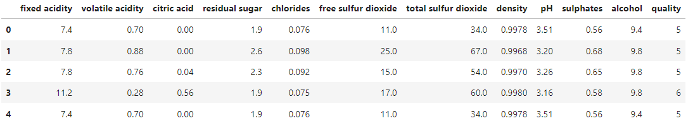
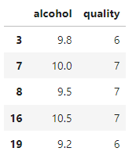

```{r, include=FALSE,warning=FALSE,message=FALSE}
options(htmltools.dir.version = FALSE)
knitr::opts_chunk$set(
  message = FALSE,
  warning = FALSE,
  dev = "svg",
  fig.align = "center",
  #fig.width = 11,
  #fig.height = 5
  cache = TRUE
)

# define vars
om = par("mar")
lowtop = c(om[1],om[2],0.1,om[4])
library(tidyverse)
library(knitr)
library(reticulate)
use_python("C:\\Users\\jbpost2\\AppData\\Local\\Programs\\Python\\Python310\\python.exe")
#use_python("C:\\python\\python.exe")
options(dplyr.print_min = 5)
options(reticulate.repl.quiet = TRUE)
```


layout: false
class: title-slide-section-red, middle

# `pyspark`: pandas-on-Spark
Justin Post 

---
layout: true

<div class="my-footer"></div> 


---

# Spark Recap

Spark - Distributed processing software for big data workloads
+ Generally faster than Hadoop's MapReduce (and more flexible)
+ DAGs make it fault tolerant and improve computational speed


Five major parts to Spark
- Spark Core as its foundation
- Spark SQL for SQL type queries
- Spark Streaming for real-time analytics
- Spark MLlib for machine learning
- Spark GraphX for graph processing


---

# Data Object Used by pyspark

**DataFrame** APIs are commonly used in `pyspark`

- DataFrames (think usual relational database table) are created and implemented on top of RDDs

- DataFrames are stored across the cluster

    + When transformations are done, lazy evaluation is used
    + When actions are done, computation starts and results returned

---

# Data Object Used by pyspark

**DataFrame** APIs are commonly used in `pyspark`

- DataFrames (think usual relational database table) are created and implemented on top of RDDs

- DataFrames are stored across the cluster

    + When transformations are done, lazy evaluation is used
    + When actions are done, computation starts and results returned

Two major DataFrame APIs in `pyspark`
- [pandas-on-Spark](https://spark.apache.org/docs/3.3.1/api/python/reference/pyspark.pandas/index.html) DataFrames through the `pyspark.pandas` module
- [Spark SQL](https://spark.apache.org/docs/3.3.1/api/python/reference/pyspark.sql.html) DataFrames through `pyspark.sql` module


---

# pandas-on-Spark

- pandas API on spark is super easy to use since we know `pandas`!

- First we can import our modules

```{python, eval = FALSE}
import pandas as pd
import numpy as np
import pyspark.pandas as ps
```

---

# pandas-on-Spark

- Now you can create `pandas-on-Spark` series or `pandas-on-Spark` DataFrame
- Note the `ps` not `pd`!

```{python, eval = FALSE}
ps.Series([1, 3, 5, np.nan, 6, 8])
```
<pre>
0    1.0
1    3.0
2    5.0
3    NaN
4    6.0
5    8.0
dtype: float64
</pre>


---

# pandas-on-Spark

- Now you can create `pandas-on-Spark` series or `pandas-on-Spark` DataFrame
- Note the `ps` not `pd`!

```{python, eval = FALSE}
ps.DataFrame(
    {'a': [1, 2, 3, 4, 5, 6],
     'b': [100, 200, 300, 400, 500, 600],
     'c': ["one", "two", "three", "four", "five", "six"]},
    index=[10, 20, 30, 40, 50, 60])
```
```{r, echo = FALSE, out.width="170px"}
knitr::include_graphics("img/psdf1.png")
```


---

# pandas-on-Spark

- Now you can create `pandas-on-Spark` series or `pandas-on-Spark` DataFrame

- We can also convert from `pandas` to `pandas-on-Spark`

```{python, eval = FALSE}
pdf = pd.read_csv("https://www4.stat.ncsu.edu/~online/datasets/red-wine.csv", delimiter = ";")
psdf = ps.from_pandas(pdf)
psdf.head()
```
```{r, echo = FALSE, out.width="800px"}

```


---

# pandas-on-Spark

- We now have a much of the same functionality from `pandas` available through `pandas-on-Spark` ([API reference guide](https://spark.apache.org/docs/3.3.1/api/python/reference/pyspark.pandas/index.html))

    + `.index`, `.columns`, `.shape`, `.info`
    + `.head()`, `tail()`
    + `[["column1", "column2"]]`, `.loc[]`
    + `.mean()`, `.sum()`, `.groupby()`, `.describe()`, `.value_counts()`
    
    
---

# pandas-on-Spark

- We now have a much of the same functionality from `pandas` available through `pandas-on-Spark` ([API reference guide](https://spark.apache.org/docs/3.3.1/api/python/reference/pyspark.pandas/index.html))

    + `.index`, `.columns`, `.shape`, `.info`
    + `.head()`, `tail()`
    + `[["column1", "column2"]]`, `.loc[]`
    + `.mean()`, `.sum()`, `.groupby()`, `.describe()`, `.value_counts()`
    
```{python, eval = FALSE}
psdf.loc[psdf.quality > 5, ["alcohol", "quality"]].head()
```
```{r, echo = FALSE, out.width="200px"}

```


---

# pandas-on-Spark

- We now have a much of the same functionality from `pandas` available through `pandas-on-Spark` ([API reference guide](https://spark.apache.org/docs/3.3.1/api/python/reference/pyspark.pandas/index.html))

    + `.index`, `.columns`, `.shape`, `.info`
    + `.head()`, `tail()`
    + `[["column1", "column2"]]`, `.loc[]`
    + `.mean()`, `.sum()`, `.groupby()`, `.describe()`, `.value_counts()`
    
```{python, eval = FALSE}
titanic_ps = ps.read_csv("titanic.csv") #can't call from URL
titanic_ps["survived"].value_counts()
```
```{r, echo = FALSE, out.width="400px"}
knitr::include_graphics("img/psdf6.png")
```

---

# pandas-on-Spark

- We now have a much of the same functionality from `pandas` available through `pandas-on-Spark` ([API reference guide](https://spark.apache.org/docs/3.3.1/api/python/reference/pyspark.pandas/index.html))

    + `.index`, `.columns`, `.shape`, `.info`
    + `.head()`, `tail()`
    + `[["column1", "column2"]]`, `.loc[]`
    + `.mean()`, `.sum()`, `.groupby()`, `.describe()`, `.value_counts()`
    
```{python, eval = FALSE}
titanic_ps.groupby("survived").mean()
```
```{r, echo = FALSE, out.width="600px"}
knitr::include_graphics("img/psdf5.png")
```


---

# pandas-on-Spark

- We now have a much of the same functionality from `pandas` available through `pandas-on-Spark` ([API reference guide](https://spark.apache.org/docs/3.3.1/api/python/reference/pyspark.pandas/index.html))

    + `.index`, `.columns`, `.shape`, `.info`
    + `.head()`, `tail()`
    + `[["column1", "column2"]]`, `.loc[]`
    + `.mean()`, `.sum()`, `.groupby()`, `.describe()`, `.value_counts()`

```{python, eval = FALSE}
titanic_ps.describe()
```
```{r, echo = FALSE, out.width="400px"}
knitr::include_graphics("img/psdf4.png")
```
]

---

# pandas-on-Spark

- `.transform()` and `.apply()` methods allow you to perform [operations on columns or rows](https://spark.apache.org/docs/3.3.1/api/python/user_guide/pandas_on_spark/transform_apply.html)

```{python, eval = FALSE}
def standardize(pser):
     return (pser + pser.mean())/pser.std()  # should always return the same length as input.
```


---

layout: false

# pandas-on-Spark

- `.transform()` and `.apply()` methods allow you to perform [operations on columns or rows](https://spark.apache.org/docs/3.3.1/api/python/user_guide/pandas_on_spark/transform_apply.html)


```{python, eval = FALSE}
def standardize(pser):
     return (pser + pser.mean())/pser.std()  # should always return the same length as input.
```

```{python, eval = FALSE}
titanic_ps[["age", "fare"]] \
    .rename(columns = {"age": "o_age", "fare": "o_fare"}) \
    .join(titanic_ps[["age", "fare"]]
              .transform(standardize))
```
```{r, echo = FALSE, out.width="600px"}
knitr::include_graphics("img/psdf7.png")
```


---

# pandas-on-Spark

- `.transform()` and `.apply()` methods allow you to perform [operations on columns or rows](https://spark.apache.org/docs/3.3.1/api/python/user_guide/pandas_on_spark/transform_apply.html)

```{python, eval = FALSE}
def standardize_positives(pser):
     return (pser[pser>30] + pser[pser>30].mean())/pser[pser>30].std()  
# can return something short than input length
```


---

# pandas-on-Spark

- `.transform()` and `.apply()` methods allow you to perform [operations on columns or rows](https://spark.apache.org/docs/3.3.1/api/python/user_guide/pandas_on_spark/transform_apply.html)

```{python, eval = FALSE}
def standardize_positives(pser):
     return (pser[pser>30] + pser[pser>30].mean())/pser[pser>30].std()  
# can return something short than input length
```

```{python, eval = FALSE}
titanic_ps[["age"]].apply(standardize_positives).head()
```
```{r, echo = FALSE, out.width="150px"}
knitr::include_graphics("img/psdf8.png")
```


---

# To Jupyterlab

- Let's more easily handle the counting of words in our Oliver Twist example!


---

# Recap


- **DataFrames** are the type of object (and name of the API) commonly used in `pyspark`
    + DataFrames built on RDDs

- [pandas-on-Spark](https://spark.apache.org/docs/latest/api/python/reference/pyspark.pandas/index.html) DataFrames through the `pyspark.pandas` module

    + Most of the usual pandas functionality!

- Lazy eval allows you to build up your transformations and then execute only when an action is performed

