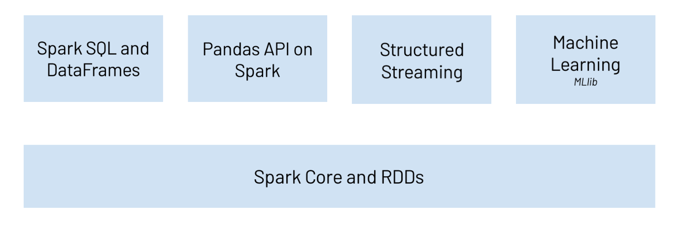

```{r, include=FALSE,warning=FALSE,message=FALSE}
options(htmltools.dir.version = FALSE)
knitr::opts_chunk$set(
  message = FALSE,
  warning = FALSE,
  dev = "svg",
  fig.align = "center",
  #fig.width = 11,
  #fig.height = 5
  cache = TRUE
)

# define vars
om = par("mar")
lowtop = c(om[1],om[2],0.1,om[4])
library(tidyverse)
library(knitr)
library(reticulate)
#use_python("C:\\Users\\jbpost2\\AppData\\Local\\Programs\\Python\\Python310\\python.exe")
use_python("C:\\ProgramData\\Anaconda3\\python.exe")
options(dplyr.print_min = 5)
options(reticulate.repl.quiet = TRUE)
```


layout: false
class: title-slide-section-red, middle

# `pyspark`: Spark SQL
Justin Post 

---

# Spark

Spark - Distributed processing software for big data workloads
+ Generally faster than Hadoop's MapReduce (and much more flexible)
+ DAGs make it fault tolerant and improve computational speed


Five major parts to (py)Spark
- Spark Core and RDDs as its foundation
- Spark SQL and DataFrames
- Pandas on Spark
- Spark Structured Streaming
- Spark Machine Learning (MLlib)

```{r, echo = FALSE, fig.align='center', out.width='500px'}

```

---

# Data Object Used by pyspark

**DataFrame** APIs are commonly used in `pyspark`

- DataFrames (think usual relational database table) are created and implemented on top of RDDs

- DataFrames are stored across the cluster

    + When transformations are done, lazy evaluation is used
    + When actions are done, computation starts and results returned

Two major DataFrame APIs in `pyspark`
- [`pandas`-on-Spark](https://spark.apache.org/docs/latest/api/python/reference/pyspark.pandas/index.html) DataFrames through the `pyspark.pandas` module
- [Spark SQL](https://spark.apache.org/docs/latest/api/python/reference/pyspark.sql/index.html) DataFrames through `pyspark.sql` module


---

# Starting a Spark Instance

- Use `pyspark.sql.SparkSession` to create a spark instance (or link to an existing one)

```{python, eval = FALSE}
from pyspark.sql import SparkSession
spark = SparkSession.builder.master('local[*]').appName('my_app').getOrCreate()
```


---

# Starting a Spark Instance

- Use `pyspark.sql.SparkSession` to create a spark instance (or link to an existing one)

```{python, eval = FALSE}
from pyspark.sql import SparkSession
spark = SparkSession.builder.master('local[*]').appName('my_app').getOrCreate()
```

By the way, you may also see a few other ways of creating a spark instance

- `sparkContext()`: now this is created when you run `SparkSession`
- `SQLContext()`: legacy way to create an SQL context
- `HiveContext()`: legacy way to connect to a Hive database

If you are reading tutorials, these (and a few others) can mostly be handled through `SparkSession()`


---

# Creating a Spark SQL DataFrame

- Create a DataFrame using `pyspark.sql.spark.createDataFrame()`
- Can specify the data by `Row()` and infer the **schema**

```{python, eval = FALSE}
from pyspark.sql import Row
from datetime import datetime, date
df = spark.createDataFrame([
    Row(a=1, b=2., c='string1', d=date(2000, 1, 1), e=datetime(2000, 1, 1, 12, 0)),
    Row(a=2, b=3., c='string2', d=date(2000, 2, 1), e=datetime(2000, 1, 2, 12, 0)),
    Row(a=4, b=5., c='string3', d=date(2000, 3, 1), e=datetime(2000, 1, 3, 12, 0))
])
df
```
<pre>DataFrame[a: bigint, b: double, c: string, d: date, e: timestamp]</pre>

---

# Creating a Spark SQL DataFrame

- Create a DataFrame using `pyspark.sql.spark.createDataFrame()`
- Can specify the data and schema explicitly 

```{python, eval = FALSE}
df = spark.createDataFrame([
    (1, 2., 'string1', date(2000, 1, 1), datetime(2000, 1, 1, 12, 0)),
    (2, 3., 'string2', date(2000, 2, 1), datetime(2000, 1, 2, 12, 0)),
    (3, 4., 'string3', date(2000, 3, 1), datetime(2000, 1, 3, 12, 0))
], schema='a long, b double, c string, d date, e timestamp')
df
```
<pre>DataFrame[a: bigint, b: double, c: string, d: date, e: timestamp]</pre>


---

# Creating a Spark SQL DataFrame

- Create a DataFrame using `pyspark.sql.spark.createDataFrame()`
- Can read data in directly in from a file
```{python, eval = FALSE}
df = spark.read.load("data/neuralgia.csv",
                     format="csv", 
                     sep=",", 
                     inferSchema="true", 
                     header="true")
df
```
<pre>df: DataFrame[Treatment: string, Sex: string, Age: int, Duration: int, Pain: string]</pre>


---

# Creating a Spark SQL DataFrame

- Create a DataFrame using `pyspark.sql.spark.createDataFrame()`
- Can read data in directly in from a file
```{python, eval = FALSE}
df = spark.read.load("data/neuralgia.csv",
                     format="csv", 
                     sep=",", 
                     inferSchema="true", 
                     header="true")
df
```
<pre>df: DataFrame[Treatment: string, Sex: string, Age: int, Duration: int, Pain: string]</pre>

- `spark.read.load()` can read in other delimited data, json data, parquet data, and others
- specific functions like `spark.read().csv("path")` also exist


---

# Creating a Spark SQL DataFrame

- Create a DataFrame using `pyspark.sql.spark.createDataFrame()`
- Can create from a (*regular*) `pandas` DataFrame

```{python, eval = FALSE}
import pandas as pd
pandas_df = pd.DataFrame({
    'a': [1, 2, 3],
    'b': [2., 3., 4.],
    'c': ['string1', 'string2', 'string3'],
    'd': [date(2000, 1, 1), date(2000, 2, 1), date(2000, 3, 1)],
    'e': [datetime(2000, 1, 1, 12, 0), datetime(2000, 1, 2, 12, 0), datetime(2000, 1, 3, 12, 0)]
})
df = spark.createDataFrame(pandas_df)
df
```
<pre>df: DataFrame[a: bigint, b: double, c: string, d: date, e: timestamp]</pre>


---

# Note!

You can go back and forth between Spark SQL and pandas-on-Spark DataFrames!

```{python, eval = FALSE}
sdf = spark.read.load("neuralgia.csv",
                     format="csv", 
                     sep=",", 
                     inferSchema="true", 
                     header="true")
type(sdf)
```
<pre>pyspark.sql.dataframe.DataFrame</pre>

```{python, eval = FALSE}
dfps = sdf.pandas_api()
type(dfps)
```
<pre>pyspark.pandas.frame.DataFrame</pre>

```{python, eval = FALSE}
sdf2 = dfps.to_spark()
type(sdf2)
```
<pre>pyspark.sql.dataframe.DataFrame</pre>


---

# Understanding Spark SQL Data Frames

Schema is vital to know (often need to cast to other data types)!

```{python, eval = FALSE}
df.printSchema()
```
<pre>
root
 |-- Treatment: string (nullable = true)
 |-- Sex: string (nullable = true)
 |-- Age: integer (nullable = true)
 |-- Duration: integer (nullable = true)
 |-- Pain: string (nullable = true)
</pre>

---

# Understanding Spark SQL Data Frames

Schema is vital to know (often need to cast to other data types)!

```{python, eval = FALSE}
df.printSchema()
```
<pre>
root
 |-- Treatment: string (nullable = true)
 |-- Sex: string (nullable = true)
 |-- Age: integer (nullable = true)
 |-- Duration: integer (nullable = true)
 |-- Pain: string (nullable = true)
</pre>

Similar to pandas, we can see the columns via an attribute

```{python, eval = FALSE}
df.columns
```
<pre>
['Treatment', 'Sex', 'Age', 'Duration', 'Pain']
</pre>


---

# Common Actions on a Spark SQL Data Frame

- Spark SQL Data Frames act more like RDDs by default

    + When transformations are done, lazy evaluation is used
    + When actions are done, computation starts and results returned
    
---

# Common Actions on a Spark SQL Data Frame

- Spark SQL Data Frames act more like RDDs by default

    + When transformations are done, lazy evaluation is used
    + When actions are done, computation starts and results returned
    
- Common actions to return data
    + `show(n)`, `take(n)`
    + `collect()` (may throw error if data is too big to return!)

```{python, eval = FALSE}
df.show(3)
```

<pre>
+---------+---+---+--------+----+
|Treatment|Sex|Age|Duration|Pain|
+---------+---+---+--------+----+
|        P|  F| 68|       1|  No|
|        B|  M| 74|      16|  No|
|        P|  F| 67|      30|  No|
+---------+---+---+--------+----+
only showing top 3 rows
</pre>


---

# Common Actions on a Spark SQL Data Frame

- Spark SQL Data Frames act more like RDDs by default

    + When transformations are done, lazy evaluation is used
    + When actions are done, computation starts and results returned
    
- Common actions to return data
    + `show(n)`, `take(n)`
    + `collect()` (may throw error if data is too big to return!)

```{python, eval = FALSE}
df.take(3)
```

<pre>
[Row(Treatment='P', Sex='F', Age=68, Duration=1, Pain='No'),
 Row(Treatment='B', Sex='M', Age=74, Duration=16, Pain='No'),
 Row(Treatment='P', Sex='F', Age=67, Duration=30, Pain='No')]
</pre>

- `df.collect()` gives all the rows in this form


---

# Working with Small Data

- If you know you aren't dealing with large data, you can change the lazy evaluation

```{python, eval = FALSE}
spark.conf.set('spark.sql.repl.eagerEval.enabled', True)
```

- Now computation is done immediately and results returned (not recommended generally!)


---

# Common Transformations on a Spark SQL Data Frame

- Selecting and Accessing Data

    - `.select()` method can be used to subset columns

```{python, eval = FALSE}
df.select("Age")
```
<pre>
DataFrame[Age: int]
</pre>  

<ul><ul>  
    <li> Can also reference a column via usual attribute method (different result!)</li>
</ul></ul>

```{python, eval = FALSE}
df.Age
```
<pre>
Column<'Age'>
</pre>


---

# Common Transformations on a Spark SQL Data Frame

- Selecting and Accessing Data

    - Neither `.select()` or `.attribute` method returns the data due to lazy eval!

```{python, eval = FALSE}
df.select("Age", "Pain").show(3)
```
<pre>
+---+----+
|Age|Pain|
+---+----+
| 68|  No|
| 74|  No|
| 67|  No|
+---+----+
only showing top 3 rows
</pre>


---

# Common Transformations on a Spark SQL Data Frame

- Performing Actions on a Column

    - `.withColumn()` method is useful to create a new column from another
    
```{python, eval = FALSE}
df.withColumn("Current_Age", df.Age + 2).show(3)
```
<pre>
+---------+---+---+--------+----+-----------+
|Treatment|Sex|Age|Duration|Pain|Current_Age|
+---------+---+---+--------+----+-----------+
|        P|  F| 68|       1|  No|         70|
|        B|  M| 74|      16|  No|         76|
|        P|  F| 67|      30|  No|         69|
+---------+---+---+--------+----+-----------+
only showing top 3 rows
</pre>


---

layout: false

# Common Transformations on a Spark SQL Data Frame

- Performing Actions on a Column

    - `.withColumn()` method is useful to create a new column from another
    - `.withColumnRenamed()` method can rename a column
    
```{python, eval = FALSE}
from pyspark.sql.functions import col
df \
  .withColumnRenamed('Age', 'Former_Age') \
  .withColumn("Current_Age", col("Former_Age") + 2) \
  .show(3)
```
<pre>
+---------+---+----------+--------+----+-----------+
|Treatment|Sex|Former_Age|Duration|Pain|Current_Age|
+---------+---+----------+--------+----+-----------+
|        P|  F|        68|       1|  No|         70|
|        B|  M|        74|      16|  No|         76|
|        P|  F|        67|      30|  No|         69|
+---------+---+----------+--------+----+-----------+
only showing top 3 rows
</pre>

---


# Transformations on Spark DataFrame via pyspark.sql

- Performing Actions on a Column

    - `.withColumn()` method is useful to create a new column from another
    - [Lots of SQL functions](https://spark.apache.org/docs/latest/api/python/reference/pyspark.sql/functions.html) available
```{python, eval = FALSE}
from pyspark.sql.functions import *
df.withColumn("Age_cat", 
               when(df.Age>75, "75+")
              .when(df.Age>=70, "70-75")
              .otherwise("<70")) \
    .show(3)
```
<pre>
+---------+---+---+--------+----+-------+
|Treatment|Sex|Age|Duration|Pain|Age_cat|
+---------+---+---+--------+----+-------+
|        P|  F| 68|       1|  No|    <70|
|        B|  M| 74|      16|  No|  70-75|
|        P|  F| 67|      30|  No|    <70|
+---------+---+---+--------+----+-------+
only showing top 3 rows
</pre>


---

# Transformations on Spark DataFrame via pyspark.sql

- Performing Actions on a Column

    - `.withColumn()` method is useful to create a new column from another
    - [Lots of SQL functions](https://spark.apache.org/docs/latest/api/python/reference/pyspark.sql/functions.html) available
```{python, eval = FALSE}
df.withColumn("Age_cat", 
               when(df.Age>75, "75+")
              .when(df.Age>=70, "70-75")
              .otherwise("<70")) \
   .withColumn("ln_Duration", log(df.Duration)) \
   .show(3)
```
<pre>
+---------+---+---+--------+----+-------+------------------+
|Treatment|Sex|Age|Duration|Pain|Age_cat|       ln_Duration|
+---------+---+---+--------+----+-------+------------------+
|        P|  F| 68|       1|  No|    <70|               0.0|
|        B|  M| 74|      16|  No|  70-75| 2.772588722239781|
|        P|  F| 67|      30|  No|    <70|3.4011973816621555|
+---------+---+---+--------+----+-------+------------------+
only showing top 3 rows
</pre>


---

# Transformations on Spark DataFrame via pyspark.sql

- Performing Actions on a Column

    - `.withColumn()` method is useful to create a new column from another
    - Create a user defined function (`udf` from `pyspark.sql.functions`)
```{python, eval = FALSE}
code_trt = udf(lambda x: "P Trt" if x == "P" else "Other")
df.withColumn('my_trt', code_trt('Treatment')).show(3)
```
<pre>
+---------+---+---+--------+----+------+
|Treatment|Sex|Age|Duration|Pain|my_trt|
+---------+---+---+--------+----+------+
|        P|  F| 68|       1|  No| P Trt|
|        B|  M| 74|      16|  No| Other|
|        P|  F| 67|      30|  No| P Trt|
+---------+---+---+--------+----+------+
only showing top 3 rows
</pre>


---

# Transformations on Spark DataFrame via pyspark.sql

- Reorder Rows

    - `.sort()` can reorder your rows
    
```{python, eval = FALSE}
df.sort(df.Duration).show(3)
```
<pre>
+---------+---+---+--------+----+
|Treatment|Sex|Age|Duration|Pain|
+---------+---+---+--------+----+
|        A|  M| 69|       1|  No|
|        B|  M| 70|       1|  No|
|        B|  F| 78|       1|  No|
+---------+---+---+--------+----+
only showing top 3 rows
</pre>

---

# Transformations on Spark DataFrame via pyspark.sql

- Reorder Rows

    - `.sort()` can reorder your rows
    
```{python, eval = FALSE}
df.sort(df.Duration, ascending = False).show(3)
```
<pre>
+---------+---+---+--------+----+
|Treatment|Sex|Age|Duration|Pain|
+---------+---+---+--------+----+
|        B|  F| 72|      50|  No|
|        A|  M| 62|      42|  No|
|        B|  F| 69|      42|  No|
+---------+---+---+--------+----+
only showing top 3 rows
</pre>


---

# Transformations on Spark DataFrame via pyspark.sql

- Subset Rows with filter

    - `.filter()` method to subset via a condition

```{python, eval = FALSE}
df.filter(df.Age < 65).show(3)
```
<pre>
+---------+---+---+--------+----+
|Treatment|Sex|Age|Duration|Pain|
+---------+---+---+--------+----+
|        A|  F| 63|      27|  No|
|        A|  M| 62|      42|  No|
|        P|  F| 64|       1| Yes|
+---------+---+---+--------+----+
only showing top 3 rows
</pre>


---

# Transformations on Spark DataFrame via pyspark.sql

- We can also do basic summaries!

    - `.describe()` method gives basic info
    
```{python, eval = FALSE}
df.select("Age", "Pain").describe().show()
```
<pre>
+-------+-----------------+----+
|summary|              Age|Pain|
+-------+-----------------+----+
|  count|               60|  60|
|   mean|            70.05|null|
| stddev|5.189379637003748|null|
|    min|               59|  No|
|    max|               83| Yes|
+-------+-----------------+----+
</pre>


---

# Transformations on Spark DataFrame via pyspark.sql

- We can also do basic summaries!

    + `.avg()`, `.sum()`, `.count()`, etc

```{python, eval = FALSE}
df \
    .select(["Duration", "Age", "Treatment"]) \
    .agg(sum("Duration"), avg("Age"), count("Treatment")) \
    .show()
```
<pre>
+-------------+--------+----------------+
|sum(Duration)|avg(Age)|count(Treatment)|
+-------------+--------+----------------+
|         1004|   70.05|              60|
+-------------+--------+----------------+
</pre>


---

# Transformations on Spark DataFrame via pyspark.sql

- We can also do basic summaries!

    - Can use `.groupBy()` first to get grouped summaries!

```{python, eval = FALSE}
df.select(["Duration", "Age", "Treatment"]) \
    .groupBy("Treatment") \
    .sum() \
    .withColumnRenamed("sum(Duration)", "sum_Duration") \
    .withColumnRenamed("sum(Age)", "sum_Age") \
    .show()
```
<pre>
+---------+------------+-------+
|Treatment|sum_Duration|sum_Age|
+---------+------------+-------+
|        B|         386|   1417|
|        A|         327|   1385|
|        P|         291|   1401|
+---------+------------+-------+
</pre>


---

# Using SQL Type Code

- Can make a `View` of an SQL Data Frame and use *standard* SQL type code!

```{python, eval = FALSE}
df.createTempView("df")
spark.sql("SELECT sex, age FROM df LIMIT 4").show()
```
<pre>
+---+---+
|sex|age|
+---+---+
|  F| 68|
|  M| 74|
|  F| 67|
|  M| 66|
+---+---+
</pre>


---

# To Jupyter Lab

- Let's redo our MapReduce example with Spark SQL!


---

# Recap

- Use `SparkSession` to use spark

- **DataFrames** are the commonly used object in `pyspark`
    + DataFrames built on RDDs
    + Lazy eval allows you to build up your transformations and then execute only when an action is performed

- [pandas-on-Spark](https://spark.apache.org/docs/latest/api/python/reference/pyspark.pandas/index.html) DataFrames through the `pyspark.pandas` module

- [Spark SQL](https://spark.apache.org/docs/latest/api/python/reference/pyspark.sql/index.html) DataFrames through `pyspark.sql` module

