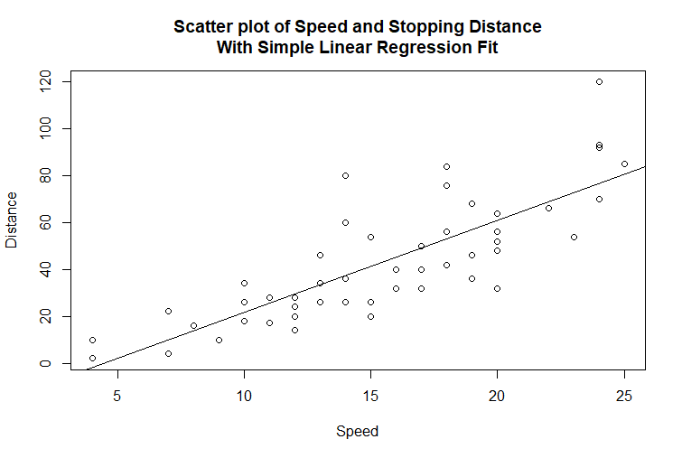

```{r, include=FALSE,warning=FALSE,message=FALSE}
options(htmltools.dir.version = FALSE)
knitr::opts_chunk$set(
  message = FALSE,
  warning = FALSE,
  dev = "svg",
  fig.align = "center",
  #fig.width = 11,
  #fig.height = 5
  cache = TRUE
)

# define vars
om = par("mar")
lowtop = c(om[1],om[2],0.1,om[4])
library(tidyverse)
library(knitr)
library(reticulate)
#use_python("C:\\ProgramData\\Anaconda3\\python.exe")
#use_python("C:\\Users\\jbpost2\\AppData\\Local\\Programs\\Python\\Python310\\python.exe")
use_python("C:\\python\\python.exe")
options(dplyr.print_min = 5)
options(reticulate.repl.quiet = TRUE)
```


layout: false
class: title-slide-section-red, middle

# Modeling Data Recap
Justin Post 

---
layout: true

<div class="my-footer"></div> 

---

# Recap

- Programming in python
- 5 V's of Big Data
    + Volume
    + Variety
    + Velocity
    + Veracity (Variability)
    + Value
- Understanding of the Big Data pipeline and basics of handling Big Data
    + Databases/Data Lakes/Data Warehouses/etc.
    + SQL basics
    + Hadoop
    + Spark
- Now: Modeling (Big) Data


---

# Common Uses for Data

Four major goals with data:
1. Description (EDA)
2. Inference
3. Prediction/Classification
4. Pattern Finding


---

# Statistical Learning

**Statistical learning** - Inference, prediction/classification, and pattern finding

- Supervised learning - a variable (or variables) represents an **output** or **response** of interest

    + May model response and
        - Make **inference** on the model parameters  
        - **predict** a value or **classify** an observation

```{r, echo = FALSE, fig.align='center', out.width='450px'}
knitr::include_graphics("img/tree.png")
```


---

# What is a Statistical Model?

- A mathematical representation of some phenomenon on which you've observed data

- Predictive model used to:

    + *Predict* a **numeric response** 
    + *Classify* an observation into a **category**


---

# What is a Statistical Model?

- A mathematical representation of some phenomenon on which you've observed data

- Predictive model used to:

    + *Predict* a **numeric response** 
    + *Classify* an observation into a **category**


- Common Supervised Learning Models

    + Least Squares Regression  
    + Penalized regression  
    + Generalized linear models  
    + Regression/classification trees  
    + Random forests, boosting, bagging  

... and many more - tons of models!


---

# Fitting a Model

Given a model, we **fit** or **train** it using the data

```{r, echo = FALSE, out.width='500px', fig.align='center'}

```

---

# Fitting a Model

Given a model, we **fit** or **train** it using the data

```{r, echo = FALSE, out.width='500px', fig.align='center'}

```

- Models can be used to yield predicted responses for each observation, call these $\hat{y}_i$


---

# Quantifying How Well the Model Predicts

Need a way to quantify how well our prediction is doing (a model metric)

- For a numeric response, we commonly use squared error loss to evaluate a prediction
$$L(y_i,\hat{y}_i) = (y_i-\hat{y}_i)^2$$


---

# Quantifying How Well the Model Predicts

Need a way to quantify how well our prediction is doing (a model metric)

- For a numeric response, we commonly use squared error loss to evaluate a prediction
$$L(y_i,\hat{y}_i) = (y_i-\hat{y}_i)^2$$

- Use Root Mean Square Error as a metric across all observations
$$RMSE = \sqrt{\frac{1}{n}\sum_{i=1}^{n} L(y_i, \hat{y}_i)} = \sqrt{\frac{1}{n}\sum_{i=1}^{n}(y_i-\hat{y}_i)^2}$$


---

# Quantifying How Well the Model Predicts

Need a way to quantify how well our prediction is doing (a model metric)

- For classification (binary response here), we can look at accuracy 

- Accuracy
$$\frac{\mbox{Sum of correct predictions}}{\mbox{Total number of predictions}}$$


---

# Training vs Test Sets

Ideally we want our model to predict well for observations **it has yet to see**


---

# Training vs Test Sets

Ideally we want our model to predict well for observations **it has yet to see**
- Predictions over the observations used to fit or train the model are called the **training (set) error**

$$\mbox{Training RMSE} = \sqrt{\frac{1}{\mbox{# of obs used to fit model}}\sum_{\mbox{obs used to fit model}}(y-\hat{y})^2}$$

- If we only consider this, we'll have no idea how the model will fare on data it hasn't seen!


---

# Training vs Test Sets
One method is to split the data into a **training set** and **test set**
- On the training set we can fit (or train) our models
- We can then predict for the test set observations and judge effectiveness with RMSE

```{r, echo = FALSE, out.width="600px"}
knitr::include_graphics("img/trainingtest.png")
```


---

# Issues with Trainging vs Test Sets

Why may we not want to just do a basic training/test set?

- If we don't have much data, we aren't using it all when fitting the models

- Data is randomly split into training/test

- Instead, we could consider splitting the data multiple ways and averaging the test error over the results!


---

# Cross-Validation Idea

$k$ fold Cross-Validation (CV)

- Split data into k folds
- Train model on first k-1 folds, find test error on kth fold
- Train model on first k-2 folds and kth fold, find test error on (k-1)st fold
- ...

Find CV error by combining test errors appropriately

---

# Cross-Validation Idea

$k$ fold Cross-Validation (CV)

- Split data into k folds
- Train model on first k-1 folds, find test error on kth fold
- Train model on first k-2 folds and kth fold, find test error on (k-1)st fold
- ...

Find CV error by combining test errors appropriately

- Key = no predictions used in the RMSE were done on data used to train that model!
- Once a best model is chosen, model is refit on entire data set


---

# May Use Both Training/Test & CV

- Recall: LASSO model is similar to an MLR model but shrinks coefficients and may set some to 0
    + Tuning parameter must be chosen (usually by CV)
    

---

# May Use Both Training/Test & CV

- Recall: LASSO model is similar to an MLR model but shrinks coefficients and may set some to 0
    + Tuning parameter must be chosen (usually by CV)
    
- Training/Test split gives us a way to validate our model's performance
    - CV can be used on the training set to select **tuning parameters**
    - Helps determine the 'best' model for a class of models 
    
- With many competing model types, compare best models on test set via our metric


---

# Plan

- May want to review the videos/notebooks from earlier
- Learn more supervised learning methods
- Implement in `sklearn` and `pyspark`
- Consider nuances of different loss functions and model metrics
- See how to use model **pipelines**


```{r, echo = FALSE, out.width='750px', fig.align='center'}
knitr::include_graphics('img/pipeline1.png')
```
