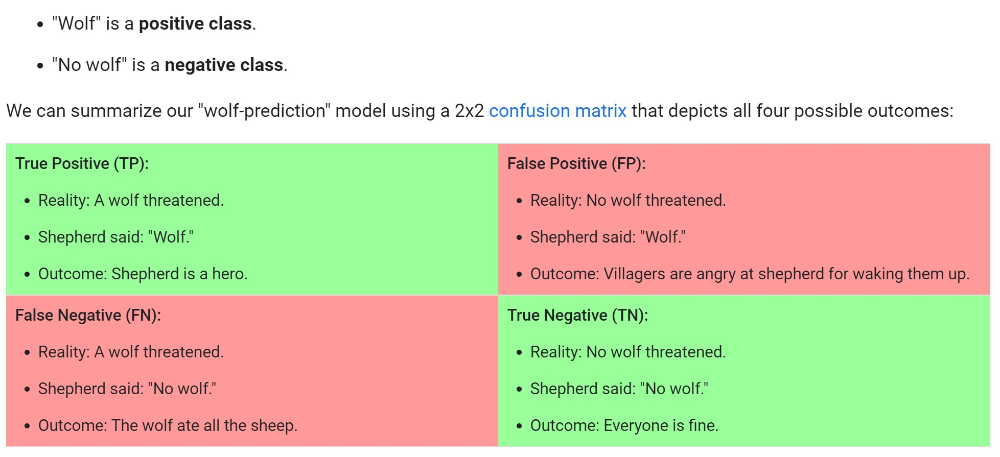

```{r, include=FALSE,warning=FALSE,message=FALSE}
options(htmltools.dir.version = FALSE)
knitr::opts_chunk$set(
  message = FALSE,
  warning = FALSE,
  dev = "svg",
  fig.align = "center",
  #fig.width = 11,
  #fig.height = 5
  cache = TRUE
)

# define vars
om = par("mar")
lowtop = c(om[1],om[2],0.1,om[4])
library(tidyverse)
library(knitr)
library(reticulate)
#use_python("C:\\ProgramData\\Anaconda3\\python.exe")
#use_python("C:\\Users\\jbpost2\\AppData\\Local\\Programs\\Python\\Python310\\python.exe")
use_python("C:\\python\\python.exe")
options(dplyr.print_min = 5)
options(reticulate.repl.quiet = TRUE)
```


layout: false
class: title-slide-section-red, middle

# Loss Functions & Model Performance
Justin Post 

---
layout: true

<div class="my-footer"></div> 


---

# Loss Functions

- Loss functions are the function that we use to **fit** or **train** our model


---

# Loss Functions

- Loss functions are the function that we use to **fit** or **train** our model

- Ex: MLR with minimizing the sum of squared errors

    + Response: $y$ = brozek score
    + Predictors: $x_1$ = age, $x_2$ = height, ...
    
$$\min\limits_{\beta's}\sum_{i=1}^{n}(y_i-(\beta_0+\beta_1x_{1i}+...+\beta_px_{pi}))^2$$


---

# Loss Functions

- Loss functions are the function that we use to **fit** or **train** our model

- Ex: MLR with minimizing the sum of squared errors plus a penalty

    + Response: $y$ = brozek score
    + Predictors: $x_1$ = age, $x_2$ = height, ...
    
$$\min\limits_{\beta's}\sum_{i=1}^{n}(y_i-(\beta_0+\beta_1x_{1i}+...+\beta_px_{pi}))^2 + \alpha\sum_{j=1}^{p}|\beta_j|$$

---

# Loss Functions

- Loss functions are the function that we use to **fit** or **train** our model

- Ex: MLR with minimizing the mean absolute error

    + Response: $y$ = brozek score
    + Predictors: $x_1$ = age, $x_2$ = height, ...
    
$$\min\limits_{\beta's}\sum_{i=1}^{n}\left|y_i-(\beta_0+\beta_1x_{1i}+...+\beta_px_{pi})\right|$$

---

# Loss Functions

- Loss functions are the function that we use to **fit** or **train** our model

- Ex: Logistic Regression with (negative) binary cross entropy

    + Response: $y$ = Potability (1 or 0)
    + Predictors: $x_1$ = Hardness, $x_2$ = Chloramines, ...
    
    
$$\min\limits_{\beta's} = -\sum_{i=1}^{n}(y_i log(p(x_1,...,x_n))+(1-y_i)log(1-p(x_1,...,x_n)))$$
where $p(x_1,...,x_n) = \frac{1}{1+e^{-\beta_0-\beta_1x_{1i}-...-\beta_px_{pi}}}$


---

# Loss Functions

- Loss functions are the function that we use to **fit** or **train** our model

- Ex: Logistic Regression with (negative) binary cross entropy and penalty

    + Response: $y$ = Potability (1 or 0)
    + Predictors: $x_1$ = Hardness, $x_2$ = Chloramines, ...
    
    
$$\min\limits_{\beta's} = -\sum_{i=1}^{n}(y_i log(p(x_1,...,x_n))+(1-y_i)log(1-p(x_1,...,x_n))) + \lambda\sum_{i=1}^{p}\beta_j^2$$
where $p(x_1,...,x_n) = \frac{1}{1+e^{-\beta_0-\beta_1x_{1i}-...-\beta_px_{pi}}}$

---

# Model Metric

- Model metrics are used to determine the quality of the predictions

- Pretty much any loss function can also act as a metric!

    - Often choose to use the same loss function used as the metric


---

# Model Metric

- Model metrics are used to determine the quality of the predictions

- Pretty much any loss function can also act as a metric!

    - Often choose to use the same loss function used as the metric

- Ex: 
    + Fit 'usual' least squares regression (minimize sum of squared errors)
    + Determine quality with RMSE or mean absolute error (MAE)
    
    
---

# Model Metric

- Model metrics are used to determine the quality of the predictions
- Pretty much any loss function can also act as a metric! 
    - Often choose to use the same loss function used as the metric

- Ex: 
    + Fit (MLR) LASSO model (minimize sum of squared errors subject to L1 penalty)
    + Determine quality with RMSE or MAE
    
    

---

# Model Metric

- Model metrics are used to determine the quality of the predictions
- Pretty much any loss function can also act as a metric! 
    - Often choose to use the same loss function used as the metric

- Ex: 
    + Fit Logistic Regression model (minimize (negative) binary cross entropy)
    + Determine quality with (negative) binary cross entropy (`neg_log_loss`) or accuracy
  

---

# Other Commonly Used Model Metrics

For a categorical response, many rely on:

```{r, echo = FALSE, out.width='850px', fig.align='center', fig.cap="From google's ML crash course"}

```

---

# Other Commonly Used Model Metrics

For a categorical response:
- Accuracy = $\frac{TP + TN}{TP+TN+FP+FN}$
- Precision = $\frac{TP}{TP+FP}$
- Recall (or True positive rate, TPR) = $\frac{TP}{TP+FN}$
- False Positive Rate (FPR) = $\frac{FP}{FP+TN}$


---

# Other Commonly Used Model Metrics

For a categorical response:
- Accuracy = $\frac{TP + TN}{TP+TN+FP+FN}$
- Precision = $\frac{TP}{TP+FP}$
- Recall (or True positive rate) = $\frac{TP}{TP+FN}$
- False Positive Rate (FPR) = $\frac{FP}{FP+TN}$

Built off of these ideas 
- Receiver Operating Characteristic (ROC) curve
- Plots FPR vs TPR at different classification thresholds
- Area under ROC curve often used!

---

# Note: Model Selection Without Training/Test

- For a numeric response, these are just calculated on the training data
    - AIC
    - AICc
    - BIC
    - Mallow's Cp
    - Adjusted R-squared

- Can be used to select a model without a training/test split

---

# Recap

- Loss functions are used during model fitting

- Model metrics are used to evaluate a model

    + Can be the same!
    + Often still call it a loss function when using as a metric