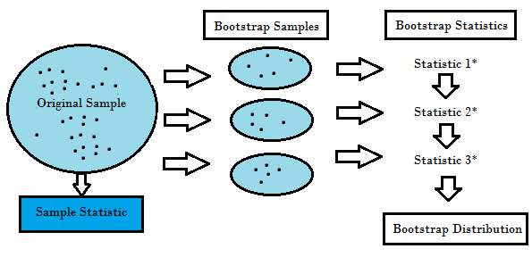

```{r, include=FALSE,warning=FALSE,message=FALSE}
options(htmltools.dir.version = FALSE)
knitr::opts_chunk$set(
  message = FALSE,
  warning = FALSE,
  dev = "svg",
  fig.align = "center",
  #fig.width = 11,
  #fig.height = 5
  cache = FALSE
)

# define vars
om = par("mar")
lowtop = c(om[1],om[2],0.1,om[4])
library(tidyverse)
library(knitr)
library(reticulate)
#use_python("C:\\ProgramData\\Anaconda3\\python.exe")
#use_python("C:\\Users\\jbpost2\\AppData\\Local\\Programs\\Python\\Python310\\python.exe")
use_python("C:\\python\\python.exe")
options(dplyr.print_min = 5)
options(reticulate.repl.quiet = TRUE)
```


layout: false
class: title-slide-section-red, middle

# Bagging Trees & Random Forests
Justin Post 

---
layout: true

<div class="my-footer"></div> 


---

# Recap 

- MLR, Penalized MLR, & Regression Trees
    - Commonly used model with a numeric response

- Logistic Regression, Penalized Logistic Regression, & Classification Trees
    - Commonly used model with a binary response

- MLR & Logistic regression are more structured (linear)
- Trees easier to read but more variable (non-linear)


---

# Prediction with Tree Based Methods

If we care mostly about prediction not interpretation  

- Often use **bootstrapping** to get multiple samples to fit on  
- Can average across many fitted trees  
- Decreases variance over an individual tree fit  

  
 
---

# Prediction with Tree Based Methods

If we care mostly about prediction not interpretation  

- Often use **bootstrapping** to get multiple samples to fit on  
- Can average across many fitted trees  
- Decreases variance over an individual tree fit  
  
Major ensemble tree methods  

1. Bagging (boostrap aggregation)  
2. Random Forests (extends idea of bagging - includes bagging as a special case)  
3. Boosting (*slow* training of trees)  


---

# Bagging  

Bagging = Bootstrap Aggregation - a general method  

Bootstrapping  

- resample from the data (non-parametric) or a fitted model (parameteric)  

- for non-parameteric  

    + treats sample as population  
    + resampling done with replacement  
    + can get same observation multiple times  
    
    
---

# Bagging  

Bagging = Bootstrap Aggregation - a general method  

Bootstrapping  

- resample from the data (non-parametric) or a fitted model (parameteric)  

- for non-parameteric  

    + treats sample as population  
    + resampling done with replacement  
    + can get same observation multiple times  
    
- method or estimation applied to each resample  

- traditionally used to obtain standard errors (measures of variability) or construct confidence intervals  


---

# Non-Parametric Bootstrapping  

```{r, out.width="800px", echo = FALSE, fig.caption = "statisticshowto.datasciencecentral.com"}

```


---

# Bagging  

Process for Regression Trees:  

1. Create a bootstrap sample (same size as actual sample)  

    + `sample(data, size = n, replace = TRUE)`  


---

# Bagging  

Process for Regression Trees:  

1. Create a bootstrap sample (same size as actual sample)  

    + `sample(data, size = n, replace = TRUE)`  
    
2. Train tree on this sample (no pruning necessary)  
    + Call prediction for a given set of $x$ values $\hat{y}^{*1}(x)$


---

# Bagging  

Process for Regression Trees:  

1. Create a bootstrap sample (same size as actual sample)  

    + `sample(data, size = n, replace = TRUE)`  
    
2. Train tree on this sample (no pruning necessary)  
    + Call prediction for a given set of $x$ values $\hat{y}^{*1}(x)$

3. Repeat B = 1000 times (books often say 100, no set mark)  
    + Obtain $\hat{y}^{*j}(x)$, $j = 1, ..., B$  
    
    
---

# Bagging  

Process for Regression Trees:  

1. Create a bootstrap sample (same size as actual sample)  
    + `sample(data, size = n, replace = TRUE)`  
    
2. Train tree on this sample (no pruning necessary)  
    + Call prediction for a given set of $x$ values $\hat{y}^{*1}(x)$

3. Repeat B = 1000 times (books often say 100, no set mark)  
    + Obtain $\hat{y}^{*j}(x)$, $j = 1, ..., B$  
    
4. Final prediction is average of these predictions  
    + $\hat{y}(x) = \frac{1}{B}\sum_{j=1}^{B} \hat{y}^{*j}(x)$  
    
    
---

# Bagging  

For Classification Trees:  

1. Create a bootstrap sample (same size as actual sample)  
    + `sample(data, size = n, replace = TRUE)`  
    
2. Train tree on this sample (no pruning necessary)  
    + Call class prediction for a given set of $x$ values $\hat{y}^{*1}(x)$

3. Repeat B = 1000 times (books often say 100, no set mark)  
    + Obtain $\hat{y}^{*j}(x)$, $j = 1, ..., B$  


---

# Bagging  

For Classification Trees:  

1. Create a bootstrap sample (same size as actual sample)  
    + `sample(data, size = n, replace = TRUE)`  
    
2. Train tree on this sample (no pruning necessary)  
    + Call class prediction for a given set of $x$ values $\hat{y}^{*1}(x)$

3. Repeat B = 1000 times (books often say 100, no set mark)  
    + Obtain $\hat{y}^{*j}(x)$, $j = 1, ..., B$  

4. (One option) Use **majority vote** as final classification prediction (i.e. use most common prediction made by all bootstrap trees)  


---

layout: false

# Bagging Example  

```{python}
import pandas as pd
import numpy as np
import matplotlib.pyplot as plt
bike_data = pd.read_csv("data/bikeDetails.csv")
#create response and new predictor
bike_data['log_selling_price'] = np.log(bike_data['selling_price'])
bike_data['log_km_driven'] = np.log(bike_data['km_driven'])
#Add a Categorical Predictor via a Dummy Variable
bike_data["one_owner"] = pd.get_dummies(bike_data["owner"]).iloc[:,0]
pd.get_dummies(bike_data["owner"])
```


---

# Bagging Example  

- We can use the `RandomForestRegressor` function with `max_features` set to `None`
- No tuning parameters really needed. Can set `max_depth` or `min_samples_leaf` as before 
- Default says to train on 100 trees (bootstrap samples)

```{python}
from sklearn.ensemble import RandomForestRegressor
bag_tree = RandomForestRegressor(max_features = None, n_estimators = 500)
```

---

# Bagging Example  

- We can use the `RandomForestRegressor` function with `max_features` set to `None`
- No tuning parameters really needed. Can set `max_depth` or `min_samples_leaf` as before 
- Default says to train on 100 trees (bootstrap samples)

```{python, eval = FALSE}
from sklearn.ensemble import RandomForestRegressor
bag_tree = RandomForestRegressor(max_features = None, n_estimators = 500)
bag_tree.fit(bike_data[['log_km_driven', 'year']], 
             bike_data['log_selling_price'])
```
             
```{python, include = FALSE}
from sklearn.ensemble import RandomForestRegressor
bag_tree = RandomForestRegressor(max_features = None, n_estimators = 500)
bag_tree.fit(bike_data[['log_km_driven', 'year']], 
             bike_data['log_selling_price'])
```


---

# Bagging Example  

- We can use the `RandomForestRegressor` function with `max_features` set to `None`
- No tuning parameters really needed. Can set `max_depth` or `min_samples_leaf` as before 
- Default says to train on 100 trees (bootstrap samples)

```{python, eval = FALSE}
from sklearn.ensemble import RandomForestRegressor
bag_tree = RandomForestRegressor(max_features = None, n_estimators = 500)
bag_tree.fit(bike_data[['log_km_driven', 'year']], 
             bike_data['log_selling_price'])
```

- Still predict with `.predict()`

```{python}
print(bag_tree.predict(np.array([[9.5, 1990], [9.5, 2015], [10.6, 1990], [10.6, 2015]])))
print(np.exp(bag_tree.predict(np.array([[9.5, 1990], [9.5, 2015], [10.6, 1990], [10.6, 2015]]))))
```


---

# Bagging Example  

- Can look at variable importance measure 

```{python fig.align='center', message=FALSE, warning=FALSE, out.width="350px"}
bag_tree.feature_importances_
plt.barh(bike_data.columns[[8,2]], bag_tree.feature_importances_); plt.xlabel("Importance");plt.show()
```


---

# Bagging Example  

- Fit the bagged tree model

```{python, eval = FALSE}
bag_tree2 = RandomForestRegressor(max_features = None, n_estimators = 500)
bag_tree2.fit(bike_data[['log_km_driven', 'year', 'one_owner']], 
             bike_data['log_selling_price'])
```

```{python, include = FALSE}
bag_tree2 = RandomForestRegressor(max_features = None, n_estimators = 500)
bag_tree2.fit(bike_data[['log_km_driven', 'year', 'one_owner']], 
             bike_data['log_selling_price'])
```

- Compare predictions between models

```{python}
to_predict = np.array([[9.5, 1990, 1], [9.5, 1990, 0], [9.5, 2000, 1], [9.5, 2000, 0]])
pred_compare = pd.DataFrame(zip(bag_tree.predict(to_predict[:,0:2]), bag_tree2.predict(to_predict)), 
                            columns = ["No Cat", "Cat"])
pd.concat([pred_compare, np.exp(pred_compare)], axis = 1)
```


---

# Variable Importance

```{python fig.align='center', message=FALSE, warning=FALSE, out.width="400px"}
plt.barh(bike_data.columns[[8,2, 9]], bag_tree2.feature_importances_); plt.xlabel("Importance");plt.show()
```


---

# Compare CV Error of Bagged Tree to Other Models

```{python}
from sklearn.model_selection import GridSearchCV, cross_validate
from sklearn.linear_model import LinearRegression
from sklearn.tree import DecisionTreeRegressor
bag_cv = cross_validate(RandomForestRegressor(n_estimators = 500, max_depth = 4, min_samples_leaf = 10),
                        bike_data[['log_km_driven', 'year', 'one_owner']], 
                        bike_data['log_selling_price'], cv = 5, scoring = "neg_mean_squared_error")
```

---

# Compare CV Error of Bagged Tree to Other Models


```{python, eval = FALSE}
from sklearn.model_selection import GridSearchCV, cross_validate
from sklearn.linear_model import LinearRegression
from sklearn.tree import DecisionTreeRegressor
bag_cv = cross_validate(RandomForestRegressor(n_estimators = 500, max_depth = 4, min_samples_leaf = 10),
                        bike_data[['log_km_driven', 'year', 'one_owner']], 
                        bike_data['log_selling_price'], cv = 5, scoring = "neg_mean_squared_error")
```

```{python}
rtree_tune = GridSearchCV(DecisionTreeRegressor(),
                            {'max_depth': range(2,15),'min_samples_leaf':[3, 10, 50, 100]}, cv = 5,
                            scoring = "neg_mean_squared_error") \
                            .fit(bike_data[['log_km_driven', 'year', 'one_owner']], 
                                        bike_data['log_selling_price'])
rtree_cv = cross_validate(rtree_tune.best_estimator_,
                        bike_data[['log_km_driven', 'year', 'one_owner']], 
                        bike_data['log_selling_price'], cv = 5, scoring = "neg_mean_squared_error")
```

---

# Compare CV Error of Bagged Tree to Other Models


```{python, eval = FALSE}
from sklearn.model_selection import GridSearchCV, cross_validate
from sklearn.linear_model import LinearRegression
from sklearn.tree import DecisionTreeRegressor
bag_cv = cross_validate(RandomForestRegressor(n_estimators = 500, max_depth = 4, min_samples_leaf = 10),
                        bike_data[['log_km_driven', 'year', 'one_owner']], 
                        bike_data['log_selling_price'], cv = 5, scoring = "neg_mean_squared_error")
```

```{python, eval = FALSE}
rtree_tune = GridSearchCV(DecisionTreeRegressor(),
                            {'max_depth': range(2,15),'min_samples_leaf':[3, 10, 50, 100]}, cv = 5,
                            scoring = "neg_mean_squared_error") \
                            .fit(bike_data[['log_km_driven', 'year', 'one_owner']], 
                                        bike_data['log_selling_price'])
rtree_cv = cross_validate(rtree_tune.best_estimator_,
                        bike_data[['log_km_driven', 'year', 'one_owner']], 
                        bike_data['log_selling_price'], cv = 5, scoring = "neg_mean_squared_error")
```

```{python}
mlr_cv = cross_validate(LinearRegression(),
                        bike_data[['log_km_driven', 'year', 'one_owner']], 
                        bike_data['log_selling_price'], cv = 5, scoring = "neg_mean_squared_error")
```


---

# Compare CV Error of Bagged Tree to Other Models


```{python, eval = FALSE}
from sklearn.model_selection import GridSearchCV, cross_validate
from sklearn.linear_model import LinearRegression
from sklearn.tree import DecisionTreeRegressor
bag_cv = cross_validate(RandomForestRegressor(n_estimators = 500, max_depth = 4, min_samples_leaf = 10),
                        bike_data[['log_km_driven', 'year', 'one_owner']], 
                        bike_data['log_selling_price'], cv = 5, scoring = "neg_mean_squared_error")
```

```{python, eval = FALSE}
rtree_tune = GridSearchCV(DecisionTreeRegressor(),
                            {'max_depth': range(2,15),'min_samples_leaf':[3, 10, 50, 100]}, cv = 5,
                            scoring = "neg_mean_squared_error") \
                            .fit(bike_data[['log_km_driven', 'year', 'one_owner']], 
                                        bike_data['log_selling_price'])
rtree_cv = cross_validate(rtree_tune.best_estimator_,
                        bike_data[['log_km_driven', 'year', 'one_owner']], 
                        bike_data['log_selling_price'], cv = 5, scoring = "neg_mean_squared_error")
```

```{python, eval = FALSE}
mlr_cv = cross_validate(LinearRegression(),
                        bike_data[['log_km_driven', 'year', 'one_owner']], 
                        bike_data['log_selling_price'], cv = 5, scoring = "neg_mean_squared_error")
```

```{python}
print(np.sqrt([-sum(bag_cv['test_score'])/5, -sum(rtree_cv['test_score'])/5, -sum(mlr_cv['test_score'])/5]))

```


---

# Prediction with Tree Based Methods

If we care mostly about prediction not interpretation  

- Often use **bootstrapping** to get multiple samples to fit on  
- Can average across many fitted trees  
- Decreases variance over an individual tree fit  
  
 
Major ensemble tree methods  

1. Bagging (boostrap aggregation)  
2. Random Forests (extends idea of bagging - includes bagging as a special case)  
3. Boosting (*slow* training of trees)  


---

# Random Forests  

- Uses same idea as bagging  
- Create multiple trees from bootstrap samples
- Average results  

---

# Random Forests  

- Uses same idea as bagging  
- Create multiple trees from bootstrap samples
- Average results

Difference:  

- Don't use all predictors!
- Consider splits using a random subset of predictors each time


---

# Random Forests  

- Uses same idea as bagging  
- Create multiple trees from bootstrap samples
- Average results  

Difference:  

- Don't use all predictors!
- Consider splits using a random subset of predictors each time

But why?  

- If a really strong predictor exists, every bootstrap tree will probably use it for the first split (2nd split, etc.)
- Makes bagged trees predictions more correlated
- Correlation --> smaller reduction in variance from aggregation


---

# Random Forests  

By randomly selecting a subset of predictors, a good predictor or two won't dominate the tree fits  

- Rules of thumb say use `num_features` = $\sqrt{\mbox{# predictors}}$ (classification) or `num_features` = $\mbox{# predictors}/3$ (regression) (randomly selected) predictors  

- If `num_features` = number of predictors then you have bagging!
    + Default for `RandomForestRegressor()`

- Better to determine `num_features` via CV (or other measure) 


---

# Random Forests  

- Select best random forest model using `GridSearchCV()`

```{python, eval = FALSE}
parameters = {"max_features": range(1,4), "max_depth": [3, 4, 5, 10, 15],'min_samples_leaf':[3, 10, 50, 100]}
rf_tune = GridSearchCV(RandomForestRegressor(n_estimators = 500), 
                       parameters, cv = 5, scoring = "neg_mean_squared_error")
rf_tune.fit(bike_data[['log_km_driven', 'year', 'one_owner']],
            bike_data['log_selling_price'])
```

```{python, include = FALSE}
parameters = {"max_features": range(1,4), "max_depth": [3, 4, 5, 10, 15],'min_samples_leaf':[3, 10, 50, 100]}
rf_tune = GridSearchCV(RandomForestRegressor(n_estimators = 500), 
                       parameters, cv = 5, scoring = "neg_mean_squared_error")
rf_tune.fit(bike_data[['log_km_driven', 'year', 'one_owner']],
            bike_data['log_selling_price'])
```

```{python}
print(rf_tune.best_estimator_)
```

---

# Random Forests  

Compare all model CV errors

```{python}                    
rf_cv = cross_validate(rf_tune.best_estimator_, 
                         bike_data[['log_km_driven', 'year', 'one_owner']], 
                         bike_data['log_selling_price'], cv = 5, 
                         scoring = "neg_mean_squared_error")

print(np.sqrt([-sum(bag_cv['test_score'])/5, -sum(rtree_cv['test_score'])/5, 
               -sum(mlr_cv['test_score'])/5, -sum(rf_cv['test_score'])/5]))
```

---

# Recap

Averaging many trees can greatly improve prediction

- Comes at a loss of interpretability
- Variable importance measures can be used

Bagging 
- Fit many trees on bootstrap samples and combine predictions in some way

Random Forest
- Do bagging but randomly select the predictors to use for each split


