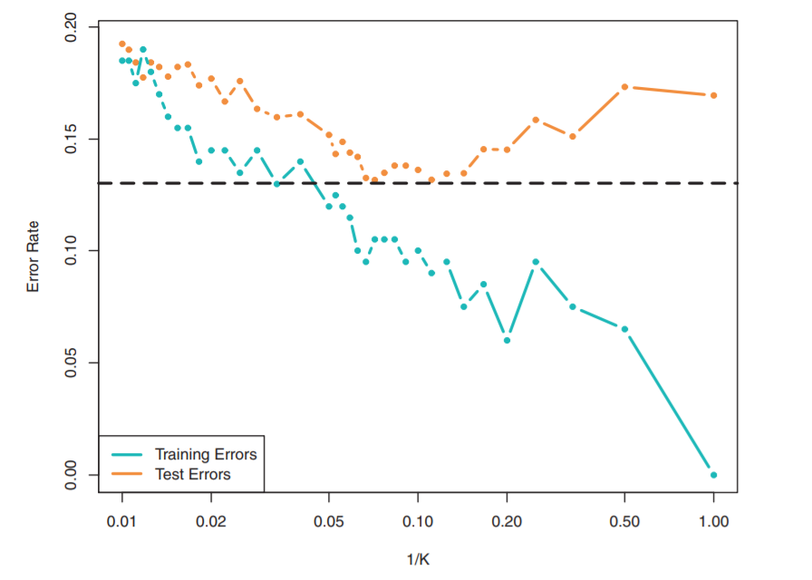
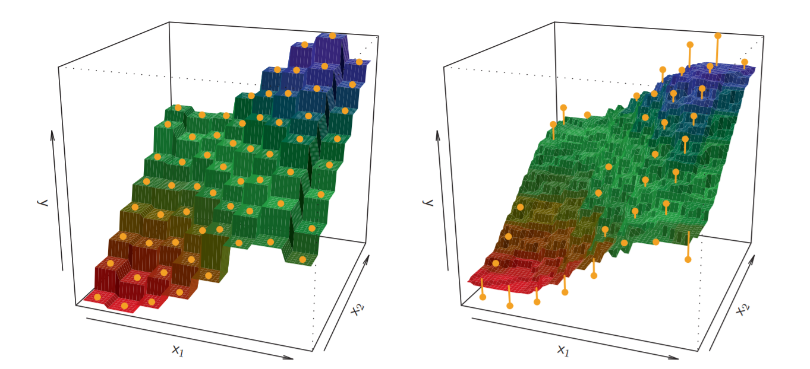

```{r, include=FALSE,warning=FALSE,message=FALSE}
options(htmltools.dir.version = FALSE)
knitr::opts_chunk$set(
  message = FALSE,
  warning = FALSE,
  dev = "svg",
  fig.align = "center",
  #fig.width = 11,
  #fig.height = 5
  cache = FALSE
)

# define vars
om = par("mar")
lowtop = c(om[1],om[2],0.1,om[4])
library(tidyverse)
library(knitr)
library(reticulate)
#use_python("C:\\ProgramData\\Anaconda3\\python.exe")
#use_python("C:\\Users\\jbpost2\\AppData\\Local\\Programs\\Python\\Python310\\python.exe")
use_python("C:\\python\\python.exe")
options(dplyr.print_min = 5)
options(reticulate.repl.quiet = TRUE)
```


layout: false
class: title-slide-section-red, middle

# k Nearest Neighbors
Justin Post 


---

# Recap 

- MLR, Penalized MLR, & Regression Trees
    - Commonly used model with a numeric response

- Logistic Regression, Penalized Logistic Regression, & Classification Trees
    - Commonly used model with a binary response

- MLR & Logistic regression are more structured (linear)
- Trees easier to read but more variable (non-linear)

- Ensemble trees can greatly improve predictions in some cases (but you lose interpretability)


---

# Recap 

- MLR, Penalized MLR, & Regression Trees
    - Commonly used model with a numeric response

- Logistic Regression, Penalized Logistic Regression, & Classification Trees
    - Commonly used model with a binary response

- MLR & Logistic regression are more structured (linear)
- Trees easier to read but more variable (non-linear)

- Ensemble trees can greatly improve predictions in some cases (but you lose interpretability)

Now: k Nearest Neighbors (kNN) - another non-linear method for prediction/classification


---

# kNN (Classification)

Suppose you have two **numeric** predictors and a categorical response (red or blue)

```{r, echo = FALSE, out.width='450px', fig.align = 'center'}
library("ElemStatLearn")
train <- mixture.example$x
trainclass <- mixture.example$y
test <- mixture.example$xnew
pts1 <- mixture.example$px1
pts2 <- mixture.example$px2
plot(train, asp = 1, type = "n", xlab = "x1", ylab = "x2", 
         xlim = range(pts2), ylim = range(pts2))
points(train, col = ifelse(trainclass == 1, "coral", "cornflowerblue"), cex = 1.5, pch = 21, lwd = 2)
```

---

# kNN (Classification)

Want to predict class membership (red or blue) based on (x1, x2) combination  

kNN algorithm:
- Use "closest" k observations from training set to predict class

- Often Euclidean distance used: $ob_1 = (x_{11}, x_{21})$, $ob_2 = (x_{12}, x_{22})$ then $d(ob_1, ob_2) = \sqrt{(x_{11}-x_{12})^2+(x_{21}-x_{22})^2}$)


---

# kNN (Classification)

Want to predict class membership (red or blue) based on (x1, x2) combination  

kNN algorithm:
- Use "closest" k observations from training set to predict class
- Often Euclidean distance used: $ob_1 = (x_{11}, x_{21})$, $ob_2 = (x_{12}, x_{22})$ then $d(ob_1, ob_2) = \sqrt{(x_{11}-x_{12})^2+(x_{21}-x_{22})^2}$)

- Find estimates:
$$P(red|x1,x2) = \mbox{proportion of k closest values that are red}$$
$$P(blue|x1,x2) = \mbox{proportion of k closest values that are blue}$$

---

# kNN (Classification)

Want to predict class membership (red or blue) based on (x1, x2) combination  

kNN algorithm:
- Use "closest" k observations from training set to predict class 
- Often Euclidean distance used: $ob_1 = (x_{11}, x_{21})$, $ob_2 = (x_{12}, x_{22})$ then $d(ob_1, ob_2) = \sqrt{(x_{11}-x_{12})^2+(x_{21}-x_{22})^2}$)

- Find estimates:
$$P(red|x1,x2) = \mbox{proportion of k closest values that are red}$$
$$P(blue|x1,x2) = \mbox{proportion of k closest values that are blue}$$

- Classify (predict) to class with highest probability
- [App here: https://shiny.stat.ncsu.edu/jbpost2/knn/](https://shiny.stat.ncsu.edu/jbpost2/knn/)


---

# kNN $k$ value

- Small $k$ implies flexible (possibly overfit, higher variance)    
     + Training error will be small, may not extend to testing error  
     
- Large $k$ implies more rigid (possibly underfit, lower variance)  


---

# kNN $k$ value

- Small $k$ implies flexible (possibly overfit, higher variance)    
     + Training error will be small, may not extend to testing error  
     
- Large $k$ implies more rigid (possibly underfit, lower variance)  

```{r, echo = FALSE, out.width = "500px"}

```

Courtesy: Introduction to Statistical Learning  


---

# kNN for Regression   

- Same idea!
    + Use average of responses of "closest" $k$ observations in training set as prediction  
    + Closest again often Euclidean distance

- Note: Should usually standardize predictors (center/scale) any time you use 'distance' as scale becomes important 

---

```{r, echo = FALSE, out.width="900px"}

```

From: Introduction to Statistical Learning  
$k$ = 1 on the left, $k$ = 9 on the right 


---

# More than Two Predictors

- Must all be numeric unless you develop or use a 'distance' measure that is appropriate for categorical data


---

# More than Two Predictors

- Must all be numeric unless you develop or use a 'distance' measure that is appropriate for categorical data

- For all numeric data, Euclidean distance extends easily and is the default!

$$ob_1 = (x_{11}, x_{21}, ..., x_{p1}), ob_2 = (x_{12}, x_{22}, ..., x_{p2})$$

$$D(ob_1, ob_2) = \sqrt{\sum_{i=1}^{p}(x_{i1}-x_{i2})^2}$$


---

# Visualize Fit vs SLR

- Consider `bike_data` we've used and `ex_showroom_price` as a predictor of `selling_price`

```{r, echo = FALSE, out.width = "450px", fig.align='center'}
train <- read_csv("data/bikeDetails.csv")
#create response and new predictor
train$log_selling_price <- log(train$selling_price)
train$log_km_driven <- log(train$km_driven)

fitSLR <- lm(log_selling_price ~ log_km_driven, data = train)
ggplot(train, aes(x = log_km_driven, y = log_selling_price)) +
  geom_point() +
  geom_smooth(method = "lm", se = FALSE)
```


---

# Visualize Fit vs SLR

- SLR vs kNN with $k = 1$

```{r, echo = FALSE, out.width = "450px", fig.align='center'}
#Let's now fit the kNN model using a few values of $k$.
library("caret")
k <- 1
kNNFit1 <- train(log_selling_price ~ log_km_driven, 
      data = train, 
      method = "knn", 
      tuneGrid = data.frame(k =k)
      )

grid <- data.frame(log_km_driven = seq(5.8, 13.7, length = 10000))
kNNPred <- predict(kNNFit1, grid)

#plot with overlay
plot(x = train$log_km_driven, y= train$log_selling_price, main = "kNN predictions vs SLR", xlab = "log km driven", ylab = "log selling price")
    lines(x = grid$log_km_driven, y = kNNPred, type = "S", lwd = 2)
    #add linear fit
    abline(fitSLR)
```

---

# Visualize Fit vs SLR

- SLR vs kNN with $k = 10$

```{r, echo = FALSE, out.width = "450px", fig.align='center'}
k <- 10
kNNFit1 <- train(log_selling_price ~ log_km_driven, 
      data = train, 
      method = "knn", 
      tuneGrid = data.frame(k =k)
      )

grid <- data.frame(log_km_driven = seq(5.8, 13.7, length = 10000))
kNNPred <- predict(kNNFit1, grid)

#plot with overlay
plot(x = train$log_km_driven, y= train$log_selling_price, main = "kNN predictions vs SLR", xlab = "log km driven", ylab = "log selling price")
    lines(x = grid$log_km_driven, y = kNNPred, type = "S", lwd = 2)
    #add linear fit
    abline(fitSLR)
```

---

# Visualize Fit vs SLR

- SLR vs kNN with $k = 20$

```{r, echo = FALSE, out.width = "450px", fig.align='center'}
k <- 20
kNNFit1 <- train(log_selling_price ~ log_km_driven, 
      data = train, 
      method = "knn", 
      tuneGrid = data.frame(k =k)
      )

grid <- data.frame(log_km_driven = seq(5.8, 13.7, length = 10000))
kNNPred <- predict(kNNFit1, grid)

#plot with overlay
plot(x = train$log_km_driven, y= train$log_selling_price, main = "kNN predictions vs SLR", xlab = "log km driven", ylab = "log selling price")
    lines(x = grid$log_km_driven, y = kNNPred, type = "S", lwd = 2)
    #add linear fit
    abline(fitSLR)
```

---

# Visualize Fit vs SLR

- SLR vs kNN with $k = 50$

```{r, echo = FALSE, out.width = "450px", fig.align='center'}
k <- 50
kNNFit1 <- train(log_selling_price ~ log_km_driven, 
      data = train, 
      method = "knn", 
      tuneGrid = data.frame(k =k)
      )

grid <- data.frame(log_km_driven = seq(5.8, 13.7, length = 10000))
kNNPred <- predict(kNNFit1, grid)

#plot with overlay
plot(x = train$log_km_driven, y= train$log_selling_price, main = "kNN predictions vs SLR", xlab = "log km driven", ylab = "log selling price")
    lines(x = grid$log_km_driven, y = kNNPred, type = "S", lwd = 2)
    #add linear fit
    abline(fitSLR)
```

---

# Visualize Fit vs SLR

- SLR vs kNN with $k = 100$

```{r, echo = FALSE, out.width = "450px", fig.align='center'}
k <- 100
kNNFit1 <- train(log_selling_price ~ log_km_driven, 
      data = train, 
      method = "knn", 
      tuneGrid = data.frame(k =k)
      )

grid <- data.frame(log_km_driven = seq(5.8, 13.7, length = 10000))
kNNPred <- predict(kNNFit1, grid)

#plot with overlay
plot(x = train$log_km_driven, y= train$log_selling_price, main = "kNN predictions vs SLR", xlab = "log km driven", ylab = "log selling price")
    lines(x = grid$log_km_driven, y = kNNPred, type = "S", lwd = 2)
    #add linear fit
    abline(fitSLR)
```


---

# Fitting kNN with `sklearn` 

- Same process as other models
    + Create an instance of the model
    + Use the `.fit()` method
    + Predict with `.predict()`
    
- Of course we likely want to use CV
    + Use `GridSearchCV()`

---

# Fitting kNN with `sklearn` 

```{python}
import pandas as pd
import numpy as np
import matplotlib.pyplot as plt
bike_data = pd.read_csv("data/bikeDetails.csv")
#create response and new predictor
bike_data['log_selling_price'] = np.log(bike_data['selling_price'])
bike_data['log_km_driven'] = np.log(bike_data['km_driven'])
```


---

# Fitting kNN with `sklearn` 

- Fit the model with $k = 3$

```{python, eval = FALSE}
from sklearn.neighbors import KNeighborsRegressor
neigh = KNeighborsRegressor(n_neighbors = 3)
neigh.fit(bike_data[['log_km_driven', 'year']], 
             bike_data['log_selling_price'])
```

```{python, include = FALSE}
from sklearn.neighbors import KNeighborsRegressor
neigh = KNeighborsRegressor(n_neighbors = 3)
neigh.fit(bike_data[['log_km_driven', 'year']], 
             bike_data['log_selling_price'])
```

---

# Fitting kNN with `sklearn` 

- Fit the model with $k = 3$

```{python, eval = FALSE}
from sklearn.neighbors import KNeighborsRegressor
neigh = KNeighborsRegressor(n_neighbors = 3)
neigh.fit(bike_data[['log_km_driven', 'year']], 
             bike_data['log_selling_price'])
```

- Compare predictions with the Bagged tree model

```{python, include = FALSE}
from sklearn.ensemble import RandomForestRegressor
bag_tree = RandomForestRegressor(max_features = None, n_estimators = 500)
bag_tree.fit(bike_data[['log_km_driven', 'year']], 
             bike_data['log_selling_price'])
```

```{python, eval = FALSE}
from sklearn.ensemble import RandomForestRegressor
bag_tree = RandomForestRegressor(max_features = None, n_estimators = 500)
bag_tree.fit(bike_data[['log_km_driven', 'year']], 
             bike_data['log_selling_price'])
```

---

# Fitting kNN with `sklearn` 

- Fit the model with $k = 3$

```{python, eval = FALSE}
from sklearn.neighbors import KNeighborsRegressor
neigh = KNeighborsRegressor(n_neighbors = 3)
neigh.fit(bike_data[['log_km_driven', 'year']], 
             bike_data['log_selling_price'])
```

- Compare predictions with the Bagged tree model

```{python, eval = FALSE}
from sklearn.ensemble import RandomForestRegressor
bag_tree = RandomForestRegressor(max_features = None, n_estimators = 500)
bag_tree.fit(bike_data[['log_km_driven', 'year']], 
             bike_data['log_selling_price'])
```

```{python, echo = FALSE}
log_km_driven = [9.5, 9.5, 10.6, 10.6]
year = [1990, 2015, 1990, 2015]
preds = pd.DataFrame(zip(log_km_driven, year), columns = ["log_km_driven", "year"])
bag_pred = np.exp(bag_tree.predict(preds))
neigh_pred = np.exp(neigh.predict(preds))
preds.join(pd.DataFrame(zip(bag_pred, neigh_pred), columns = ["bagged_preds", "kNN_preds"]))
```

---

# `GridSearchCV`

- No 'built-in' CV function
- Use `GridSearchCV()`

---

# `GridSearchCV`

- No 'built-in' CV function
- Use `GridSearchCV()`

```{python}
from sklearn.model_selection import GridSearchCV
k_range = list(range(1, 100))
param_grid = dict(n_neighbors=k_range)
  # defining parameter range
grid = GridSearchCV(KNeighborsRegressor(), 
                    param_grid, 
                    cv=5, 
                    scoring='neg_root_mean_squared_error')
```


---

# `GridSearchCV`

- No 'built-in' CV function
- Use `GridSearchCV()`

```{python, eval = FALSE}
from sklearn.model_selection import GridSearchCV
k_range = list(range(1, 100))
param_grid = dict(n_neighbors=k_range)
  # defining parameter range
grid = GridSearchCV(KNeighborsRegressor(), 
                    param_grid, 
                    cv=5, 
                    scoring='neg_root_mean_squared_error')
```

```{python, include = FALSE}
grid.fit(bike_data[['log_km_driven', 'year']], 
             bike_data['log_selling_price'])
```

```{python, eval = FALSE}
grid.fit(bike_data[['log_km_driven', 'year']], 
             bike_data['log_selling_price'])
```
```{python}
print(grid.best_params_)
```


---

# Recap  

- kNN uses k closest observations from the training set for prediction

- Very flexible to not flexible!

- Can be used for both regression and classification problems

    + `KNeighborsRegressor()` or `KNeighborsClassifier()`
    
- CV easily done with `GridSearchCV()`

