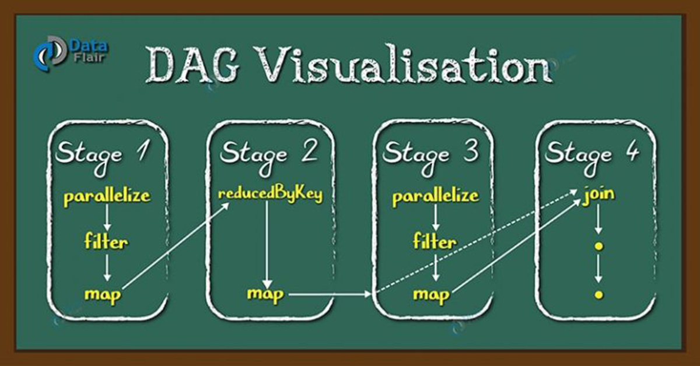
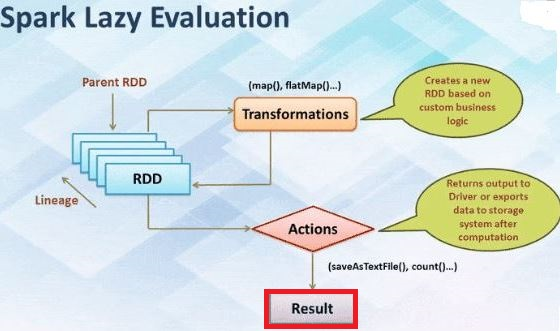

```{r, include=FALSE,warning=FALSE,message=FALSE}
options(htmltools.dir.version = FALSE)
knitr::opts_chunk$set(
  message = FALSE,
  warning = FALSE,
  dev = "svg",
  fig.align = "center",
  #fig.width = 11,
  #fig.height = 5
  cache = FALSE
)

# define vars
om = par("mar")
lowtop = c(om[1],om[2],0.1,om[4])
library(tidyverse)
library(knitr)
library(reticulate)
#use_python("C:\\ProgramData\\Anaconda3\\python.exe")
#use_python("C:\\Users\\jbpost2\\AppData\\Local\\Programs\\Python\\Python310\\python.exe")
use_python("C:\\python\\python.exe")
options(dplyr.print_min = 5)
options(reticulate.repl.quiet = TRUE)
```


layout: false
class: title-slide-section-red, middle

# Spark MLlib Basics
Justin Post 

---
layout: true

<div class="my-footer"></div> 

---

# Big Picture

- We've studied the idea of data pipelines
- We've looked at considerations for doing (supervised) modeling and how to judge those models

<div style = "float:left">
Next up:
<ul>
  <li> Using Spark to do our modeling</li>
  <li> Understanding model pipelines</li>
  <li> Documenting the model building process</li>
  <li> Practical considerations for ML and big data</li>
  <li> Streaming Data</li>
</ul>
</div>
<div style = "float:right">
```{r echo = FALSE, fig.align = 'center', out.width = '450px'}
knitr::include_graphics("img/ml-engineering.jpg")
```
</div>

---

# Spark Recap

Create a **Spark Session** in `pyspark`

Defines:

- Cluster and workers
- Spark coordinator (i.e. the **Driver**)
- Name of the app

```{python, eval = FALSE}
from pyspark.sql import SparkSession
spark = SparkSession.builder.master('local[*]').appName('my_app').getOrCreate()
```


---

# Spark Recap

Spark handles big data and is fault tolerant!

- Turns transformations and actions into a directed acyclic graph (DAG) that allows computation to be picked back up if something fails

```{r, echo = FALSE, fig.align='center', out.width="450px"}

```

---

# Spark Recap

- [All transformations in Spark](https://spark.apache.org/docs/latest/rdd-programming-guide.html) are _lazy_
- **Transformations** are built up and computation done only when needed

- Makes computation faster!
    + Spark can realize a dataset created through map will be used in a reduce and return only the result of the reduce rather than the larger mapped dataset

```{r, echo = FALSE, fig.align='center', out.width="400px"}

```


---

# Spark Recap

Two major DataFrame APIs in `pyspark`
- [pandas-on-Spark](https://spark.apache.org/docs/3.3.1/api/python/reference/pyspark.pandas/index.html) DataFrames through the `pyspark.pandas` module
- [Spark SQL](https://spark.apache.org/docs/3.3.1/api/python/reference/pyspark.sql.html) DataFrames through `pyspark.sql` module

---

# Spark Recap

Two major DataFrame APIs in `pyspark`
- [pandas-on-Spark](https://spark.apache.org/docs/3.3.1/api/python/reference/pyspark.pandas/index.html) DataFrames through the `pyspark.pandas` module
- [Spark SQL](https://spark.apache.org/docs/3.3.1/api/python/reference/pyspark.sql.html) DataFrames through `pyspark.sql` module

Recommended to use spark SQL for machine learning!

- Common actions to return data
    + `show(n)`, `take(n)`, `collect()` 
- Common transformations done with [SQL like functions](https://spark.apache.org/docs/3.3.1/api/python/reference/pyspark.sql/functions.html)

```{python, eval = FALSE}
from pyspark.sql.functions import *
df.withColumn("Age_cat", 
               when(df.Age>75, "75+")
              .when(df.Age>=70, "70-75")
              .otherwise("<70"))
```


---

# Spark `MLlib`

`MLlib` allows for fitting ML models in spark!

```{r, echo = FALSE, out.width="500px", fig.align='center'}

```

- Syntax of model fitting, CV, etc. very similar to `sklearn`!


---

# Spark `MLlib`

- Two major components:
    + Transformers (Create polynomials, standardize data, etc.)
    + Estimators (Models)

```{r, echo = FALSE, out.width="650px", fig.align='center'}
knitr::include_graphics("img/pipeline1.png")
```


---

# Spark `MLlib`

- Two major components:
    + Transformers (Create polynomials, standardize data, **models**, etc.)
    + Estimators (Models)

```{r, echo = FALSE, out.width="650px", fig.align='center'}
knitr::include_graphics("img/pipeline2.png")
```

---

# How to fit an ML Model in Spark?

- Setting up response and predictors is different:

    + Create a `label` column which represents the response
    + Create a `features` column with all of the predictors in it!

---

# How to fit an ML Model in Spark?

- Setting up response and predictors is different:

    + Create a `label` column which represents the response
    + Create a `features` column with all of the predictors in it!

- Many functions with a `.transform()` method
```{python, eval = FALSE}
from pyspark.ml.feature import SQLTransformer
sqlTrans = SQLTransformer(statement = "SELECT year, log(km_driven) as log_km_driven FROM __THIS__")
sqlTrans.transform(bike)
```


---

# How to fit an ML Model in Spark?

- Setting up response and predictors is different:
    + Create a `label` column which represents the response
    + Create a `features` column with all of the predictors in it!

- Many functions with a `.transform()` method
```{python, eval = FALSE}
from pyspark.ml.feature import SQLTransformer
sqlTrans = SQLTransformer(statement = "SELECT year, log(km_driven) as log_km_driven FROM __THIS__")
sqlTrans.transform(bike)
```

- Models and CV function have a `.fit()` method (once fitted a `.transform()` method too!)
```{python, eval = FALSE}
from pyspark.ml.regression import LinearRegression
lr = LinearRegression(regParam = 0, elasticNetParam = 0).fit(...)
```


---

# Jump Into Pyspark!

- Go through basic example of fitting a linear regression model in Spark `MLlib`

---

# Recap

- Setting up response and predictors:
    + Create a `label` column which represents the response
    + Create a `features` column with all of the predictors in it!

- Many functions with a `.transform()` method
- Models and CV function have a `.fit()` method (once fitted a `.transform()` method too!)

