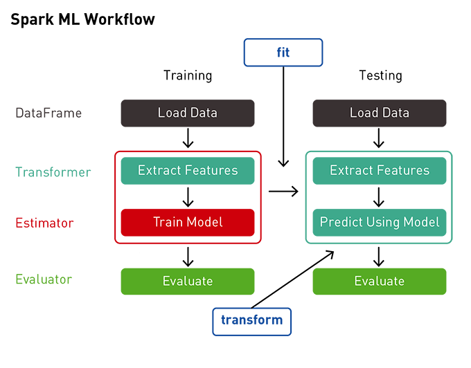

```{r, include=FALSE,warning=FALSE,message=FALSE}
options(htmltools.dir.version = FALSE)
knitr::opts_chunk$set(
  message = FALSE,
  warning = FALSE,
  dev = "svg",
  fig.align = "center",
  #fig.width = 11,
  #fig.height = 5
  cache = FALSE
)

# define vars
om = par("mar")
lowtop = c(om[1],om[2],0.1,om[4])
library(tidyverse)
library(knitr)
library(reticulate)
#use_python("C:\\ProgramData\\Anaconda3\\python.exe")
#use_python("C:\\Users\\jbpost2\\AppData\\Local\\Programs\\Python\\Python310\\python.exe")
use_python("C:\\python\\python.exe")
options(dplyr.print_min = 5)
options(reticulate.repl.quiet = TRUE)
```


layout: false
class: title-slide-section-red, middle

# Model Pipelines in `MLlib`
Justin Post 

---
layout: true

<div class="my-footer"></div> 

---

# `MLlib`

- Allows us to fit our ML models in Spark!

- Setting up response and predictors:
    + Create a `label` column which represents the response
    + Create a `features` column with all of the predictors in it!

- Many functions with a `.transform()` method
- Models and CV function have a `.fit()` method (once fitted a `.transform()` method too!)


```{r, echo = FALSE, out.width="450px", fig.align='center'}
knitr::include_graphics("img/pipeline1.png")
```

---

# CV in `MLlib`

- Similar to `GridSearchCV()` in `sklearn`, `CrossValidator()` allows us to do CV easily!
    - `ParamGridBuilder()` allows us to easily create a grid of tuning parameters
    - Set up `CrossValidator()` object and then use the `.fit()` method!

---

# CV in `MLlib`

- Similar to `GridSearchCV()` in `sklearn`, `CrossValidator()` allows us to do CV easily!
    - `ParamGridBuilder()` allows us to easily create a grid of tuning parameters
    - Set up `CrossValidator()` object and then use the `.fit()` method!

```{python, eval = FALSE}
from pyspark.ml.regression import LinearRegression
from pyspark.ml.tuning import CrossValidator, ParamGridBuilder
from pyspark.ml.evaluation import RegressionEvaluator
```


---

# CV in `MLlib`

- Similar to `GridSearchCV()` in `sklearn`, `CrossValidator()` allows us to do CV easily!
    - `ParamGridBuilder()` allows us to easily create a grid of tuning parameters
    - Set up `CrossValidator()` object and then use the `.fit()` method!

```{python, eval = FALSE}
from pyspark.ml.regression import LinearRegression
from pyspark.ml.tuning import CrossValidator, ParamGridBuilder
from pyspark.ml.evaluation import RegressionEvaluator

lr = LinearRegression()
paramGrid = ParamGridBuilder() \
    .addGrid(lr.regParam, [0, 0.5]) \
    .addGrid(lr.elasticNetParam, [0, 0.2]) \
    .build()
```


---

# CV in `MLlib`

- Similar to `GridSearchCV()` in `sklearn`, `CrossValidator()` allows us to do CV easily!
    - `ParamGridBuilder()` allows us to easily create a grid of tuning parameters
    - Set up `CrossValidator()` object and then use the `.fit()` method!

```{python, eval = FALSE}
from pyspark.ml.regression import LinearRegression
from pyspark.ml.tuning import CrossValidator, ParamGridBuilder
from pyspark.ml.evaluation import RegressionEvaluator

lr = LinearRegression()
paramGrid = ParamGridBuilder() \
    .addGrid(lr.regParam, [0, 0.5]) \
    .addGrid(lr.elasticNetParam, [0, 0.2]) \
    .build()
crossval = CrossValidator(estimator = lr,
                          estimatorParamMaps = paramGrid,
                          evaluator = RegressionEvaluator(metricName='rmse'),
                          numFolds=5) #now use .fit() method on crossval!
```


---

# Pipelines

- Often have many data transformation steps

- Followed by fitting the model

- Then want to use the model to predict!

---

# Pipelines

- Often have many data transformation steps

- Followed by fitting the model

- Then want to use the model to predict!

```{r, echo =FALSE, out.width = '475px', fig.align='center'}

```


---

# Pipelines

- Often have many data transformation steps

- Followed by fitting the model

- Then want to use the model to predict!

- `Pipeline()` allows us to wrap all this into an easy call 

```{python, eval = FALSE}
from pyspark.ml import Pipeline
pipeline = Pipeline(stages = [sqlTrans, assembler, lr])
crossval = CrossValidator(estimator = pipeline,
                          estimatorParamMaps = paramGrid,
                          evaluator = RegressionEvaluator(),
                          numFolds=5)
cvModel = crossval.fit(train)
cvModel.transform(test) #for predictions
```

---

# To `pyspark`

Let's do quick example of CV and using Pipelines in `MLlib`!


---

# Recap

- CV easy to do, similar to `sklearn`

- Pipelines make the process simpler
    + Easy to predict
    + Easy to switch model type
    


