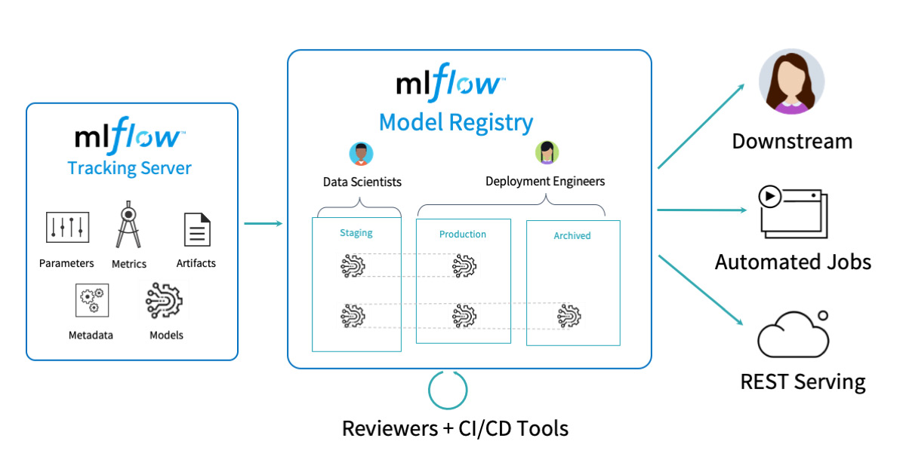
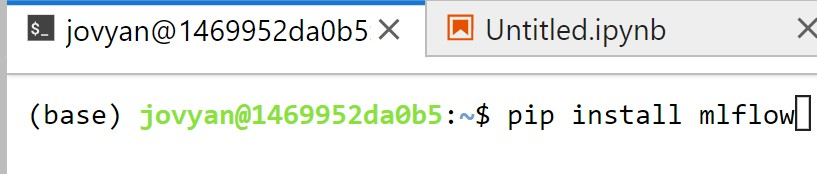

```{r, include=FALSE,warning=FALSE,message=FALSE}
options(htmltools.dir.version = FALSE)
knitr::opts_chunk$set(
  message = FALSE,
  warning = FALSE,
  dev = "svg",
  fig.align = "center",
  #fig.width = 11,
  #fig.height = 5
  cache = FALSE
)

# define vars
om = par("mar")
lowtop = c(om[1],om[2],0.1,om[4])
library(tidyverse)
library(knitr)
library(reticulate)
#use_python("C:\\ProgramData\\Anaconda3\\python.exe")
#use_python("C:\\Users\\jbpost2\\AppData\\Local\\Programs\\Python\\Python310\\python.exe")
use_python("C:\\python\\python.exe")
options(dplyr.print_min = 5)
options(reticulate.repl.quiet = TRUE)
```


layout: false
class: title-slide-section-red, middle

# MLflow
Justin Post 

---
layout: true

<div class="my-footer"></div> 

---

# Documenting Model Fitting Process

- Fitting many models, we should make a log of the results/information!


```{r, out.width='700px', fig.align='center', echo = FALSE}

```


---

# Documenting Model Fitting Process

- Fitting many models, we should make a log of the results/information!

- [`MLflow` is a great package](https://mlflow.org/docs/latest/index.html) that does this and more

    - Not included in our jupyterhub, must install it first
    - Open a new Terminal and run `pip install mlflow` (and perhaps some other things) 

```{r, out.width='500px', fig.align='center', echo = FALSE}

```


---

# `MLflow` Basics

- Let's go through their tutorial to understand the process!


---

# Recap

- `MLflow` gives us a nice way to document the model fitting process

- Has a nice GUI but not easy to use on our jupyterhub

- Can easily convert results into a pandas data frame and inspect!

```{python, eval = FALSE}
import mlflow
mlflow.search_runs(experiment_ids=["0"])
```


