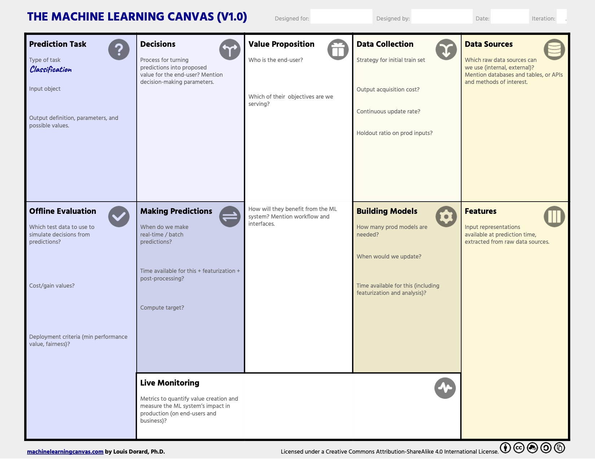
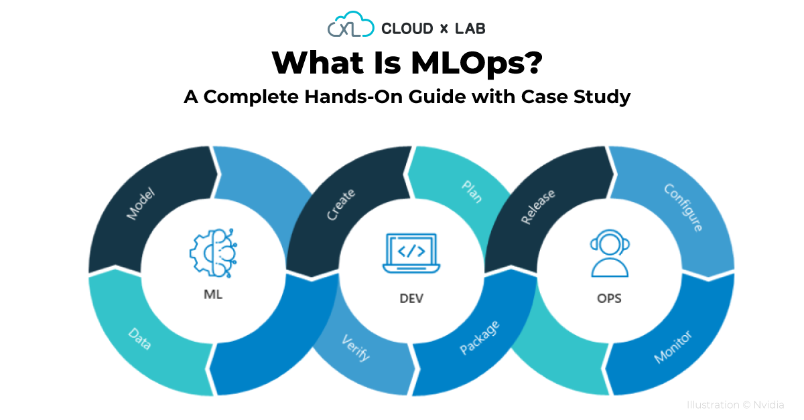
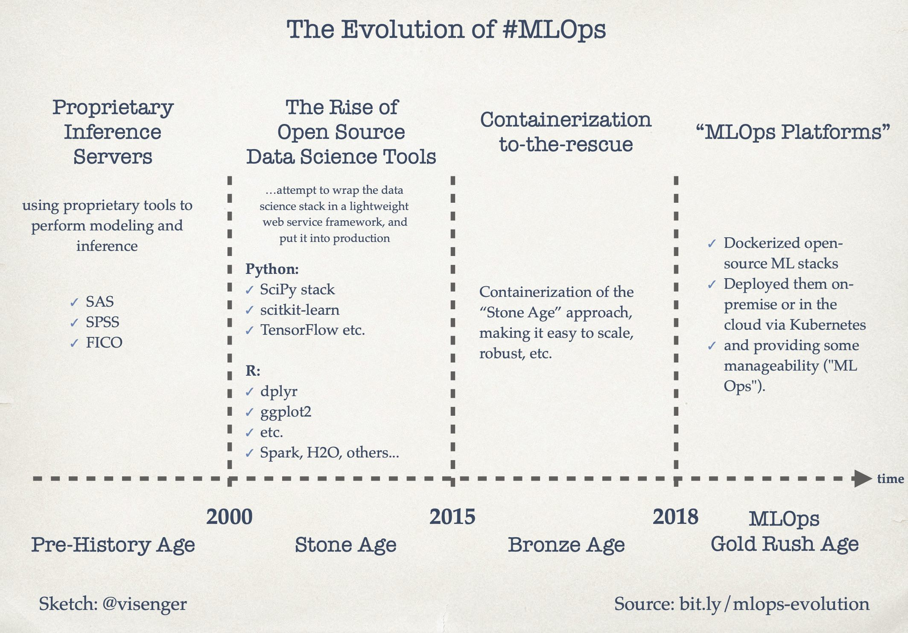
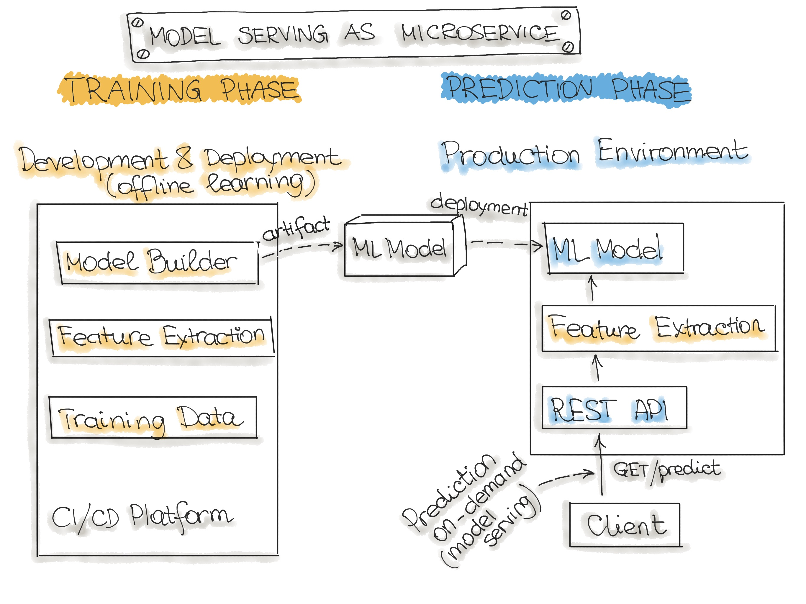
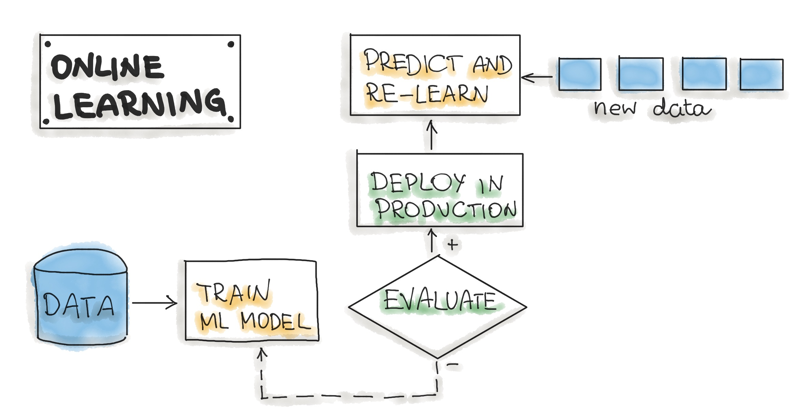
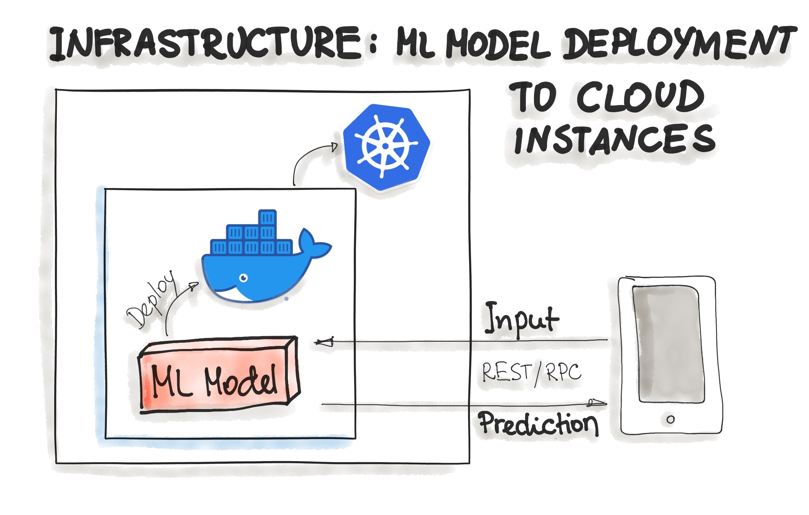
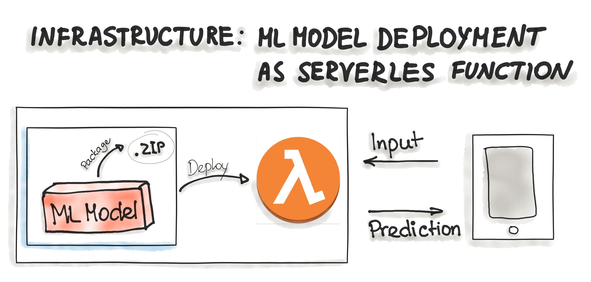
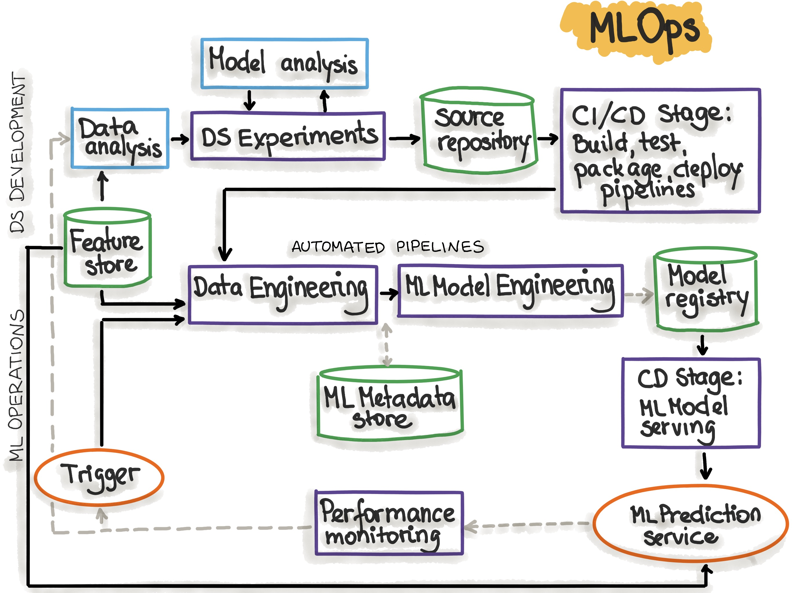

```{r, include=FALSE,warning=FALSE,message=FALSE}
options(htmltools.dir.version = FALSE)
knitr::opts_chunk$set(
  message = FALSE,
  warning = FALSE,
  dev = "svg",
  fig.align = "center",
  #fig.width = 11,
  #fig.height = 5
  cache = FALSE
)

# define vars
om = par("mar")
lowtop = c(om[1],om[2],0.1,om[4])
library(tidyverse)
library(knitr)
library(reticulate)
#use_python("C:\\ProgramData\\Anaconda3\\python.exe")
#use_python("C:\\Users\\jbpost2\\AppData\\Local\\Programs\\Python\\Python310\\python.exe")
use_python("C:\\python\\python.exe")
options(dplyr.print_min = 5)
options(reticulate.repl.quiet = TRUE)
```


layout: false
class: title-slide-section-red, middle

# MLOps
Justin Post 

---
layout: true

<div class="my-footer"></div> 

---

# Implementation Concerns

- Big picture of dealing with big data: it's complicated!

<div style = "float: left">
```{r echo = FALSE, fig.align = 'center', out.width = '450px'}

```
</div>

---

# Implementation Concerns

- Big picture of dealing with big data: it's complicated!

<div style = "float: left">
```{r echo = FALSE, fig.align = 'center', out.width = '450px'}

```
</div>
<div style = "float: right">
<ul>
  <li>Data pipeline</li>
  <ul>
    <li>Is the data valid?</li>
    <li>Garbage in garbage out!</li>
  </ul>
  <li>ML pipeline</li>
  <ul>
    <li>Model performing well?</li>
    <li> Still valid with new data or refit needed?</li>
  </ul>
  <li>How do others use our model???</li>
</ul>
</div>

<!--We need to validate the data as it comes in. If you feed bad data into a model you get bad results!
But of course, more data is coming so we need to valid and test that data to make sure it makes sense before we use it
How about our model? We need to make sure the paradigm hasn't shifted and our model is at least meeting basic thresholds for quality.
Main challenges people face when developing ML capabilities are scale, version control, model reproducibility, and aligning stakeholders (2020 state of enterprise machine learning)-->


---

# Implementation Concerns

- Good software is hard to build quickly

- [DevOps](https://about.gitlab.com/topics/devops/) is a framework for software development and deployment

    + Automation of the software development lifecycle
    + Collaboration and communication
    + Continuous improvement and minimization of waste
    + Hyperfocus on user needs with short feedback loops

```{r echo = FALSE, fig.align = 'center', out.width = '450px'}
knitr::include_graphics("img/devops.png")
```


---

layout: false

# Implementation Concerns

- Similar ideas have arisen when implementing ML models (especially on big data)
- [ML-Ops](https://ml-ops.org/) is a framework for the entire ML development/deployment process 
    + These notes are almost entirely distilled from their material!

```{r echo = FALSE, fig.align = 'center', out.width = '500px'}
knitr::include_graphics("img/ml-engineering.jpg")
```

<!-- MLops, like devops, emerges from the understanding that separating the ML model developmment from the process that delivers it - ml operations - lowers quality, transparency, and agility of the whole intelligent software-->


---

# `MLOps` to Solve a Problem

Good read from ["Value Proposition" on](https://ml-ops.org/content/phase-zero)!
```{r echo = FALSE, fig.align = 'center', out.width = '600px'}

```


---

# `MLOps` Concepts

- Models really useful when they make reasonable predictions and are available to the 'core software system'
- Models should be 'first-class citizens'
- Must continually monitor and update models (three levels of change)
- Testing of models should be automated

```{r echo = FALSE, fig.align = 'center', out.width = '550px'}

```
<!--https://cloudxlab.com/blog/mlops-machine-learning-operations-a-complete-hands-on-guide-with-case-study/-->

---

# MLOps Evolution

```{r echo = FALSE, fig.align = 'center', out.width = '650px'}

```

---

# Three Main Processes of ML Deployment

Build model on data you collect to make predictions, classifications, recommendations, etc.

- Three main phases, each must be monitored (again taken from ml-ops.org!)
    1. Data Engineering: data acquisition & data preparation
    2. ML Model Engineering: ML model training & serving
    3. Code Engineering :integrating ML model into the final product

```{r echo = FALSE, fig.align = 'center', out.width = '550px'}
knitr::include_graphics("img/ThreeLevelsOfChange.jpg")
```

<!-- Any of these may trigger a need to rebuild things!-->


---

# Data Engineering

Usually create a *Data Engineering Pipeline*: 
- Must integrate data from many source
- Data cleaning, imputation, and validation must be done
- Data splitting

**Generally takes the longest time and most resources to do this part!**

<!--Data preparation is a critical activity in the data science workflow because it is important to avoid the propagation of data errors to the next phase, data analysis, as this would result in the derivation of wrong insights from the data.

The final goal of these operations is to create training and testing datasets for the ML algorithms. -->


---

# ML Model Engineering

**Model Engineering Pipeline** generally has a few steps:

- Model Training 
    + Including feature engineering and the hyperparameter tuning
- Model Evaluation 
    + Ensure it meets predetermined standards 
- Model Testing 
    + On the holdout dataset
- Model Packaging 
    + Exporting the final ML model to be used by a business application
    + See the ["Model serialization formats"](https://ml-ops.org/content/three-levels-of-ml-software) section

---

# Code Engineering

**Deployment pipeline** involves things like:

- Model Serving 
    + Using the model in some software
- Model Performance Monitoring
    + Making sure the model is still performing ok on new data
- Model Performance Logging
    + Every time the model is used you log it


---

# Models Built on Batch Data

```{r echo = FALSE, fig.align = 'center', out.width = '650px'}

```

---

# Models Based on Streaming Data

```{r echo = FALSE, fig.align = 'center', out.width = '750px'}

```


---

# Deployment Strategies

Two common ways for deploying models:
- As Docker Containers to Cloud Instances 
- As Serverless Functions

```{r echo = FALSE, fig.align = 'center', out.width = '550px'}

```

---

# Deployment Strategies

Two common ways for deploying models:
- As Docker Containers to Cloud Instances 
- As Serverless Functions

```{r echo = FALSE, fig.align = 'center', out.width = '550px'}

```


---

# Big Picture Workflow

```{r echo = FALSE, fig.align = 'center', out.width = '700px'}
knitr::include_graphics("img/ml-engineering.jpg")
```

---

# Iterative Process That Must Be Monitored

```{r echo = FALSE, fig.align = 'center', out.width = '550px'}
knitr::include_graphics("img/mlops-loop-en.jpg")
```

---

# Automated MLOps Pipeline

```{r echo = FALSE, fig.align = 'center', out.width = '550px'}

```

---

# Important Components to Consider

[Entire Section Worth Reading](https://ml-ops.org/content/mlops-principles)

- Source Control: Versioning the Code, Data, and ML Model artifacts

- Test & Build Services: Unit tests and building of model to be deployed

- Model Registry: Registry for storing already trained ML models

- Feature Store: Preprocessing input data as features to be consumed in the model training pipeline and during the model serving

- ML Metadata Store: Tracking metadata of model training, for example model name, parameters, training data, test data, and metric results.
- Reproducibility

---

# Recap

`MLOps` provides a framework to efficiently include ML models within a business application

- Three main phases, each must be monitored (again taken from ml-ops.org!)
    1. Data Engineering: data acquisition & data preparation
    2. ML Model Engineering: ML model training & serving
    3. Code Engineering :integrating ML model into the final product

