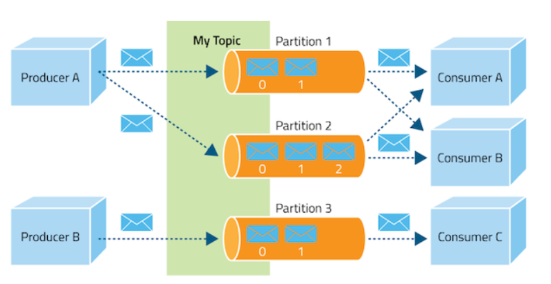
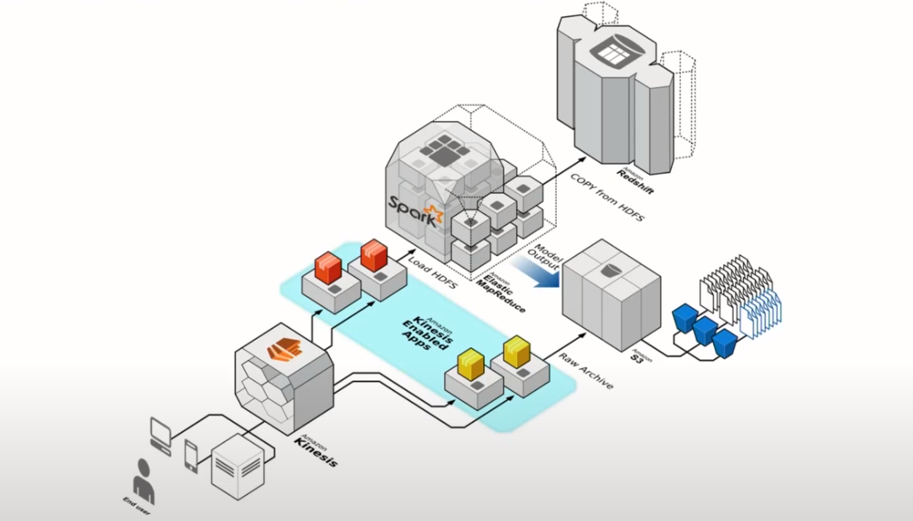
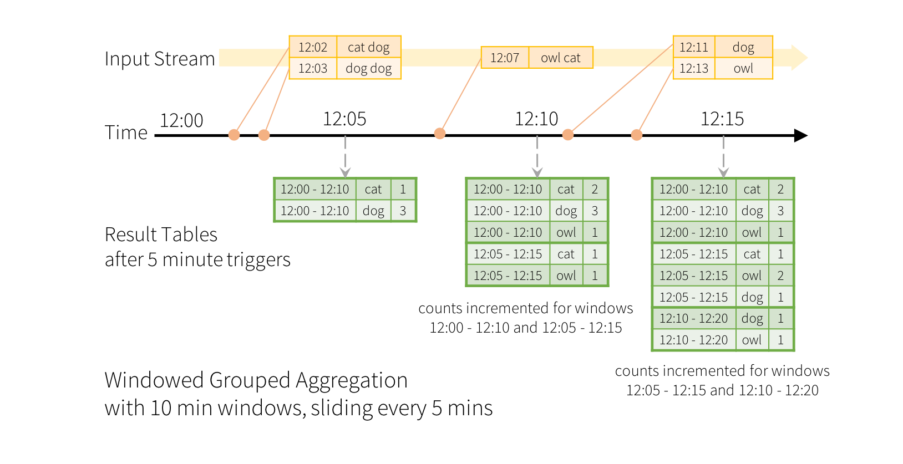

```{r, include=FALSE,warning=FALSE,message=FALSE}
options(htmltools.dir.version = FALSE)
knitr::opts_chunk$set(
  message = FALSE,
  warning = FALSE,
  dev = "svg",
  fig.align = "center",
  #fig.width = 11,
  #fig.height = 5
  cache = TRUE
)

# define vars
om = par("mar")
lowtop = c(om[1],om[2],0.1,om[4])
library(tidyverse)
library(knitr)
library(reticulate)
#use_python("C:\\Users\\jbpost2\\AppData\\Local\\Programs\\Python\\Python310\\python.exe")
use_python("C:\\python\\python.exe")
options(dplyr.print_min = 5)
options(reticulate.repl.quiet = TRUE)
```


layout: false
class: title-slide-section-red, middle

# Streaming Data Concepts
Justin Post 


---

# Recap

- 5 V's of Big Data
    + Volume
    + Variety
    + Velocity
    + Veracity (Variability)
    + Value

- Understanding of the Big Data pipeline and basics of handling Big Data
    + Databases/Data Lakes/Data Warehouses/etc.
    + Hadoop
    + Spark
    
- Modeling data
    + Machine learning algorithms
    + Tuning and testing models

Now: Common issues seen on data with velocity


---
layout: true

<div class="my-footer"></div> 

---

# Batch data

Batch data

- data that updates only at certain times
- can often be much larger in volume

Example: Update to a database at the end of each hour/day

- update inventory status
- update employee time/roster
- update electricity usage and populate/send bills


---

# Streaming Data

Streaming data  

- data that is generated over time (usually continuously)
- often smaller amounts of data 


---

# Streaming Data

Streaming data  

- data that is generated over time (usually continuously)
- often smaller amounts of data 

Commonly a stream of logs that record events

- temperature sensors
- customers using a web app
- in-game player activity/clicks
- financial trading


---

# Streaming Data

Streaming data  

- data that is generated over time (usually continuously)
- often small amounts of data with high velocity

Commonly a stream of logs that record events

- temperature sensors
- customers using a web app
- in-game player activity/clicks
- financial trading

Data streams often in an unstructured or semi-structured format

- JSON data or XML key-value pairs


---

# Data Producers and Consumers  


```{r, fig.align='center', out.width='650px', echo = FALSE, fig.cap="https://docs.cloudera.com/documentation/kafka/1-2-x/topics/kafka.html"}

```


---

# Example Streaming Setup

```{r, fig.align='center', out.width='650px', echo = FALSE, fig.cap = "https://databricks.com/blog/2017/04/26/processing-data-in-apache-kafka-with-structured-streaming-in-apache-spark-2-2.html"}
knitr::include_graphics("img/nest-kafka.png")
```


---

# Example Streaming Setup

```{r, fig.align='center', out.width='700px', echo = FALSE, fig.cap = "https://www.youtube.com/watch?v=Mxr408U_gqo&t=2s"}

```


---

# Batch vs Streaming Analysis  

Can process a stream in real-time, batch process at intervals, or do a combined approach

---

# Batch vs Streaming Analysis  

Can process a stream in real-time, batch process at intervals, or do a combined approach

- Usually processed sequentially and incrementally as the records come in
- Often analyzed over windows of time
- Also stored for later batch processing


---

# Batch vs Streaming Analysis  

Can process a stream in real-time, batch process at intervals, or do a combined approach

- Usually processed sequentially and incrementally as the records come in
- Often analyzed over windows of time
- Also stored for later batch processing

[Example](https://www.infoworld.com/article/3646589/what-is-streaming-data-event-stream-processing-explained.html)
- Acoustic monitor on a machine 
- Stream process detects an abnormal squeak and issues an alert
- Batch process invokes a model to predict time to failure based on the squeak progression
    + Schedule maintenance for the machine before it is likely to fail


---

# Common Issues Raised by Streaming Data

Preprocessing/Sending alerts
+ Missing data from a censor
+ Tracking a fleet of vehicles on speed, geo-fences, etc.
    
---

# Common Issues Raised by Streaming Data

Preprocessing/Sending alerts
+ Missing data from a censor
+ Tracking a fleet of vehicles on speed, geo-fences, etc.

Combining data streams and dealing with time intervals
+ Uber request

---

# Common Issues Raised by Streaming Data

Preprocessing/Sending alerts
+ Missing data from a censor
+ Tracking a fleet of vehicles on speed, geo-fences, etc.

Combining data streams and dealing with time intervals
+ Uber request

Detecting trends, counting, and averages 
+ Algorithmic stock market trading
+ Trending twitter posts

---

# Common Issues Raised by Streaming Data

Preprocessing/Sending alerts
+ Missing data from a censor
+ Tracking a fleet of vehicles on speed, geo-fences, etc.

Combining data streams and dealing with time intervals
+ Uber request

Detecting trends, counting, and averages
+ Algorithmic stock market trading
+ Trending twitter posts

Updating or using predictive models
+ Product recommendations


---

# Summarizing Streaming Data Over Windows

Often want to summarize/find trends/etc. over certain windows of time

```{r, echo = FALSE, out.width='800px', fig.cap = "https://spark.apache.org/docs/latest/structured-streaming-programming-guide.html", fig.align='center'}

```

---

# Recap

- Important information can be gleaned from streaming data 

- Dealing with data as it comes in over time creates a number of common use cases

    + Preprocessing/Sending alerts
    + Combining data streams and dealing with time intervals
    + Detecting trends, counting, and averages (over certain windows or buckets of time)
    + Updating or using predictive models

