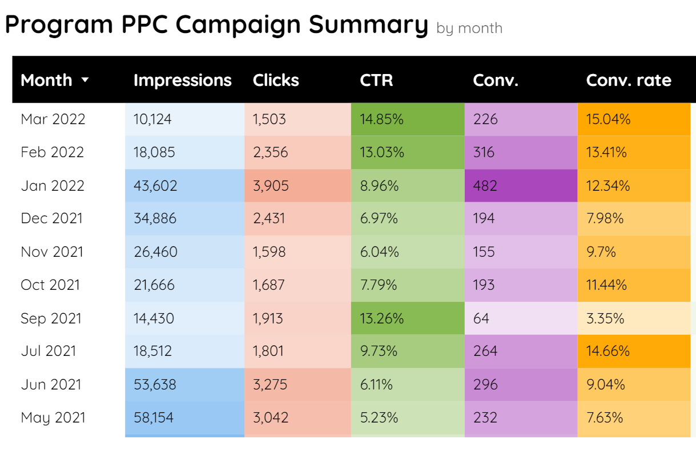

```{r, include=FALSE,warning=FALSE,message=FALSE}
options(htmltools.dir.version = FALSE)
knitr::opts_chunk$set(
  message = FALSE,
  warning = FALSE,
  dev = "svg",
  fig.align = "center",
  #fig.width = 11,
  #fig.height = 5
  cache = TRUE
)

# define vars
om = par("mar")
lowtop = c(om[1],om[2],0.1,om[4])
library(tidyverse)
library(knitr)
library(reticulate)
use_python("C:\\Users\\jbpost2\\AppData\\Local\\Programs\\Python\\Python310\\python.exe")
#use_python("C:\\python\\python.exe")
options(dplyr.print_min = 5)
options(reticulate.repl.quiet = TRUE)
```


layout: false
class: title-slide-section-red, middle

# Preprocessing, Sending Alerts, and Combining Streams
Justin Post 

---

# Common Task: Preprocessing/Sending alerts

Preprocessing/Sending alerts
+ Missing data from a censor
+ Tracking a fleet of vehicles on speed, geo-fences, etc.


---

# Common Task: Preprocessing/Sending alerts

Preprocessing/Sending alerts
+ Missing data from a censor
+ Tracking a fleet of vehicles on speed, geo-fences, etc.

Must be able to filter and process the data
+ Data often in the form of a log
+ We'll deal with data in JSON form
+ For now, ignore streaming aspect and parse data in a data frame using a time variable


---

# Example: Air Quality Data

From: <https://archive.ics.uci.edu/ml/datasets/Air+quality>

>  ...dataset contains 9358 instances of hourly averaged responses from an array of 5 metal oxide chemical sensors embedded in an Air Quality Chemical Multisensor Device

```{python}
import pandas as pd
air_data = pd.read_csv("data/AirQualityUCI.csv", sep = ";", decimal = ",")
air_data
```

---

# Example: Air Quality Data

From: <https://archive.ics.uci.edu/ml/datasets/Air+quality>

```{python}
air_data.info()
```


---

# Example: Air Quality Data

From: <https://archive.ics.uci.edu/ml/datasets/Air+quality>

Could fix this ourselves... instead read the .xlsx version (still some issues)

```{python}
air_data = pd.read_excel("data/AirQualityUCI.xlsx")
air_data
```


---

# Example: Air Quality Data

```{python}
air_data.info()
type(air_data.Time[0])
```


---

# Dates and Times in Python

Most standard date/time operations can be handled via the `datetime` module.  Includes data types:

- `date`: attributes of `year`, `month`, `day`
- `time`: attributes of `hour`, `minute`, `second`, `microsecond`, and `tzinfo`
- `datetime`: attributes of both `date` and `time`
- `timedelta`: difference between two `date`, `time` or `datetime` instances

---

# Dates and Times in Python

Most standard date/time operations can be handled via the `datetime` module.  Includes data types:

- `date`: attributes of `year`, `month`, `day`
- `time`: attributes of `hour`, `minute`, `second`, `microsecond`, and `tzinfo`
- `datetime`: attributes of both `date` and `time`
- `timedelta`: difference between two `date`, `time` or `datetime` instances

With this functionality we can add and subtract dates/times to get meaningful info while keeping the data in a more readable format (rather than say looking at the data as days since Jan 1, 1960)


---

# Dates and Times in `pandas`

- Uses `NumPy`'s `datetime64` and `timedelta64` dtypes
- Very similar functionality for doing useful things with dates! [Link](https://pandas.pydata.org/pandas-docs/stable/user_guide/timeseries.html)

```{python}
a = pd.to_datetime(["04-01-2022 10:00"], dayfirst=True)
a
```
```{python}
b = pd.to_datetime(["04-01-2022 11:00"])
a-b
b.day
b.hour
```


---

# Example: Air Quality Data

From: <https://archive.ics.uci.edu/ml/datasets/Air+quality>

```{python}
air_data = pd.read_excel("data/AirQualityUCI.xlsx", parse_dates = [["Date", "Time"]])
air_data.info()
```


---

# Example: Air Quality Data

From: <https://archive.ics.uci.edu/ml/datasets/Air+quality>

```{python}
air_data = air_data.rename(columns = {'CO(GT)': 'co_gt'})
air_data
```

---

# Common Task: Preprocessing/Sending alerts

Checking conditions on the data:

- Check if the data is missing
- Check if data is in an appropriate range
- etc.
    + If not, print an alert, write the event to a file, and/or send an email


---

# Common Task: Preprocessing/Sending alerts

Let's focus on the `co_gt` variable (true hourly averaged CO concentration (mg/m^3))

- 'Take data in over time' (via a loop over the rows)
- If the data exceeds 8 we print a message

```{python}
for i in range(air_data.shape[0]):
    if air_data.iloc[i].co_gt > 8:
        print("High CO Concentration at " + str(air_data.Date_Time[i]))
```


---

# Common Task: Preprocessing/Sending alerts

- 'Take data in over time' (via a loop over the rows)
- If the data exceeds 8 we print a message
- If the data is less than 0 we print a message (-200 represents missing here)
    + Write either occurrence to a log file (or perhaps a database)

```{python}
for i in range(air_data.shape[0]):
    temp = air_data.iloc[i]
    dt = temp.Date_Time
    value = temp.co_gt
    if value > 8:
        print("High CO Concentration at " + str(dt))
        with open('logs/COHigh.txt', 'a') as f:
            f.write(str(dt) + "," + str(value) + "\n")
    elif value < 0:
        print("Invalid CO Concentration at " + str(dt))
        with open('logs/COInvalid.txt', 'a') as f:
            f.write(str(dt) + "," + str(value) + "\n")
```


---

# Check on Status of a Producer

- Check to see if the `producer` seems to be down. If so, send an email! [Article](https://realpython.com/python-send-email/) (let's go through an example notebook)

```{python, eval = FALSE}
missing = 0
for i in range(air_data.shape[0]):
    temp = air_data.iloc[i]
    dt = temp.Date_Time
    value = temp.co_gt
    if value > 8:
        print("High CO Concentration at " + str(dt))
        with open('logs/COHigh.txt', 'a') as f:
            f.write(str(dt) + "," + str(value) + "\n")
        missing = 0
    elif value < 0:
        print("Invalid CO Concentration at " + str(dt))
        with open('logs/COInvalid.txt', 'a') as f:
            f.write(str(dt) + "," + str(value) + "\n")
        if value == -200:
            missing += 1
        if missing == 6:
            #Send email code
    else:
        missing = 0
```


---

# Common Issue: Combining Data Streams

- Often have multiple data streams that need to be combined

    + Usually combined via a shared key or time stamps

- Once combined we can then preprocess/summarize/etc.

```{r, echo = FALSE, fig.align='center', out.width = "550px"}

```


---

# Common Issue: Combining Data Streams

[Example](https://docs.databricks.com/_static/notebooks/stream-stream-joins-python.html) of streams using google ads type data

- Impression - ad seen by a user
- Clicks - ad was clicked on by user

```{python}
import pandas as pd
import numpy as np
np.random.seed(10)
impressions = pd.DataFrame({
  'adId': range(500),
  'clickTime': (pd.to_datetime('2022-01-01') + pd.to_timedelta(np.random.rand(500), unit = "D")).sort_values()
})
clicks = impressions.iloc[np.random.randint(size = 30, low = 0, high = 499)].sort_index()
clicks.clickTime = clicks.clickTime + pd.to_timedelta(np.random.rand(30)/100, unit = "D")
```


---

# Common Issue: Combining Data Streams

[Example](https://docs.databricks.com/_static/notebooks/stream-stream-joins-python.html) of streams using google ads type data

- Impression - ad seen by a user
- Clicks - ad was clicked on by user

<div style="float: left; width: 45%;">
```{python}
impressions
```
</div>
<div style="float: right; width: 45%;">
```{python}
clicks
```
</div>
<!--comment-->


---

# Combining Streams

- Impression - ad seen by a user
- Clicks - ad was clicked on by user

Idea is easy :)  Will be harder with actual data streams!

```{python}
pd.merge(left = impressions, right = clicks, on = "adId", how = 'right')
```


---

# Recap

Often need to check/validate the data

- Basic checks to create an issue log file or entries in an issues data base

- Might send email as a notification

- Could of course do basic ETL type operations as the data comes in too!
    + Filter observations
    + Quick transformations
    + Combine data streams
    + etc.


