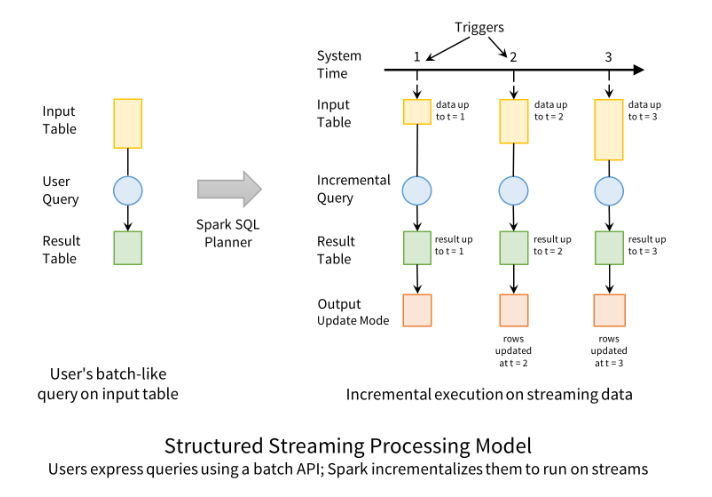

```{r, include=FALSE,warning=FALSE,message=FALSE}
options(htmltools.dir.version = FALSE)
knitr::opts_chunk$set(
  message = FALSE,
  warning = FALSE,
  dev = "svg",
  fig.align = "center",
  #fig.width = 11,
  #fig.height = 5
  cache = TRUE
)

# define vars
om = par("mar")
lowtop = c(om[1],om[2],0.1,om[4])
library(tidyverse)
library(knitr)
library(reticulate)
#use_python("C:\\Users\\jbpost2\\AppData\\Local\\Programs\\Python\\Python310\\python.exe")
use_python("C:\\python\\python.exe")
options(dplyr.print_min = 5)
options(reticulate.repl.quiet = TRUE)
```


layout: false
class: title-slide-section-red, middle

# Spark Structured Streaming
Justin Post 

---
layout: true

<div class="my-footer"></div> 


---

# Recap 

Streaming Data  

- Data that is generated over time (usually continuously)
- Often small amounts of data with high velocity

Common Tasks 
- Preprocessing/Sending alerts
- Combining data streams and dealing with time intervals
- Detecting trends, counting, and averages (over certain windows or buckets of time)
- Updating or using predictive models

Big issues
- Need to handle it as it comes in record by record
- Generally, don't want to store all the data from the stream


---

# Spark for Streaming Data

Spark has two systems for streaming data: 

- Spark Streaming 

	  + Uses discretized streams or DStreams
	  + Internally is a sequence of RDDs

	
- Spark Structured Streaming 

	  + Can use Spark DataFrames with SQL type functions


---

# Spark SQL Recap

Use `pyspark.sql.SparkSession` to create a spark instance

- Spark SQL DataFrames are created and implemented on top of RDDs

    + `df.printSchema()`

- DataFrames are stored across the cluster

    + When transformations are done, lazy evaluation is used
    + When actions are done, computation starts and results returned

---

# Spark SQL Recap

Often do transformations 

- `.select()` method can be used to subset columns
- `.withColumn()` method is useful to create a new column from another
- `.filter()` method allows you to subset via a condition

---

# Spark SQL Recap

Often do transformations 

- `.select()` method can be used to subset columns
- `.withColumn()` method is useful to create a new column from another
- `.filter()` method allows you to subset via a condition

Summarizations (often with grouping via `.groupBy()`)

-  `.avg()`, `.sum()`, `.count()`, etc

---

# Spark SQL Recap

Often do transformations 

- `.select()` method can be used to subset columns
- `.withColumn()` method is useful to create a new column from another
- `.filter()` method allows you to subset via a condition

Summarizations (often with grouping via `.groupBy()`)

-  `.avg()`, `.sum()`, `.count()`, etc

DataFrame isn't printed out when we do the default call of the object due to lazy eval

- `show(n)`, `take(n)`, `collect()`
- **Won't be able to use these with streaming data**


---

# Spark SQL Recap

And don't forget!

- Can use more 'standard' SQL style code:

    + `df.createOrReplaceTempView("df")`
    + `spark.sql("SELECT sex, age FROM df LIMIT 4")`


---

# Spark Structured Streaming 

> Structured Streaming provides fast, scalable, fault-tolerant, end-to-end exactly-once stream processing without the user having to reason about streaming

---

# Spark Structured Streaming 

> Structured Streaming provides fast, scalable, fault-tolerant, end-to-end exactly-once stream processing without the user having to reason about streaming

<div style="float: left; width: 45%;">
- Still set up sequence of transformations
- Lazy execution until you execute the query that will return data
</div>
<div style="float: left; width: 45%;">
```{r, echo = FALSE, out.width='600px', fig.cap = "https://databricks.com/glossary/what-is-structured-streaming", fig.align='center'}

```
</div>
<!--comment-->


---

# Spark Structured Streaming 


<div style="float: left; width: 40%;">
- Spark Uses micro-batching at time intervals you set (100 milliseconds minimum) 
- Continuous version (1 millisecond) exists but is still experimental
- Easy to do windowing operations!
</div>
<div style="float: left; width: 60%;">
```{r, echo = FALSE, out.width='600px', fig.cap = "https://spark.apache.org/docs/latest/structured-streaming-programming-guide.html", fig.align='center'}
knitr::include_graphics('img/structured-streaming-window.png')
```
</div>
<!--comment-->


---

# Spark Structured Streaming Process


General process:

- Create a spark session
1. Read in a stream
    + Stream from a file, terminal, or use something like kafka
2. Set up transformations/aggregations to do (mostly using SQL type functions)
    + Perhaps over windows
    
    
---

# Spark Structured Streaming Process


General process:

- Create a spark session
1. Read in a stream
    + Stream from a file, terminal, or use something like kafka
2. Set up transformations/aggregations to do (mostly using SQL type functions)
    + Perhaps over windows
3. Set up writing of the query to an output source
    + Console (for debugging)
    + File (say .csv)
    + Database
4. `query.start()` the query!  
    + Continues listening until terminated (`query.stop()`)

   
---

# First: To JupyterLab to do Spark without Streaming!

Basic word count operation

Using Spark SQL we can use [functions listed here](https://spark.apache.org/docs/latest/api/sql/index.html).  Process:
- Read data into a spark SQL dataframe
- Use `split(str, regex)`
- Use `explode(expr)` (separates the elements of the array `expr` into multiple rows, or the elements of map `expr` into multiple rows and columns)

                  
---

# First: To JupyterLab to do Spark without Streaming!

Basic word count operation

Using Spark SQL we can use [functions listed here](https://spark.apache.org/docs/latest/api/sql/index.html).  Process:
- Read data into a spark SQL dataframe
- Use `split(str, regex)`
- Use `explode(expr)` (separates the elements of the array `expr` into multiple rows, or the elements of map `expr` into multiple rows and columns)
- Use `.groupBy()` with `.count()`

Syntax similar to what we've done already
```{python eval = FALSE}
df.select(["Duration", "Age", "Treatment"]).groupBy("Treatment").avg().show()
```


---

# Second: To pyspark to do Word Counts on Streaming Data!


General process:

- Create a spark session
1. Read in a stream
    + Listen for `.csv` files in a folder


---

# Second: To pyspark to do Word Counts on Streaming Data!


General process:

- Create a spark session
1. Read in a stream
    + Listen for `.csv` files in a folder
2. Set up transformations/aggregations to do 
    + Similar to what we just did!

---

# Second: To pyspark to do Word Counts on Streaming Data!


General process:

- Create a spark session
1. Read in a stream
    + Listen for `.csv` files in a folder
2. Set up transformations/aggregations to do 
    + Similar to what we just did!
3. Set up writing of the query to an output source
    + Console (just for illustration!)

---

# Second: To pyspark to do Word Counts on Streaming Data!


General process:

- Create a spark session
1. Read in a stream
    + Listen for `.csv` files in a folder
2. Set up transformations/aggregations to do 
    + Similar to what we just did!
3. Set up writing of the query to an output source
    + Console (just for illustration!)
4. `query.start()` the query!  

---

# Recap

We'll use Spark Structured Streaming to handle our streaming data!

General process:

- Create a spark session
1. Read in a stream
2. Set up transformations/aggregations to do 
3. Set up writing of the query to an output source
4. `query.start()` the query!  

- We'll look at things like windowing and joining streams as well!


