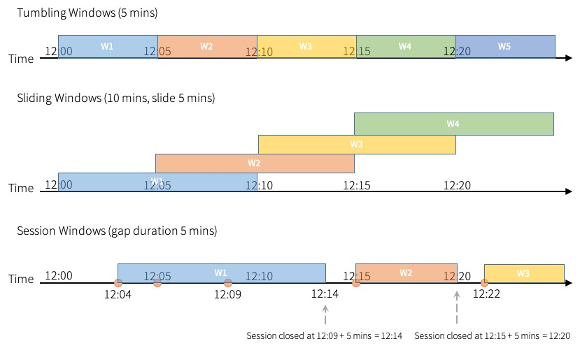

```{r, include=FALSE,warning=FALSE,message=FALSE}
options(htmltools.dir.version = FALSE)
knitr::opts_chunk$set(
  message = FALSE,
  warning = FALSE,
  dev = "svg",
  fig.align = "center",
  #fig.width = 11,
  #fig.height = 5
  cache = TRUE
)

# define vars
om = par("mar")
lowtop = c(om[1],om[2],0.1,om[4])
library(tidyverse)
library(knitr)
library(reticulate)
#use_python("C:\\Users\\jbpost2\\AppData\\Local\\Programs\\Python\\Python310\\python.exe")
use_python("C:\\python\\python.exe")
options(dplyr.print_min = 5)
options(reticulate.repl.quiet = TRUE)
```


layout: false
class: title-slide-section-red, middle

# Transformations, Windowing, and Aggregations
Justin Post 

---
layout: true

<div class="my-footer"></div> 


---

# Recap 

We'll use Spark Structured Streaming to handle our streaming data ([Guide](https://spark.apache.org/docs/latest/structured-streaming-programming-guide.html))

- Create a spark session
1. Read in a stream
    + Stream from a file, terminal, or use something like kafka
2. Set up transformations/aggregations to do (mostly using SQL type functions)
    + Perhaps over windows
3. Set up writing of the query to an output source
    + Console (for debugging)
    + File (say .csv)
    + Database
4. `query.start()` the query!  
    + Continues listening until terminated (`query.stop()`)

---

# Aggregations over an Event-time Window

```{r, echo = FALSE, out.width='800px', fig.cap = "https://spark.apache.org/docs/latest/structured-streaming-programming-guide.html", fig.align='center'}
knitr::include_graphics('img/structured-streaming-window.png')
```


---

# Aggregations over an Event-time Window

- Need a **time stamp** or **event-time** on the data 

    + Note: Event-time may be different than time the event is received by spark!
    

---

# Aggregations over an Event-time Window

- Need a **time stamp** or **event-time** on the data 

    + Note: Event-time may be different than time the event is received by spark!

- Easy to do windowing
    + Use `groupBy()` and specify the window size and update time
    
```{python, eval = FALSE}
df.groupBy(
  window(df.timestamp, "1 minute", "30 seconds"), #2nd arg is window size, 3rd update time
  other_grouping_var_if_desired
  ).aggregation()
```


---

# Aggregations over an Event-time Window

Let's jump into pyspark and aggregate some data over windows!


---

# Late Data

Spark can also handle *late* data

- Event-time (time stamp) is when the event occurred
- Not always the same as when the data is received

```{r, echo = FALSE, out.width='650px', fig.cap = "https://spark.apache.org/docs/latest/structured-streaming-programming-guide.html", fig.align='center'}
knitr::include_graphics('img/structured-streaming-late-data.png')
```

---

# Watermarking

- Past Data is usually discarded once the event-time window for computation closes 
- Can provide a **watermark**
    + Specifies a threshold on how late our event-time data can be
    + Data states maintained until the window plus that threshold is reached


---

# Watermarking 

```{r, echo = FALSE, out.width='700px', fig.cap = "https://spark.apache.org/docs/latest/structured-streaming-programming-guide.html", fig.align='center'}
knitr::include_graphics('img/structured-streaming-watermark-update-mode.png')
```

---

# Watermarking

- Past Data is usually discarded once the event-time window for computation closes 
- Can provide a **watermark**
    + Specifies a threshold on how late our event-time data can be
    + Data states maintained until the window plus that threshold is reached

```{python, eval = FALSE}
df \
  .withWatermark("timestamp", "20 seconds") \ #accept data 20 seconds past the close of the window
  .groupBy(
    window(df.timestamp, "1 minute", "30 seconds"), #2nd arg is window size, 3rd update time
    other_grouping_var_if_desired
  ) \
  .aggregation()
```

- Note: There are [conditions for using watermarks](https://spark.apache.org/docs/latest/structured-streaming-programming-guide.html#creating-streaming-dataframes-and-streaming-datasets) given in the guide


---

# Watermarking

Let's jump back into pyspark and include a watermark!

This will allow us to write to a .csv file with our aggregation

<!--(now have the code that generates the file randomly pause after producing data, prior to writing the csv)-->


---

# Types of Time Windows

Three types of time windows in spark:

```{r, echo = FALSE, out.width='750px', fig.cap = "https://spark.apache.org/docs/latest/structured-streaming-programming-guide.html", fig.align='center'}

```

---

# Recap


- Create a spark session
1. Read in a stream
    + Stream from a file, terminal, or use something like kafka
2. Set up transformations/aggregations to do (mostly using SQL type functions)
    + Perhaps over windows
    + Use a watermark to allow for late data
3. Set up writing of the query to an output source
    + Console (for debugging)
    + File (say .csv)
    + Database
4. `query.start()` the query!  
    + Continues listening until terminated (`query.stop()`)


